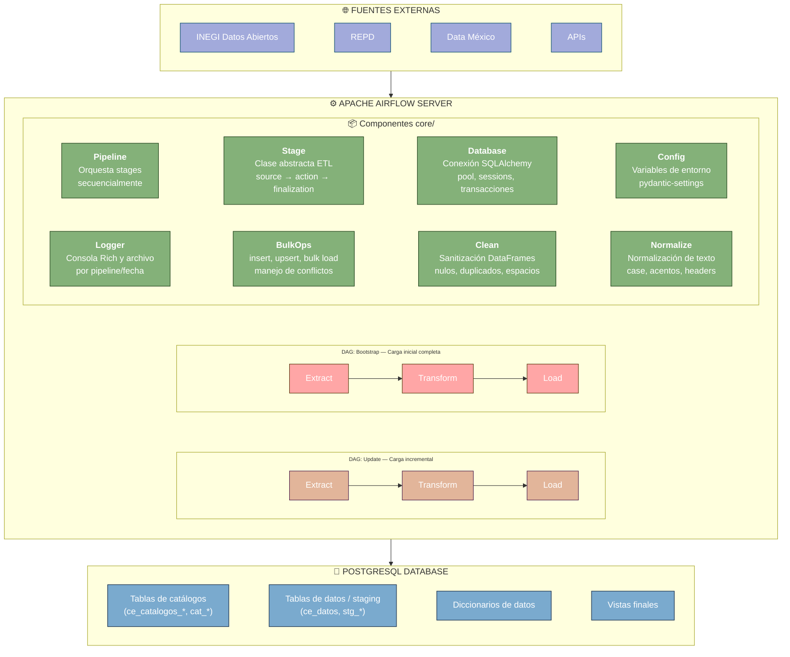

# ETL SIEEJ - Sistema de Información Estratégica del Estado de Jalisco

Proyecto de ETL (Extract, Transform, Load) para el procesamiento automatizado de datos del SIEEJ utilizando Apache Airflow. Cada pipeline descarga datos de fuentes públicas, los transforma siguiendo reglas de negocio específicas y los carga en una base de datos PostgreSQL para su análisis y consumo.

## Índice

- [Descripción](#-descripción)
- [Arquitectura](#️-arquitectura)
- [Pre-requisitos](#-pre-requisitos)
- [Estructura del Proyecto](#-estructura-del-proyecto)
- [Instalación y Ejecución Local](#-instalación-y-ejecución-local)
  - [1. Clonar el repositorio](#1-clonar-el-repositorio)
  - [2. Crear el ambiente de desarrollo](#2-crear-el-ambiente-de-desarrollo)
  - [3. Levantar la base de datos de desarrollo](#3-levantar-la-base-de-datos-de-desarrollo)
  - [4. Configurar y ejecutar migraciones (Flyway)](#4-configurar-y-ejecutar-migraciones-flyway)
  - [5. Configurar las variables de entorno del pipeline](#5-configurar-las-variables-de-entorno-del-pipeline)
  - [6. Ejecutar un pipeline localmente](#6-ejecutar-un-pipeline-localmente)
- [Ejecución con Airflow (Docker)](#-ejecución-con-airflow-docker)
- [Uso de los DAGs](#-uso-de-los-dags)
- [Logs](#-logs)
- [Comandos `just`](#-comandos-just)
- [Troubleshooting](#-troubleshooting)
- [Resumen de pasos rápidos (Local)](#-resumen-de-pasos-rápidos-local)
- [Contribución](#-contribución)
- [Enlaces Útiles](#-enlaces-útiles)

## 📋 Descripción

Este sistema extrae datos de fuentes externas; conjuntos de datos abiertos publicados en fuentes federales y/o estatales, los cuales se transforman para cumplir una categorización tipo `silver` (sanitización, tipado, desagregación en tablas y sin analíticos). Posteriormente estos datos son cargados en una base de datos PostgreSQL para su análisis y consumo.


Cada pipeline opera en dos modos:

- **bootstrap**: Carga inicial completa (se ejecuta bajo demanda).
- **update**: Carga incremental (ejecutada por un schedule de Airflow o manualmente).

## 🏗️ Arquitectura



### Flujo de Datos (ETL Pipeline)

Cada pipeline sigue el patrón **Extract → Transform → Load**, implementado mediante la clase abstracta `Stage`:

```
Pipeline.run()
  └── Para cada Stage:

        1. EXTRACT (Extracción)
           ├── source()        → Identifica archivos pendientes de descarga
           ├── action()        → Descarga y extrae datos de la fuente
           └── finalization()  → Construye inventario de archivos extraídos

        2. TRANSFORM (Transformación)
           ├── source()        → Recibe y valida inventario de Extract
           ├── action()        → Limpia catálogos, valida encabezados
           └── finalization()  → Pasa datos limpios a Load

        3. LOAD (Carga)
           ├── source()        → Conecta a BD y crea/verifica tablas
           ├── action()        → Inserta catálogos y datos por lotes
           └── finalization()  → Sincroniza secuencias, desconecta
```

## 🔧 Pre-requisitos

- **Python 3.12** (vía [Miniconda](https://docs.anaconda.com/miniconda/install/) o `venv`)
- **Git**
- **Docker** >= 20.10 y **Docker Compose** >= 2.0
- **just** — task runner para comandos del proyecto:
  ```bash
  sudo snap install just --classic
  ```
- **Flyway CLI** — para migraciones de esquema de BD:
  ```bash
  sudo snap install flyway
  ```
## 📁 Estructura del Proyecto

```
ETL-SIEEJ/
├── compose.yaml                   # Docker Compose para Airflow
├── Dockerfile                     # Imagen Docker con Chrome + dependencias Python
├── justfile                       # Recetas de tareas (just)
├── requirements.txt               # Dependencias Python
├── .env                           # Variables de entorno globales (crear)
│
├── core/                          # Núcleo del sistema ETL
│   ├── config.py                  # BaseConfig (pydantic-settings) - variables comunes de BD
│   ├── db.py                      # Clase Database (SQLAlchemy engine + sessions)
│   ├── pipeline.py                # Clase Pipeline - ejecuta stages secuencialmente
│   ├── utils/
│   │   ├── bulk_ops.py            # insert_records, upsert, bulk_insert, sync_id_sequence
│   │   ├── clean.py               # list_values_to_null, drop_duplicates_col
│   │   └── normalize.py           # Funciones de normalización de texto/columnas
│   └── pipelines/
│       ├── stage.py               # Clase abstracta Stage (source → action → finalization)
│       ├── censos_economicos/
│       │   ├── .env               # Variables de entorno del pipeline (crear)
│       │   ├── config.py          # Settings específicos (workers, batch size, años)
│       │   ├── consts.py          # URLs, slugs por entidad, columnas económicas
│       │   ├── schemas.py         # Modelos SQLAlchemy (tablas de la BD)
│       │   └── stages/
│       │       ├── extract.py     # Descarga ZIPs de INEGI y extrae CSVs
│       │       ├── transform.py   # Limpia catálogos y valida encabezados
│       │       └── load.py        # Carga catálogos y datos en PostgreSQL
│       └── repd/
│
├── dags/                          # DAGs de Airflow
│   ├── etl_censos_economicos.py
│   └── etl_repd.py
│
├── data/                          # Almacenamiento temporal (generado)
│   ├── extract/
│   ├── transform/
│   └── load/
│
├── logs/                          # Logs de ejecución (generado)
│
├── migrations/                    # Migraciones de BD (Flyway)
│   ├── censos_economicos/
│   │   ├── flyway.conf.example
│   │   └── sql/
│   │       ├── V1__catalogos_ce.sql
│   │       ├── V2__tabla_stg_ce_data.sql
│   │       └── V3__diccionario_ce.sql
│   └── repd/
│
└── config/
    └── airflow.cfg                # Configuración de Airflow
```

## 🚀 Instalación y Ejecución Local

### 1. Clonar el repositorio

```bash
git clone https://github.com/iieg-oficial/ETL-SIEEJ.git
cd ETL-SIEEJ
```

### 2. Crear el ambiente de desarrollo

#### Opción 1 — .venv

```bash
python3.12 -m venv .venv
source .venv/bin/activate
pip install -r requirements.txt
```

#### Opción 2 — Conda

```bash
conda create -n sieej python=3.12 -y
conda activate sieej
pip install -r requirements.txt
```

### 3. Levantar la base de datos de desarrollo

Para desarrollo local se utiliza un contenedor **PostGIS** gestionado con `just`. Esto evita instalar PostgreSQL directamente en la máquina.

#### 3.1 Iniciar el contenedor

```bash
just build-dev user=sieej_user pass=mi_pass db=sieej
```

Esto levanta `postgis/postgis:17-3.5` con el usuario y base de datos indicados, expuesto en el puerto `5432`.

#### 3.2 Conectar la base de datos geográfica (cvegeo)

El pipeline de referencias geográficas (`cvegeo`) requiere su propia base de datos con soporte PostGIS. El flujo completo es:

```bash
# 1. Crear la base de datos cvegeo dentro del contenedor
just create-cvegeo-db

# 2. Copiar y editar el archivo de configuración de Flyway
cp migrations/cvegeo/flyway.conf.example migrations/cvegeo/flyway.conf
```

Edita `migrations/cvegeo/flyway.conf`:

```properties
flyway.url=jdbc:postgresql://localhost:5432/cvegeo
flyway.user=sieej_user
flyway.password=mi_pass
flyway.locations=filesystem:./sql/
flyway.schemas=public
flyway.cleanDisabled=false
```

```bash
# 3. Aplicar las migraciones (crea tablas PostGIS y carga el seed de Jalisco)
just flyway-migrate cvegeo
```

### 4. Configurar y ejecutar migraciones (Flyway)

Flyway versiona y aplica los scripts SQL que crean las tablas de catálogos, staging y vistas. La instalación se hace vía snap (ver [Pre-requisitos](#-pre-requisitos)).

#### 4.1 Configurar Flyway para cada pipeline

Cada pipeline tiene `migrations/<pipeline>/flyway.conf.example`. Copia y edita el archivo:

```bash
cp migrations/censos_economicos/flyway.conf.example migrations/censos_economicos/flyway.conf
```

```properties
flyway.url=jdbc:postgresql://localhost:5432/censos_economicos
flyway.user=sieej_user
flyway.password=mi_pass
flyway.locations=filesystem:./sql/
flyway.schemas=public
flyway.cleanDisabled=false
```

Repite para cada pipeline que vayas a utilizar (`repd`, `fiscalia`, etc.).

> **Importante:** `flyway.conf` contiene credenciales y **no debe subirse al repositorio**.

#### 4.2 Ejecutar las migraciones

Desde la raíz del proyecto, usa `just` para aplicar las migraciones:

```bash
just flyway-migrate censos_economicos
just flyway-migrate repd
just flyway-migrate fiscalia
```

Otros comandos útiles de Flyway:

```bash
just flyway-info <pipeline>      # Estado de las migraciones
just flyway-validate <pipeline>  # Validar scripts
just flyway-reset <pipeline>     # clean + migrate (⚠️ elimina datos)
```

### 5. Configurar las variables de entorno del pipeline

Cada pipeline lee sus variables desde un archivo `.env` ubicado en `core/pipelines/<nombre_pipeline>/.env`. Estos archivos son cargados automáticamente por `pydantic-settings`.


### 6. Ejecutar un pipeline localmente

Una vez completados los pasos anteriores (ambiente, BD, migraciones y `.env`), puedes ejecutar cualquier pipeline directamente con Python, sin necesidad de Airflow.

#### 6.1 Ejecución directa desde el DAG

Cada archivo DAG incluye un bloque `if __name__ == "__main__"` que permite ejecutarlo como script:

```bash
# Ejecutar Censos Económicos (bootstrap)
python dags/etl_censos_economicos.py

# Ejecutar REPD (bootstrap)
python dags/etl_repd.py
```

#### 6.2 Ejecución desde un script personalizado

También puedes construir un pipeline desde código:

```python
from core.pipeline import Pipeline
from core.pipelines.censos_economicos.stages.extract import CEExtractor
from core.pipelines.censos_economicos.stages.transform import CETransformer
from core.pipelines.censos_economicos.stages.load import CELoader

pipeline = Pipeline(
    name="censos_economicos",
    stages=[
        CEExtractor(mode="bootstrap"),
        CETransformer(mode="bootstrap"),
        CELoader(mode="bootstrap"),
    ],
)
pipeline.run(mode="bootstrap")
```

#### 6.3 Ejecución desde VS Code (Debug)

Puedes crear un archivo `.vscode/launch.json` para depurar los pipelines:

```json
{
    "version": "0.2.0",
    "configurations": [
        {
            "name": "ETL Censos Económicos",
            "type": "debugpy",
            "request": "launch",
            "program": "dags/etl_censos_economicos.py",
            "console": "integratedTerminal",
            "cwd": "${workspaceFolder}"
        },
        {
            "name": "ETL REPD",
            "type": "debugpy",
            "request": "launch",
            "program": "dags/etl_repd.py",
            "console": "integratedTerminal",
            "cwd": "${workspaceFolder}"
        }
    ]
}
```

## 🐳 Ejecución con Airflow (Docker)

Para un entorno completo con Airflow (scheduler, workers, interfaz web):

### 1. Generar el archivo .env

**Importante**: Airflow requiere un UID específico para los contenedores.

```bash
# En Linux/macOS
echo "AIRFLOW_UID=$(id -u)" > .env

# En Windows (PowerShell)
echo "AIRFLOW_UID=50000" > .env
```

> **Nota:** En modo Docker, las variables de conexión a la BD del pipeline deben apuntar a un host accesible desde el contenedor (por ejemplo `host.docker.internal` en lugar de `localhost`).

### 2. Inicializar Airflow

Primera vez solamente:

```bash
docker compose up airflow-init
```

Esperar a ver el mensaje:
```
airflow-init_1  | Admin user airflow created
```

### 3. Levantar los servicios

```bash
# Construir la imagen personalizada
docker compose build

# Levantar todos los servicios
docker compose up -d
```

Esto iniciará:
- `postgres`: Base de datos PostgreSQL (metadatos de Airflow)
- `redis`: Cola de mensajes
- `airflow-apiserver`: Interfaz web (puerto 8080)
- `airflow-scheduler`: Programador de tareas
- `airflow-worker`: Ejecutor de tareas (Celery)
- `airflow-triggerer`: Gestor de triggers
- `airflow-dag-processor`: Procesador de DAGs

### 4. Verificar el estado

```bash
docker compose ps
```

Todos los servicios deben estar `healthy` o `running`.

### 5. Acceder a la interfaz web

Abrir en el navegador:
```
http://localhost:8080
```

**Credenciales por defecto**:
- **Usuario**: `airflow`
- **Contraseña**: `airflow`

## 📊 Uso de los DAGs

### DAG: Bootstrap (Carga Inicial)

**Propósito**: Carga inicial completa de datos

**Cuándo usar**:
- Primera carga del sistema
- Reconstrucción completa de datos
- Recuperación ante desastres

**Ejecución**:
1. En la interfaz de Airflow, buscar `etl_<pipeline>_bootstrap`
2. Activar el DAG (toggle switch)
3. Hacer clic en "Trigger DAG" (▶️)
4. Confirmar ejecución manual

### DAG: Update (Carga Incremental)

**Propósito**: Carga incremental de datos

**Cuándo usar**:
- Actualizaciones periódicas
- Sincronización con fuentes externas

**Schedule**:
- **Censos Económicos**: `0 3 1 3 *` (1ro de marzo, 3:00 AM)
- **REPD**: `0 2 1 * *` (1ro de cada mes, 2:00 AM)

## 📝 Logs

Los logs se almacenan en dos ubicaciones:

1. **Logs del pipeline**: `logs/<nombre_pipeline>/<YYYYMMDD>.log`
2. **Logs de Airflow** (Docker): `logs/dag_id=/run_id=/task_id=`

Ejemplo de formato:
```
2026-02-17 10:30:00 | INFO | censos_economicos | 🚀 Iniciando pipeline BOOTSTRAP: censos_economicos
2026-02-17 10:30:01 | INFO | censos_economicos.extract | 🚀 Iniciando etapa: extract
```

Ver logs en tiempo real (Docker):
```bash
# Logs del scheduler
docker compose logs -f airflow-scheduler

# Logs del worker
docker compose logs -f airflow-worker

# Todos los servicios
docker compose logs -f
```

## 🔨 Comandos `just`

Ejecuta `just` sin argumentos para ver todos los comandos disponibles.

### Docker / Airflow

| Comando | Descripción |
|---|---|
| `just up` | Construye la imagen y levanta todos los servicios |
| `just down` | Detiene los servicios |
| `just down-volumes` | Detiene y elimina volúmenes ⚠️ |
| `just rebuild <servicio>` | Reconstruye un servicio específico |
| `just logs [servicio]` | Muestra logs en tiempo real |
| `just ps` | Estado de los servicios |
| `just restart <servicio>` | Reinicia un servicio |

### Desarrollo local

| Comando | Descripción |
|---|---|
| `just build-dev [user] [pass] [db] [port]` | Levanta un contenedor PostGIS para desarrollo |
| `just create-cvegeo-db` | Crea la base de datos `cvegeo` en el contenedor de desarrollo |

### Flyway

| Comando | Descripción |
|---|---|
| `just flyway-migrate <pipeline>` | Aplica las migraciones pendientes |
| `just flyway-info <pipeline>` | Muestra el estado de las migraciones |
| `just flyway-validate <pipeline>` | Valida los scripts de migración |
| `just flyway-clean <pipeline>` | Elimina todos los objetos del esquema ⚠️ |
| `just flyway-reset <pipeline>` | `clean` + `migrate` ⚠️ |

## 🐛 Troubleshooting

### Error: "Airflow UID mismatch"

**Solución**: Verificar que el `.env` tenga el UID correcto:
```bash
echo "AIRFLOW_UID=$(id -u)" > .env
docker compose down -v
docker compose up airflow-init
docker compose up -d
```

### Error: "Port 8080 already in use"

**Solución**: Cambiar el puerto en `compose.yaml` o detener el servicio que usa el puerto:
```bash
sudo lsof -i :8080
```

### Los DAGs no aparecen

1. Verificar que la carpeta `dags/` esté montada correctamente
2. Revisar logs del scheduler: `docker compose logs airflow-scheduler`
3. Verificar permisos de archivos

### Conexión a Base de Datos falla

- **Ejecución local**: Verifica las credenciales en `core/pipelines/<pipeline>/.env` y que PostgreSQL esté corriendo

### Permisos de archivos en logs/ o data/

Verificar la variable `AIRFLOW_UID` en `.env` y reiniciar los contenedores:
```bash
echo "AIRFLOW_UID=$(id -u)" > .env
docker compose down && docker compose up -d
```

## ⚡ Resumen de pasos rápidos (Local)

```bash
# 1. Clonar y entrar al proyecto
git clone https://github.com/iieg-oficial/ETL-SIEEJ.git  && cd ETL-SIEEJ

# 2. Crear ambiente
python3.12 -m venv .venv && source .venv/bin/activate
pip install -r requirements.txt

# 3. Levantar la base de datos de desarrollo (PostGIS)
just build-dev user=sieej_user pass=mi_pass db=sieej

# 3b. Crear la BD geográfica (necesaria para tablas foráneas de cvegeo)
just create-cvegeo-db
cp migrations/cvegeo/flyway.conf.example migrations/cvegeo/flyway.conf
# Editar flyway.conf con las credenciales
just flyway-migrate cvegeo

# 4. Configurar Flyway y ejecutar migraciones del pipeline
cp migrations/censos_economicos/flyway.conf.example migrations/censos_economicos/flyway.conf
# Editar flyway.conf con las credenciales
just flyway-migrate censos_economicos

# 5. Configurar .env del pipeline
# Editar core/pipelines/censos_economicos/.env con credenciales de BD

# 6. Ejecutar
python dags/etl_censos_economicos.py
```

## 🤝 Contribución

0. Crear issue correspondiente
1. Crear una rama feature: `git checkout -b pipeline-nombre-del-flujo`
2. Commit cambios: `git commit -m 'feat(pipeline/core/utils) | update | chore | docs'`
3. Push a la rama: `git push origin pipeline-nombre-del-flujo`
4. Crear Pull Request

## 🔗 Enlaces Útiles

- [Apache Airflow Documentation](https://airflow.apache.org/docs/)
- [Docker Compose Documentation](https://docs.docker.com/compose/)
- [PostgreSQL Documentation](https://www.postgresql.org/docs/)
- [Flyway Documentation](https://documentation.red-gate.com/flyway/)
- [Miniconda Installation](https://docs.anaconda.com/miniconda/install/)
