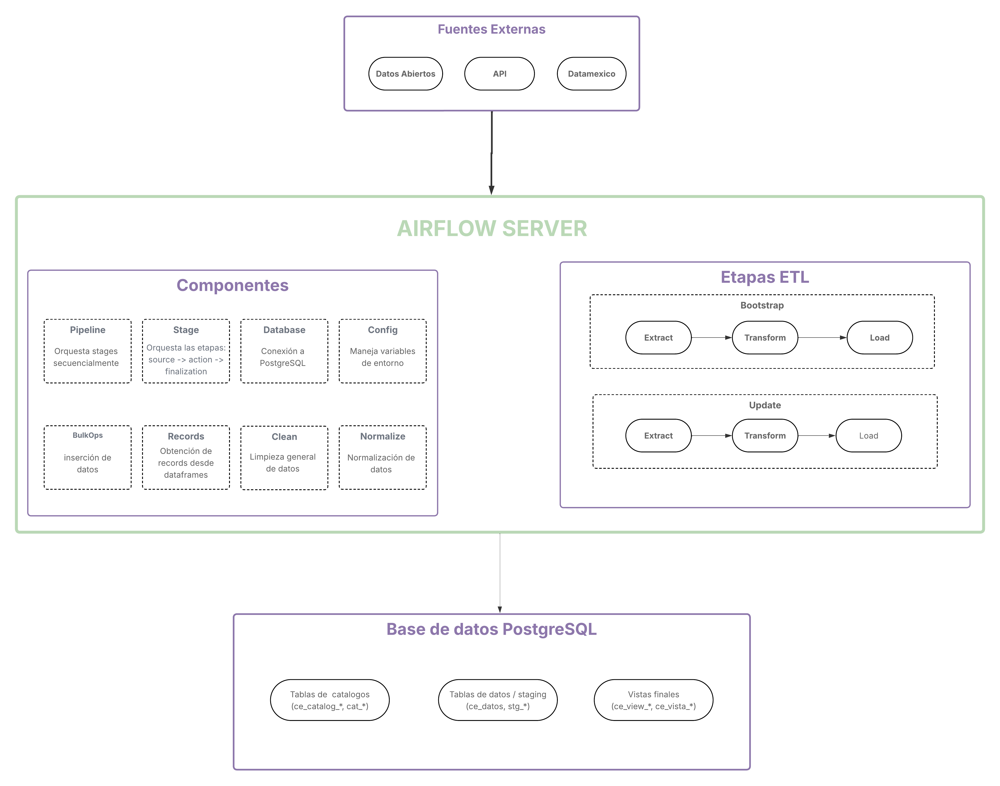

<div align="center">

#  ETL SIEEJ
### Sistema de Información Estratégica del Estado de Jalisco
**Instituto de Información Estadística y Geográfica de Jalisco**


<br/>


</div>

---

## 📋 Descripción

Sistema de **ETL (Extract, Transform, Load)** para el procesamiento automatizado de datos del SIEEJ usando **Apache Airflow**. Cada pipeline descarga datos de fuentes públicas, los transforma siguiendo reglas de negocio específicas y los carga en **PostgreSQL** para su análisis y consumo.

Cada pipeline opera en dos modos:
<div align="center">

| Modo | Descripción | Cuándo usar |
|:----:|:------------|:-----------:|
| **`bootstrap`** | Carga inicial completa | Primera carga o reconstrucción total |
| **`update`** | Carga incremental por schedule | Sincronización periódica con la fuente |

</div>

---

## 🛠️ Stack de Tecnologías

<div align="center">

| Tecnología | Versión | Rol en el proyecto |
|:-----------|:--------|:-------------------|
|  | 2.x | Orquestación y scheduling de pipelines |
|  | 3.12 | Lógica ETL, transformaciones y carga |
|  | 17 + PostGIS | Base de datos principal |
|  | ≥ 20.10 | Contenedores y entorno reproducible |
|  | Latest | Versionado y migraciones de esquema |
|  | 2.x | ORM y connection pooling |
|  | 2.x | Transformación de DataFrames |
|  | 2.x | Configuración y validación |
|  | Latest | Task runner del proyecto |

</div>

---

## 🏗️ Arquitectura



---

## 📁 Estructura del Proyecto

```
ETL-SIEEJ/
│
├── 📄 compose.yaml              # Docker Compose para Airflow completo
├── 🐳 Dockerfile                # Imagen personalizada (Chrome + deps)
├── ⚡ justfile                  # Task runner - ejecuta `just` para ver comandos
├── 📦 requirements.txt          # Dependencias Python
│
├── core/                        # 🧠 Núcleo del sistema ETL
│   ├── config.py                # BaseConfig con pydantic-settings
│   ├── db.py                    # Clase Database (SQLAlchemy engine + sessions)
│   ├── pipeline.py              # Orquestador de stages
│   ├── utils/                   # Herramientas compartidas (bulk_ops, clean, normalize)
│   └── pipelines/               # Implementación por fuente de datos
│       ├── stage.py             # Clase abstracta Stage
│       ├── censos_economicos/
│       ├── repd/
│       └── fiscalia/
│
├── dags/                        # 🔁 DAGs de Airflow (uno por pipeline)
├── migrations/                  # 🗄️  Scripts SQL versionados con Flyway
├── data/                        # 📂 Almacenamiento temporal (generado en runtime)
├── logs/                        # 📝 Logs de ejecución (generado en runtime)
├── config/                      # ⚙️  Configuración de Airflow
└── docs/                        # 📚 Documentación del proyecto
```

---

## 🐳 Levantar el Proyecto

> 💡 Para ejecutar pipelines **localmente** sin Docker, consulta la [Guía de nuevo flujo](docs/nuevo_flujo.md).

### Pre-requisitos

1. Docker
2. Just (ver [guía](docs/just.md))
3. Flyway (ver [guía](docs/flyway.md))


### 1. Clonar el repositorio

```bash
git clone https://github.com/iieg-oficial/ETL-SIEEJ.git
cd ETL-SIEEJ
```

### 2.  Generar el archivo `.env`

Airflow requiere el UID del usuario del sistema operativo para los contenedores:

```bash
# Linux / macOS
echo "AIRFLOW_UID=$(id -u)" > .env

# Windows (PowerShell)
echo "AIRFLOW_UID=50000" > .env
```

> ⚠️ **Importante:** En modo Docker, las variables de conexión a BD del pipeline deben usar `host.docker.internal` en lugar de `localhost`.

### 3. Inicializar Airflow

Solo la **primera vez**:

```bash
docker compose up airflow-init
```

Esperar el mensaje:
```
airflow-init  | Admin user airflow created
```

### 4. Levantar los servicios

```bash
just up
```

Esto construye la imagen y levanta todos los servicios en background. Servicios disponibles:
<div align="center">

| Servicio | Descripción | Puerto |
|:---------|:------------|:------|
| `airflow-apiserver` | Interfaz web | **8080** |
| `airflow-scheduler` | Programador de tareas | - |
| `airflow-worker` | Ejecutor Celery | - |
| `airflow-triggerer` | Gestor de triggers | - |
| `airflow-dag-processor` | Procesador de DAGs | - |
| `postgres` | Metadatos de Airflow | - |
| `redis` | Cola de mensajes | - |
</div>

### 5. Acceder a la interfaz

```
http://localhost:8080
# usuario: airflow
# contraseña: airflow
```

---

## 📚 Documentación


| Guía | Descripción |
|:----|:------------|
| [🤝 Contribuir al proyecto](CONTRIBUTING.md) | Flujo issue → PR, convenciones de commits, labels y board |
| [🆕 Guía de nuevo flujo](docs/nuevo_flujo.md). | Tipos, scopes, ejemplos y git hook de validación |
| [⚙️ Guía de Just](docs/just.md) | Herramienta de comandos para automatizar funciones del sistema |
| [🗄️ Guía de Flyway](docs/flyway.md) | Migraciones de esquema: setup, comandos y convenciones |
| [📋 Convención de commits](docs/convencion-commits.md) | Tipos, scopes, ejemplos y git hook de validación |


---

<div align="center">

<sub>Hecho con 💜 por el equipo de datos del IIEG Jalisco</sub>

<br/>

</div>
