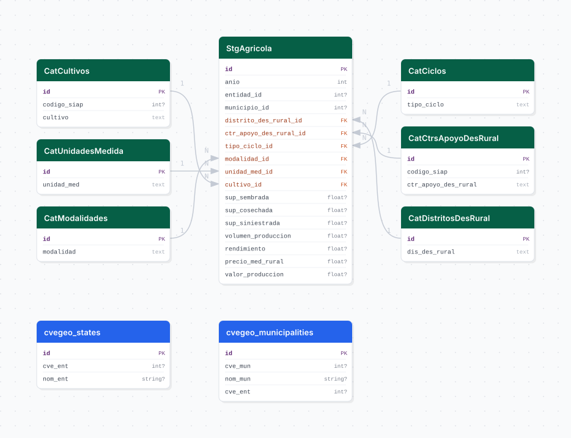

# agropecuario_siap

## Descripción general

Pipeline ETL del Sistema de Información Agroalimentaria y Pesquera (SIAP) de la Secretaría de Agricultura y Desarrollo Rural. Contiene datos anuales de producción agrícola a nivel municipal y distrital para México, incluyendo superficies sembradas, cosechadas, volumen de producción, rendimiento y valor por cultivo desde 2003.

## Fuente general

https://www.gob.mx/siap

## Fuente específica

```shell
SIAP_URL=https://nube.agricultura.gob.mx/index.php?view=10AE434F-A2158368-A120BC5A-EDF4AFAA&ANIO={anio}
```

## Características de los datos

| Característica | Valor |
|---|---|
| Última fecha disponible | `2024` |
| Frecuencia de actualización | Anual |
| Desagregación | Nacional, Estatal, Municipal |
| ¿Tiene update? | Sí |
| Update | Automático |

## Diagrama de entidad relación



## Diccionario de variables

### stg_agricola

| variable | descripción |
|---|---|
| `anio` | Año de la campaña agrícola |
| `distrito_des_rural_id` | FK al distrito de desarrollo rural |
| `ctr_apoyo_des_rural_id` | FK al centro de apoyo al desarrollo rural |
| `tipo_ciclo_id` | FK al ciclo agrícola (Primavera-Verano, Otoño-Invierno, etc.) |
| `modalidad_id` | FK a la modalidad (Riego, Temporal) |
| `unidad_med_id` | FK a la unidad de medida del cultivo |
| `cultivo_id` | FK al cultivo producido |
| `sup_sembrada` | Superficie sembrada (ha) |
| `sup_cosechada` | Superficie cosechada (ha) |
| `sup_siniestrada` | Superficie siniestrada (ha) |
| `volumen_produccion` | Volumen de producción en la unidad de medida registrada |
| `rendimiento` | Rendimiento por hectárea |
| `precio_med_rural` | Precio medio rural ($/ton) |
| `valor_produccion` | Valor de producción (miles de pesos) |

## Migraciones

| migración | descripción |
|---|---|
| `V1__foreign_tables.sql` | FDW hacia la base `cvegeo` para vínculos geográficos |
| `V2__catalogs_agropecuario_siap.sql` | Catálogos de cultivos, ciclos, modalidades, unidades de medida y distritos |
| `V3__tables_agropecuario_siap.sql` | Tabla principal `stg_agricola` |
| `V4__views_agropecuario_siap.sql` | Vistas analíticas desnormalizadas |

## Variables de entorno

| variable | descripción |
|---|---|
| `SIAP_URL` | URL con parámetro `{anio}` para descargar el CSV de cada año |
| `START_DATE` | Año inicial del bootstrap (ej. `2003`) |
| `END_DATE` | Año final del bootstrap (ej. `2024`) |
| `CHUNK_SIZE` | Tamaño de lote para inserción masiva |

## Notas metodológicas

### Extract

Descarga un CSV por año desde la URL del SIAP, iterando desde `START_DATE` hasta `END_DATE`. El archivo se escribe en el directorio de trabajo local antes de pasar a transform.

### Transform

Normaliza texto, renombra columnas según el mapa de constantes, extrae catálogos dinámicamente (cultivos, ciclos, modalidades, unidades) y resuelve los IDs foráneos correspondientes.

### Load

Inserta los catálogos nuevos con `insert_records` y carga los registros anuales con `bulk_insert` en `stg_agricola` (append-only por año).

## Ejecución

**Bootstrap** (carga inicial desde 2003):

```shell
just flyway-migrate agropecuario_siap
conda run -n etl python -m core.pipelines.agropecuario_siap bootstrap
```

**Update anual** (DAG `etl_agropecuario_siap_update`, schedule `@yearly`):

```shell
conda run -n etl python -m core.pipelines.agropecuario_siap update
```

## Notas adicionales

Los datos cubren todos los estados de México; el pipeline no filtra a Jalisco para permitir análisis comparativos nacionales. Los archivos CSV del SIAP pueden variar de formato entre años; el pipeline incluye mapeos de columnas por rango de año.
