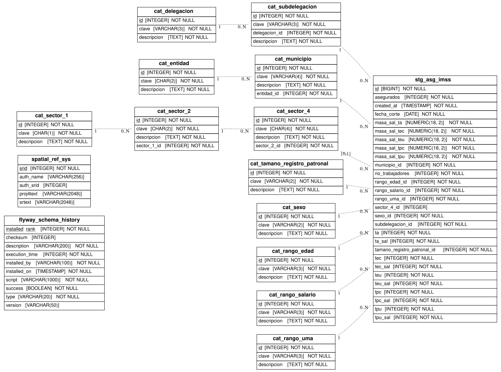

# asg_imss

## Descripción general

Pipeline ETL de Asegurados, Salarios y Grupos de cotización del IMSS. Descarga datos mensuales desde el portal de datos abiertos del IMSS con 12 catálogos normalizados (delegaciones, subdelegaciones, entidades, municipios, sectores económicos, tamaños de registro patronal, sexo, rangos de edad, salario y UMA) y una tabla de hechos con registros patronales filtrados a Jalisco desde enero de 2015.

## Fuente general

https://datos.imss.gob.mx

## Fuente específica

```shell
ASG_IMSS_CATALOG_URL=http://datos.imss.gob.mx/sites/default/files/diccionario_de_datos_1.xlsx
ASG_IMSS_DATA_URL=http://datos.imss.gob.mx/sites/default/files/asg-{date}.csv
```

## Características de los datos

| Característica | Valor |
|---|---|
| Última fecha disponible | `2024-10` |
| Frecuencia de actualización | Mensual |
| Desagregación | Municipal |
| ¿Tiene update? | Sí |
| Update | Automático |

## Diagrama de entidad relación



## Diccionario de variables

### stg_asg_imss

| variable | descripción |
|---|---|
| `fecha_corte` | Último día del mes al que corresponde el registro |
| `subdelegacion_id` | FK a subdelegación IMSS |
| `municipio_id` | FK a municipio de registro patronal |
| `sector_4_id` | FK a sector económico (4 dígitos SCIAN) |
| `tamano_registro_patronal_id` | FK a tamaño del registro patronal |
| `sexo_id` | FK a sexo del asegurado |
| `rango_edad_id` | FK a rango de edad |
| `rango_salario_id` | FK a rango salarial |
| `rango_uma_id` | FK a rango en UMAs |
| `asegurados` | Total de asegurados en el patrón |
| `ta` | Trabajadores asegurados totales |
| `teu` | Trabajadores eventuales urbanos |
| `tec` | Trabajadores eventuales del campo |
| `tpu` | Trabajadores permanentes urbanos |
| `tpc` | Trabajadores permanentes del campo |
| `ta_sal` | Suma de salarios de trabajadores asegurados totales |
| `masa_sal_ta` | Masa salarial de trabajadores asegurados totales |

## Migraciones

| migración | descripción |
|---|---|
| `V1__catalogs_asg_imss.sql` | Catálogos del pipeline (delegaciones, sectores, sexo, edades, salarios, UMA) |
| `V2__table_asg_imss.sql` | Tabla principal `stg_asg_imss` |
| `V3__view_asg_imss.sql` | Vista `vw_asg_imss` desnormalizada |
| `V4__cvegeo_link_asg_imss.sql` | FDW hacia `cvegeo` y enriquecimiento geográfico de la vista |

## Variables de entorno

| variable | descripción |
|---|---|
| `ASG_IMSS_CATALOG_URL` | URL del diccionario de datos IMSS (XLSX con catálogos) |
| `ASG_IMSS_DATA_URL` | URL de datos con template `{date}` (ej. `asg-2024-01-31.csv`) |
| `ASG_IMSS_DATA_START_DATE` | Fecha de inicio del bootstrap (ej. `2015-01-31`) |
| `ASG_IMSS_DATA_END_DATE` | Fecha de fin del bootstrap (vacío = fecha actual) |
| `BATCH_SIZE` | Tamaño de lote para inserción |
| `MAX_RETRIES` | Número de reintentos de descarga |
| `TIMEOUT` | Timeout HTTP en segundos |

## Notas metodológicas

### Extract

Descarga el XLSX de catálogos desde `ASG_IMSS_CATALOG_URL` y los CSVs mensuales desde `ASG_IMSS_DATA_URL` iterando por rango de fechas. Utiliza reintentos configurables ante fallos de red.

### Transform

Normaliza texto de catálogos, filtra registros a Jalisco por delegación, construye el mapa de IDs foráneos y genera los DataFrames listos para carga.

### Load

Upsert de catálogos con `insert_records` e inserción masiva de registros mensuales con `bulk_insert` en `stg_asg_imss` (append-only).

## Ejecución

**Bootstrap** (historial desde enero 2015):

```shell
just flyway-migrate asg_imss
conda run -n etl python -m core.pipelines.asg_imss bootstrap
```

**Update mensual** (DAG `etl_asg_imss_update`, cron `0 12 10 * *`):

```shell
conda run -n etl python -m core.pipelines.asg_imss update
```

## Notas adicionales

El bootstrap cubre desde enero de 2015 y puede tardar varias horas. Ajustar `BATCH_SIZE` y `TIMEOUT` según la velocidad de la conexión. El IMSS publica los datos de cada mes durante la primera semana del mes siguiente; el DAG de actualización se ejecuta el día 10.
