# Pipeline: Censo de Población

Pipeline ETL para datos de población y vivienda de Jalisco provenientes de los censos e intercensal del INEGI.

## Fuentes de datos

| Fuente | Tipo | Nivel geográfico |
|---|---|---|
| Censo de Población y Vivienda 2010 | ZIP → CSV (ITER) | Localidad |
| Encuesta Intercensal 2015 | XLS | Municipio |
| Censo de Población y Vivienda 2020 | ZIP → CSV (ITER) | Localidad |

## Esquema de base de datos

## Flujo del pipeline

### Extract
Descarga las 3 fuentes y selecciona solo las columnas necesarias. Usa caché en pkl para evitar re-descargas.

### Transform
- **2010 / 2020**: filtra `loc` ∈ {0, 9998, 9999}, reemplaza `*` por null, convierte numéricos, calcula `cve_geo_id` como `localidad_id`, construye catálogo de `localidades`.
- **2015**: filtra filas con estimador `"Valor"`, extrae IDs de municipio desde el string (`"001 Acatic" → 1`), pivota por sexo para obtener columnas `total`, `total_hombres`, `total_mujeres`.

### Load
1. Inserta `fuentes` y `localidades` con `ON CONFLICT DO NOTHING`
2. `bulk_insert` de `poblacion` (excluye columna `id` SERIAL)

## Periodicidad

Bootstrap único bajo demanda. Sin actualizaciones (los censos son cada 10 años).
