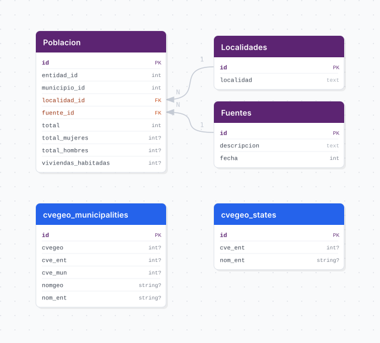

# censo_poblacion

## Descripción general

Pipeline ETL del Censo de Población y Vivienda del INEGI. Integra los datos de población a nivel localidad para los levantamientos de 2010 (ITER), 2015 (Encuesta Intercensal) y 2020 (ITER), almacenando población total, por sexo y viviendas habitadas por municipio y localidad en Jalisco.

## Fuente general

https://www.inegi.org.mx/programas/ccpv/

## Fuente específica

```shell
CENSO_URL_2010=https://www.inegi.org.mx/contenidos/programas/ccpv/2010/datosabiertos/iter_14_2010_csv.zip
CENSO_URL_2015=https://www.inegi.org.mx/contenidos/programas/intercensal/2015/tabulados/01_poblacion_jal.xls
CENSO_URL_2020=https://www.inegi.org.mx/contenidos/programas/ccpv/2020/microdatos/iter/iter_14_2020_csv.zip
```

## Características de los datos

| Característica | Valor |
|---|---|
| Última fecha disponible | `2020` |
| Frecuencia de actualización | Decenal |
| Desagregación | Estatal, Municipal, Localidad |
| ¿Tiene update? | No |
| Update | No aplica |

## Diagrama de entidad relación



## Diccionario de variables

### poblacion

| variable | descripción |
|---|---|
| `entidad_id` | Clave de entidad federativa (14 = Jalisco) |
| `municipio_id` | Clave del municipio |
| `localidad_id` | FK a catálogo de localidades (nulo a nivel municipio) |
| `fuente_id` | FK a catálogo de fuentes (censo 2010, 2015, 2020) |
| `total` | Población total |
| `total_mujeres` | Total de mujeres |
| `total_hombres` | Total de hombres |
| `viviendas_habitadas` | Total de viviendas habitadas |

## Migraciones

| migración | descripción |
|---|---|
| `V1__foreign_tables.sql` | FDW hacia la base `cvegeo` |
| `V2__catalogs_censo_poblacion.sql` | Catálogos de fuentes y localidades |
| `V3__table_poblacion.sql` | Tabla principal `poblacion` |
| `V4__views_censo_poblacion.sql` | Vistas analíticas |

## Variables de entorno

| variable | descripción |
|---|---|
| `CENSO_URL_2010` | URL del ZIP ITER 2010 de Jalisco |
| `CENSO_URL_2015` | URL del XLS de la Encuesta Intercensal 2015 |
| `CENSO_URL_2020` | URL del ZIP ITER 2020 de Jalisco |

## Notas metodológicas

### Extract

Descarga los tres archivos (ZIP 2010, XLS 2015, ZIP 2020) desde las URLs configuradas en variables de entorno.

### Transform

Descomprime los ZIPs, lee el CSV/XLS de cada año, selecciona y renombra las columnas relevantes, estandariza las claves geográficas y agrega el identificador de fuente correspondiente.

### Load

Inserción única (bootstrap-only) de registros en la tabla `poblacion` mediante `insert_records`.

## Ejecución

**Bootstrap** (única ejecución):

```shell
just flyway-migrate censo_poblacion
conda run -n etl python -m core.pipelines.censo_poblacion bootstrap
```

No tiene flujo update.

## Notas adicionales

Cada año de censo tiene un formato de archivo diferente; el pipeline adapta dinámicamente el mapeo de columnas. Solo cubre Jalisco (clave entidad 14). Para incorporar el Censo 2030 será necesario agregar `CENSO_URL_2030` y su mapeo de columnas.
