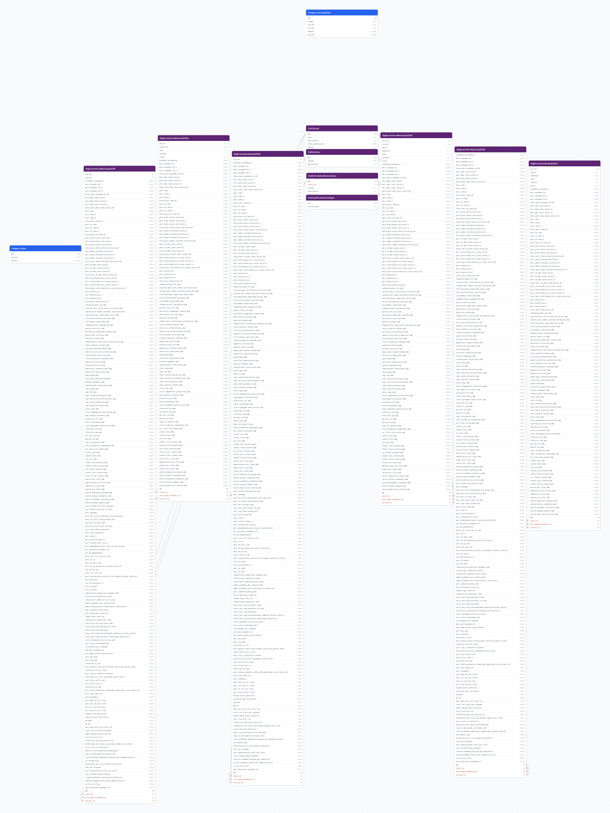

# censos_economicos

## Descripción general

Pipeline ETL de los Censos Económicos del INEGI 2019 y 2024. Contiene indicadores de actividad económica a nivel nacional y estatal por actividad SCIAN, incluyendo unidades económicas, personal ocupado (total, hombres, mujeres), horas trabajadas, personal remunerado y no remunerado, y valor de la producción.

## Fuente general

https://www.inegi.org.mx/programas/ce/

## Fuente específica

Los archivos se descargan manualmente desde INEGI en formato ZIP con CSVs por entidad. Las constantes con las URLs de descarga están definidas en `core/pipelines/censos_economicos/constants.py`.

## Características de los datos

| Característica | Valor |
|---|---|
| Última fecha disponible | `2024` |
| Frecuencia de actualización | Quinquenal |
| Desagregación | Nacional, Estatal |
| ¿Tiene update? | No |
| Update | No aplica |

## Diagrama de entidad relación



## Diccionario de variables

### stg_economico_* (por año de censo)

| variable | descripción |
|---|---|
| `censo_id` | FK al catálogo de censos (2019, 2024) |
| `actividad_economica_id` | FK a actividad económica SCIAN |
| `estrato_id` | FK a catálogo de estratos de personal |
| `unidades_economicas` | Total de unidades económicas |
| `pers_ocupado_tot` | Personal ocupado total |
| `pers_ocupado_tot_h` | Personal ocupado hombres |
| `pers_ocupado_tot_m` | Personal ocupado mujeres |
| `pers_remu` | Personal remunerado |
| `pers_no_remu` | Personal no remunerado |
| `valor_agregado_censal_bruto` | Valor agregado censal bruto |

## Migraciones

| migración | descripción |
|---|---|
| `V1__foreign_tables.sql` | FDW hacia la base `cvegeo` |
| `V2__catalogs_censos_economicos.sql` | Catálogos de censos, actividades económicas SCIAN y estratos |
| `V3__tables_censos_economicos.sql` | Tablas de staging por año de censo |
| `V4__views_censos_economicos.sql` | Vistas analíticas desnormalizadas |

## Variables de entorno

| variable | descripción |
|---|---|
| `PIPELINE_NAME` | Nombre del pipeline (`censos_economicos`) |
| `BULK_SIZE` | Tamaño de lote para inserción masiva (ej. `30000`) |

## Notas metodológicas

### Extract

Descarga los ZIPs de datos abiertos del INEGI por entidad federativa. Los archivos se descomprimen localmente antes de pasar a la fase de transformación.

### Transform

Concatena los CSVs de todas las entidades, normaliza los códigos SCIAN y estratos, renombra columnas según el mapa de constantes y crea catálogos dinámicamente a partir de los datos.

### Load

Inserta catálogos con `insert_records` y carga los registros por año de censo en tablas separadas mediante `bulk_insert`.

## Ejecución

**Bootstrap** (única ejecución):

```shell
just flyway-migrate censos_economicos
conda run -n etl python -m core.pipelines.censos_economicos bootstrap
```

No tiene flujo update.

## Notas adicionales

Cada nuevo levantamiento censal (2029, etc.) requerirá agregar una nueva tabla de staging, actualizar las constantes con las URLs de descarga y ejecutar nuevamente el bootstrap. Los datos nacionales y por entidad están en archivos separados.
