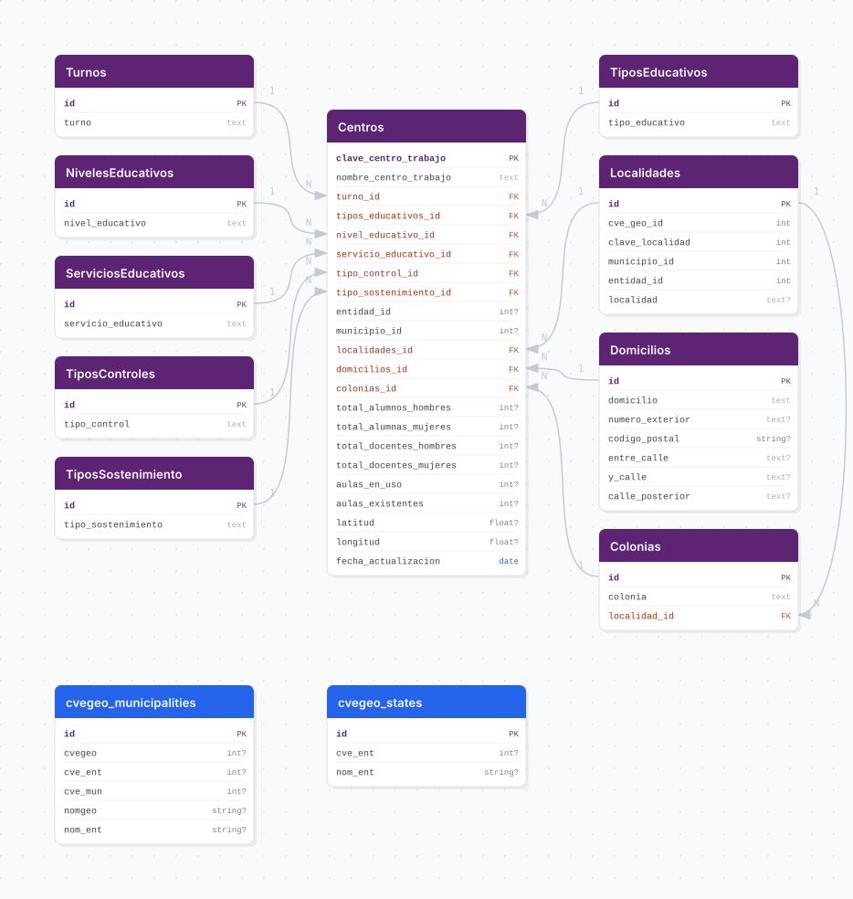

# centros_educativos

## Descripción general

Pipeline ETL del Sistema de Información y Gestión Educativa (SIGED) de la SEP. Extrae el catálogo de centros de trabajo educativos de Jalisco a través de la API del SIGED, incluyendo datos de tipo de servicio, nivel, modalidad, domicilio y estadísticas de alumnos y docentes.

## Fuente general

https://www.siged.sep.gob.mx

## Fuente específica

```shell
CENTROS_EDUCATIVOS_URL=https://api.siged.sep.gob.mx/CoreServices/servicios/escuela/selectCcts/cct=&turno=&tipoedu=&nivel=&subnivel=&control=&subcontrol=&entidad={}&municipio=&localidad=
```

## Características de los datos

| Característica | Valor |
|---|---|
| Última fecha disponible | `2025` |
| Frecuencia de actualización | Anual |
| Desagregación | Estatal, Municipal, Localidad |
| ¿Tiene update? | No |
| Update | No aplica |

## Diagrama de entidad relación



## Diccionario de variables

### centros

| variable | descripción |
|---|---|
| `clave_centro_trabajo` | Clave de centro de trabajo (PK — CCT) |
| `nombre_centro_trabajo` | Nombre oficial del centro educativo |
| `turno_id` | FK a turno escolar |
| `tipos_educativos_id` | FK a tipo educativo |
| `nivel_educativo_id` | FK a nivel educativo |
| `servicio_educativo_id` | FK a servicio educativo |
| `tipo_control_id` | FK a tipo de control (público/privado) |
| `tipo_sostenimiento_id` | FK a tipo de sostenimiento |
| `localidades_id` | FK a localidad |
| `domicilios_id` | FK a domicilio |
| `colonias_id` | FK a colonia |
| `total_alumnos_hombres` | Total de alumnos hombres |
| `total_alumnas_mujeres` | Total de alumnas mujeres |
| `total_docentes_hombres` | Total de docentes hombres |
| `total_docentes_mujeres` | Total de docentes mujeres |
| `aulas_en_uso` | Número de aulas en uso |
| `aulas_existentes` | Número de aulas existentes |
| `latitud` | Latitud geográfica |
| `longitud` | Longitud geográfica |
| `fecha_actualizacion` | Fecha de la consulta a la API |

## Migraciones

| migración | descripción |
|---|---|
| `V1__foreign_tables.sql` | FDW hacia la base `cvegeo` |
| `V2__catalogs_centros_educativos.sql` | Catálogos de turnos, niveles, tipos y sostenimientos |
| `V3__table_centros.sql` | Tabla principal `centros` |
| `V4__view_centros_educativos.sql` | Vista analítica desnormalizada |

## Variables de entorno

| variable | descripción |
|---|---|
| `CENTROS_EDUCATIVOS_URL` | URL de la API del SIGED con parámetro de entidad `{}` |

## Notas metodológicas

### Extract

Realiza peticiones a la API del SIGED por municipio de Jalisco usando Selenium para interactuar con el portal. Los resultados se almacenan localmente.

### Transform

Normaliza texto (titlecase, elimina nulos), extrae catálogos de turnos, niveles y tipos, resuelve domicilios y colonias, y mapea claves geográficas.

### Load

Upsert en la tabla `centros` usando la clave de centro de trabajo como PK. Los catálogos se sincronizan con `insert_records`.

## Ejecución

**Bootstrap** (bajo demanda):

```shell
just flyway-migrate centros_educativos
conda run -n etl python -m core.pipelines.centros_educativos bootstrap
```

No tiene flujo update automatizado.

## Notas adicionales

La API del SIGED puede presentar inestabilidad; el pipeline implementa reintentos. El bootstrap consume la API por municipio, lo que puede tomar varias horas para los 125 municipios de Jalisco.
