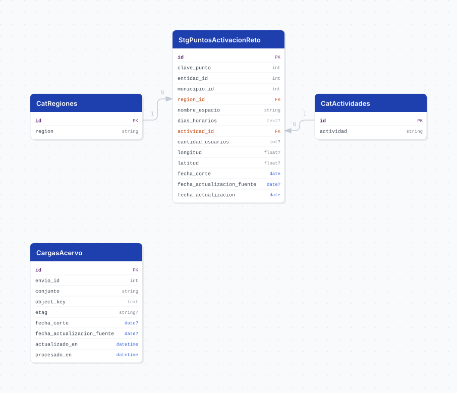

# code

> Pipeline ETL para los puntos de activación del programa Reto, Reactivación para Todas y Todos, que el Consejo Estatal para el Fomento Deportivo (CODE) entrega por el formulario de datasets del SIEEJ.

---

## Descripción general

Como `secretaria_educacion`, este pipeline se organiza por **dependencia**: CODE sube un archivo a Acervo mediante el formulario del SIEEJ y el pipeline lo descubre, lo transforma y lo carga.

El conjunto describe los espacios donde se realizan actividades físicas del programa Reto: región, municipio, nombre del espacio, días y horarios, actividad, cantidad de usuarios y ubicación geográfica. La primera carga trae 112 puntos en 52 municipios, con corte al `2026-07-01`.

El prefijo del formulario concentra las cargas de **todas** las dependencias, así que cada una es un pipeline distinto y este filtra por el nombre de la suya.

## Fuente general

Acervo, el almacenamiento de objetos del IIEG, con API compatible con S3.

## Fuente específica

```shell
ACERVO_FORM_PREFIX=<prefijo del formulario dentro del bucket>
ACERVO_BUCKET=sieej
```

Ambos se configuran en `core/acervo/.env`, no en el `.env` de este pipeline. Ver [`core/acervo/README.md`](../../acervo/README.md) para el detalle del acceso.

## Características de los datos

| Característica | Valor |
|---|---|
| Última fecha disponible | `2026-07-01` |
| Frecuencia de actualización | Por confirmar con CODE (el DAG corre mensual) |
| Desagregación | Punto de activación (espacio), con municipio y región |
| Cobertura | 52 municipios de Jalisco en el primer corte |
| ¿Tiene update? | Sí |
| Update | Automático (`0 12 5 * *`) |
| Estrategia de carga | Recarga por corte: `delete` de los `fecha_corte` del archivo + `bulk_insert` |

La recarga es por corte y no un upsert fila a fila porque CODE entrega el conjunto completo en cada envío.

## Diagrama de entidad relación



## Diccionario de variables

### stg_puntos_activacion_reto

| variable | descripción |
|---|---|
| `clave_punto` | Identificador del punto en el archivo de origen (`id`). Tiene huecos y no se garantiza estable entre cortes |
| `entidad_id` | Clave de la entidad. Siempre 14 (Jalisco). Referencia lógica a `cvegeo_states.cve_ent` |
| `municipio_id` | Clave del municipio (`clave_agem` del origen, sin relleno de ceros). Referencia lógica a `cvegeo_municipalities.cve_mun`, sin FK |
| `region_id` | Región del estado, en `cat_regiones` |
| `nombre_espacio` | Nombre del espacio donde se realiza la actividad |
| `dias_horarios` | Días y horarios en texto libre, tal como los captura CODE. No se interpreta |
| `actividad_id` | Actividad que se realiza, en `cat_actividades`. Nula cuando el origen no la reporta |
| `cantidad_usuarios` | Cantidad de usuarios reportada. Ver la nota sobre su interpretación |
| `longitud`, `latitud` | Ubicación en grados decimales (EPSG:4326), columnas `x` e `y` del origen. Nulas si el origen no las trae |
| `fecha_corte` | Fecha a la que corresponden los datos, tomada de la columna `fecha` del archivo |
| `fecha_actualizacion_fuente` | Fecha del envío en el formulario (`actualizado_en`) |
| `fecha_actualizacion` | Fecha en que el ETL cargó el registro |

Restricción única: `(fecha_corte, municipio_id, nombre_espacio)`.

### cargas_acervo

Control de envíos procesados: da el watermark del incremental.

| variable | descripción |
|---|---|
| `envio_id` | Identificador del envío en el formulario |
| `conjunto` | Nombre del conjunto tal como lo capturó la dependencia |
| `object_key` | Ruta del archivo dentro del bucket |
| `etag` | MD5 del contenido. Si coincide con la carga anterior, el archivo no cambió. No es MD5 en subidas multiparte |
| `actualizado_en` | Última modificación del envío. Es el watermark del incremental |
| `procesado_en` | Momento en que el ETL procesó el envío |

### Catálogos

| tabla | contenido |
|---|---|
| `cat_actividades` | 21 actividades. El id es el código del origen (hoja `cat_actividad`) |
| `cat_regiones` | 13 regiones del estado, ya normalizadas. El id es generado |

## Migraciones

| migración | descripción |
|---|---|
| `V1__foreign_tables.sql` | Servidor FDW y foreign tables `cvegeo_states` y `cvegeo_municipalities` |
| `V2__catalogs_code.sql` | Los 2 catálogos |
| `V3__tables_code.sql` | La tabla de hechos y la de control |
| `V4__views_code.sql` | La vista `vw_puntos_activacion_reto` |
| `V5__comments_code.sql` | `COMMENT ON` de todas las tablas, la vista y sus columnas |

## Vistas

| vista | alcance |
|---|---|
| `vw_puntos_activacion_reto` | Puntos con región y actividad resueltas; entidad y municipio desde cvegeo; `longitud` y `latitud` directas de la tabla |

## Variables de entorno

| variable | descripción |
|---|---|
| `DB_USER`, `DB_PASSWORD`, `DB_HOST`, `DB_PORT`, `DB_NAME` | Conexión a la base del pipeline |
| `DEPENDENCIA` | Nombre de la dependencia a filtrar en el formulario |

Las credenciales de Acervo viven en `core/acervo/.env`. Los placeholders FDW del `flyway.conf` no se declaran aquí: la receta `just flyway-config` los resuelve desde `migrations/cvegeo/.env`.

## Notas metodológicas

### Extract

Lista los envíos de la dependencia con `list_uploads(settings.DEPENDENCIA, field=UPLOAD_FIELD)`. CODE adjuntó sus datos en el campo del **documento metodológico** del formulario y no en el de carga de datos, por eso el campo es un parámetro de `list_uploads` y el nombre vive en `constants.py`.

El envío es un ZIP con dos archivos: `code_catalogo_actividad_reto.xlsx`, que es la fuente, y `reto.gpkg`, que se ignora. La hoja `base` trae los puntos y la hoja `cat_actividad` el catálogo de actividades.

Cada envío trae el conjunto completo, así que solo se procesa el más reciente. En modo `update` se descarta lo anterior al watermark (`actualizado_en` del último envío procesado) y los envíos cuyo `etag` ya fue cargado. Un `update` sin nada nuevo termina sin error y sin tocar la base; un `bootstrap` sin envíos sí falla.

### Transform

- Descarta las filas completamente vacías que arrastra el xlsx.
- Limpia las regiones, que llegan con espacios sobrantes y variantes de mayúsculas, a title case con acentos restituidos y preposiciones en minúscula (`Ciénega`, `Costa-Sierra Occidental`, `Sierra de Amula`).
- No guarda el nombre del municipio: se resuelve en la vista contra cvegeo. Tampoco guarda la columna `actividad` en texto libre, porque la actividad sale del catálogo.
- Renombra `x` a `longitud` e `y` a `latitud`, como el resto de pipelines con puntos; no se construye geometría.
- **El corte sale de los datos.** El formulario de CODE no trae fecha de corte ni de actualización, así que `fecha_corte` es la columna `fecha` de cada fila y `fecha_actualizacion_fuente` es la fecha del envío.
- Construye los catálogos: las actividades con el id del origen y las regiones desde los valores ya limpios.

### Load

Carga `cat_actividades` con `upsert_records` por `id`, porque `insert_records` usa `ON CONFLICT DO NOTHING` y dejaría congelada una etiqueta que CODE corrigiera. `cat_regiones` usa `insert_records` por `region`.

Recarga la tabla por corte: borra las filas de los `fecha_corte` presentes en el archivo y las reinserta, así correr dos veces no duplica. Al final registra el envío en `cargas_acervo`.

## Ejecución

**Bootstrap** (carga inicial):

```shell
just env-init code
just create-db code
just flyway-config code
just flyway-migrate code
python dags/etl_code.py
```

**Update** (mensual, DAG `etl_code_update`, schedule `0 12 5 * *`):

Arranca desde el watermark de `cargas_acervo`, así que una corrida sin cargas nuevas termina sin tocar la base. Para dispararlo a mano, descomentar `run_update()` en el bloque final del DAG.

## Notas adicionales

- **`cantidad_usuarios` no debe sumarse entre espacios.** Parece ser una cifra por municipio repetida en cada espacio (en el primer corte, 51 de 52 municipios repiten el mismo valor en todos sus espacios). Pendiente de confirmar con CODE antes de agregarla.
- **El campo `municipio` del origen trae prefijos `ZMG`** (por ejemplo `ZMG Zapopan`). No se guarda: el nombre oficial sale de cvegeo con `municipio_id`.
- **Sin llave foránea hacia cvegeo.** `municipio_id` es una referencia lógica; la vista usa el patrón compuesto `cve_mun` + `cve_ent`.
- **El DAG declara una tarea por stage** (`extract >> transform >> load`), de modo que se puede reintentar una sola sin repetir las anteriores. La excepción es reintentar `load` **después** de un run exitoso: su limpieza borra los archivos intermedios, así que hay que reintentar desde `transform`.
- **`conunto_datos`** aparece así, con el error de escritura, en las rutas del origen. No se corrige para no romper la correspondencia con el formulario.
- **El acceso a Acervo requiere red interna.** Para desarrollo local hace falta un túnel; ver [`core/acervo/README.md`](../../acervo/README.md).
