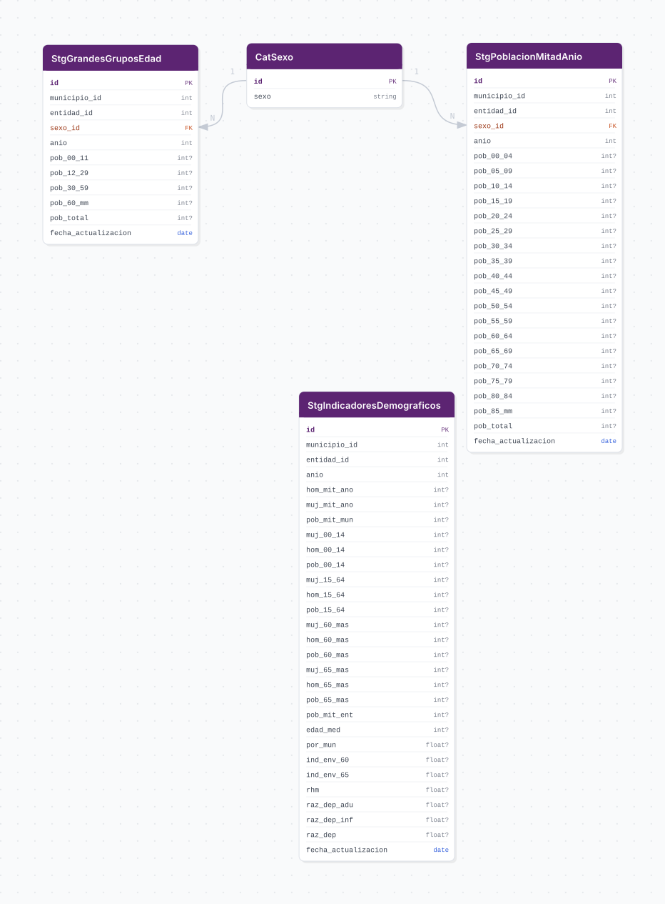

# conapo

## Descripción general

Pipeline ETL para las proyecciones de población municipal de CONAPO (Consejo Nacional de Población) en el estado de Jalisco. Contiene estimaciones anuales de población por grupos de edad quinquenales, grandes grupos de edad e indicadores demográficos diversos, cubriendo el periodo 1990–2040. Los datos están desagregados a nivel municipal y por sexo. Es la fuente base del schema `iieg_gis.demografia` y denominador de cruce en economía, desarrollo social y gobierno.

## Fuente general

https://www.gob.mx/conapo

## Fuente específica

```shell
CONAPO_URL=https://conapo.segob.gob.mx/work/models/CONAPO/pry23/DBMun/14_Jalisco.zip
```

## Características de los datos

| Característica | Valor |
|---|---|
| Última fecha disponible | `1990–2040` |
| Frecuencia de actualización | Bajo demanda (CONAPO publica aprox. cada quinquenio) |
| Desagregación | Municipal |
| ¿Tiene update? | No |
| Update | N/A |

## Diagrama de entidad relación



## Diccionario de variables

### stg_poblacion_mitad_anio

| variable | descripción |
|---|---|
| `id` | Identificador único autogenerado |
| `municipio_id` | Clave única del municipio (cvegeo) |
| `entidad_id` | Clave de la entidad federativa (Jalisco = 14) |
| `sexo_id` | Referencia al sexo (FK a cat_sexo) |
| `anio` | Año de la proyección (1990–2040) |
| `pob_00_04` | Población de 0 a 4 años |
| `pob_05_09` | Población de 5 a 9 años |
| `pob_10_14` | Población de 10 a 14 años |
| `pob_15_19` | Población de 15 a 19 años |
| `pob_20_24` | Población de 20 a 24 años |
| `pob_25_29` | Población de 25 a 29 años |
| `pob_30_34` | Población de 30 a 34 años |
| `pob_35_39` | Población de 35 a 39 años |
| `pob_40_44` | Población de 40 a 44 años |
| `pob_45_49` | Población de 45 a 49 años |
| `pob_50_54` | Población de 50 a 54 años |
| `pob_55_59` | Población de 55 a 59 años |
| `pob_60_64` | Población de 60 a 64 años |
| `pob_65_69` | Población de 65 a 69 años |
| `pob_70_74` | Población de 70 a 74 años |
| `pob_75_79` | Población de 75 a 79 años |
| `pob_80_84` | Población de 80 a 84 años |
| `pob_85_mm` | Población de 85 años y más |
| `pob_total` | Población total del municipio para ese sexo y año |
| `fecha_actualizacion` | Fecha de actualización del registro |

### stg_grandes_grupos_edad

| variable | descripción |
|---|---|
| `id` | Identificador único autogenerado |
| `municipio_id` | Clave única del municipio (cvegeo) |
| `entidad_id` | Clave de la entidad federativa (Jalisco = 14) |
| `sexo_id` | Referencia al sexo (FK a cat_sexo) |
| `anio` | Año de la proyección (1990–2040) |
| `pob_00_11` | Población de 0 a 11 años (infancia) |
| `pob_12_29` | Población de 12 a 29 años (juventud) |
| `pob_30_59` | Población de 30 a 59 años (adultos en edad productiva) |
| `pob_60_mm` | Población de 60 años y más (adultos mayores) |
| `pob_total` | Población total del municipio para ese sexo y año |
| `fecha_actualizacion` | Fecha de actualización del registro |

### stg_indicadores_demograficos

| variable | descripción |
|---|---|
| `id` | Identificador único autogenerado |
| `municipio_id` | Clave única del municipio (cvegeo) |
| `entidad_id` | Clave de la entidad federativa (Jalisco = 14) |
| `anio` | Año del indicador (1990–2040) |
| `hom_mit_ano` | Población masculina a mitad de año |
| `muj_mit_ano` | Población femenina a mitad de año |
| `pob_mit_mun` | Población total del municipio a mitad de año |
| `muj_00_14` | Población femenina de 0 a 14 años |
| `hom_00_14` | Población masculina de 0 a 14 años |
| `pob_00_14` | Población total de 0 a 14 años |
| `muj_15_64` | Población femenina de 15 a 64 años (edad productiva) |
| `hom_15_64` | Población masculina de 15 a 64 años (edad productiva) |
| `pob_15_64` | Población total de 15 a 64 años (edad productiva) |
| `muj_60_mas` | Población femenina de 60 años y más |
| `hom_60_mas` | Población masculina de 60 años y más |
| `pob_60_mas` | Población total de 60 años y más |
| `muj_65_mas` | Población femenina de 65 años y más |
| `hom_65_mas` | Población masculina de 65 años y más |
| `pob_65_mas` | Población total de 65 años y más |
| `pob_mit_ent` | Población total de la entidad (Jalisco) a mitad de año |
| `edad_med` | Edad mediana de la población del municipio |
| `por_mun` | Porcentaje de la población del municipio respecto a la entidad |
| `ind_env_60` | Índice de envejecimiento (población 60+ / población 0-14 × 100) |
| `ind_env_65` | Índice de envejecimiento (población 65+ / población 0-14 × 100) |
| `rhm` | Razón de hombres masculinos (hombres / mujeres × 100) |
| `raz_dep_adu` | Razón de dependencia adulta (población 60+ / población 15-59 × 100) |
| `raz_dep_inf` | Razón de dependencia infantil (población 0-14 / población 15-64 × 100) |
| `raz_dep` | Razón de dependencia total (población 0-14 + 60+ / población 15-59 × 100) |
| `fecha_actualizacion` | Fecha de actualización del registro |

## Migraciones

| migración | descripción |
|---|---|
| `V1__foreign_tables.sql` | Crea el FDW a la base de datos `cvegeo` para `cvegeo_states` y `cvegeo_municipalities` |
| `V2__catalogs_conapo.sql` | Crea el catálogo `cat_sexo` con valores HOMBRES y MUJERES |
| `V3__tables_conapo.sql` | Crea las 3 tablas de staging: `stg_poblacion_mitad_anio`, `stg_grandes_grupos_edad`, `stg_indicadores_demograficos` |
| `V4__views_conapo.sql` | Crea las 3 vistas de integración con JOIN a `cvegeo` y filtro por Jalisco (`cve_ent = 14`) |
| `V5__comments_conapo.sql` | Agrega comentarios descriptivos a todas las tablas, columnas y vistas |

## Variables de entorno

| variable | descripción |
|---|---|
| `LOG_LEVEL` | Nivel de logging (INFO, DEBUG, etc.) |
| `DB_USER` | Usuario de la base de datos |
| `DB_PASSWORD` | Contraseña de la base de datos |
| `DB_HOST` | Host de la base de datos |
| `DB_PORT` | Puerto de la base de datos |
| `DB_NAME` | Nombre de la base de datos (`conapo`) |
| `FDW_DB_NAME` | Nombre de la BD de cvegeo para el FDW |
| `FDW_DB_HOST` | Host de la BD de cvegeo para el FDW |
| `FDW_DB_PORT` | Puerto de la BD de cvegeo para el FDW |
| `FDW_DB_USER` | Usuario de la BD de cvegeo para el FDW |
| `FDW_DB_PASSWORD` | Contraseña de la BD de cvegeo para el FDW |
| `CONAPO_URL` | URL de descarga directa del ZIP de CONAPO |

## Notas metodológicas

### Extract

Descarga directa del archivo ZIP desde la URL de CONAPO (`CONAPO_URL`). El ZIP contiene una carpeta `14_Jalisco/` con 3 archivos XLSX:
- `1_Grupo_Quinq_14_JL.xlsx` — Población por grupos quinquenales de edad
- `2_Gran_Gedad_14_JL.xlsx` — Población por grandes grupos de edad
- `3_Indicadores_Dem_14_JL.xlsx` — Indicadores demográficos diversos

No requiere credenciales. Se descarga en memoria y se extrae usando `zipfile`. Se cachean los DataFrames como `.pkl` para evitar re-descargas.

### Transform

- Renombrado de columnas a `snake_case` en español usando mapas de `constants.py`
- Conversión de tipos de datos (enteros `Int64` y flotantes)
- Mapeo de la columna `sexo` (HOMBRES/MUJERES) a la FK `cat_sexo.id`
- Renombrado de `cve_mun` a `municipio_id` y `cve_ent` a `entidad_id`
- Limpieza de valores nulos (`N/A`, `NA`, `NaN`, cadenas vacías) usando `list_values_to_null`
- Conversión de `fecha_actualizacion` a tipo `DATE`
- Construcción del catálogo `cat_sexo` a partir de `SEXO_MAP`

### Load

- Inserción del catálogo `cat_sexo` usando `insert_records` con `ON CONFLICT DO NOTHING`
- Inserción masiva de las 3 tablas de staging usando `bulk_insert`
- Sincronización de secuencias autoincrementales con `sync_id_sequence`
- Limpieza automática de archivos temporales (`.pkl`) al finalizar con `cleanup_pipeline_data`
- Modo append-only: no hay lógica de upsert ni SCD

## Ejecución

**Bootstrap** (carga inicial):

```shell
just flyway-migrate conapo
conda run -n etl python -m core.pipelines.conapo bootstrap
```

## Notas adicionales

- El pipeline es **on-demand** (full-replace): CONAPO publica nuevas proyecciones aproximadamente cada quinquenio. No se implementa modo update.
- La fuente es un ZIP con 3 hojas XLSX exclusivamente para Jalisco (entidad 14).
- Se usa FDW a `cvegeo_municipalities` y `cvegeo_states` para resolver nombres de municipios y entidades, sin duplicar datos geográficos.
- Las 3 vistas de integración (`view_poblacion_mitad_anio`, `view_grandes_grupos_edad`, `view_indicadores_demograficos`) filtran por `cve_ent = 14` y hacen JOIN con las tablas foráneas de cvegeo.
- Total de registros en bootstrap: 31,875 (12,750 PMA + 12,750 GGE + 6,375 IDD).
- Este pipeline es prerequisito de `iieg_gis.demografia.*` y de pipelines de economía, desarrollo social y gobierno que usan población como denominador.
