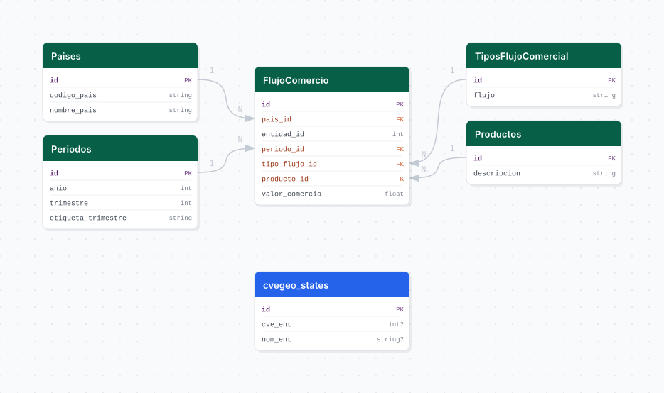

# datamexico

## Descripción general

Pipeline ETL de flujos de comercio exterior de Jalisco vía la API de DataMéxico (SE). Descarga el valor trimestral de importaciones y exportaciones de Jalisco por país y producto (clasificación HS6), disponible desde el primer trimestre de 2020.

## Fuente general

https://www.economia.gob.mx/datamexico

## Fuente específica

```shell
DATAMEXICO_URL=https://www.economia.gob.mx/apidatamexico/tesseract/data.jsonrecords
```

## Características de los datos

| Característica | Valor |
|---|---|
| Última fecha disponible | `2025-Q1` |
| Frecuencia de actualización | Trimestral |
| Desagregación | Estatal |
| ¿Tiene update? | Sí |
| Update | Automático |

## Diagrama de entidad relación



## Diccionario de variables

### flujo_comercio

| variable | descripción |
|---|---|
| `pais_id` | FK a catálogo de países (código ISO-3) |
| `entidad_id` | Clave de entidad federativa (14 = Jalisco) |
| `periodo_id` | FK a catálogo de periodos (año + trimestre) |
| `tipo_flujo_id` | FK a tipo de flujo (Exportación / Importación) |
| `producto_id` | FK a catálogo de productos (código HS6) |
| `valor_comercio` | Valor del flujo comercial (USD) |

## Migraciones

| migración | descripción |
|---|---|
| `V1__foreign_tables.sql` | FDW hacia la base `cvegeo` |
| `V2__catalogs_datamexico.sql` | Catálogos de países, periodos, tipos de flujo y productos HS6 |
| `V3__table_flujo_comercio.sql` | Tabla principal `flujo_comercio` |
| `V4__view_datamexico.sql` | Vista analítica desnormalizada |

## Variables de entorno

| variable | descripción |
|---|---|
| `DATAMEXICO_URL` | Endpoint de la API de DataMéxico |
| `START_QUARTER` | Trimestre inicial del bootstrap (ej. `20201` = Q1 2020) |
| `CHUNK_SIZE` | Tamaño de lote para inserción masiva |

## Notas metodológicas

### Extract

Realiza peticiones paginadas a la API JSON de DataMéxico filtrando por entidad Jalisco y tipo de flujo. Itera desde `START_QUARTER` hasta el trimestre actual.

### Transform

Parsea el JSON de respuesta, normaliza nombres de columnas, extrae catálogos de países y productos, y resuelve IDs foráneos.

### Load

Upsert de catálogos e inserción por lotes en `flujo_comercio` con `bulk_insert`.

## Ejecución

**Bootstrap** (desde Q1 2020):

```shell
just flyway-migrate datamexico
conda run -n etl python -m core.pipelines.datamexico bootstrap
```

**Update trimestral** (DAG `etl_datamexico_update`, cron `0 8 1 */3 *`):

```shell
conda run -n etl python -m core.pipelines.datamexico update
```

## Notas adicionales

La API de DataMéxico puede retornar respuestas parciales; el pipeline maneja paginación automáticamente. Los datos están disponibles aproximadamente 60 días después del cierre del trimestre.
