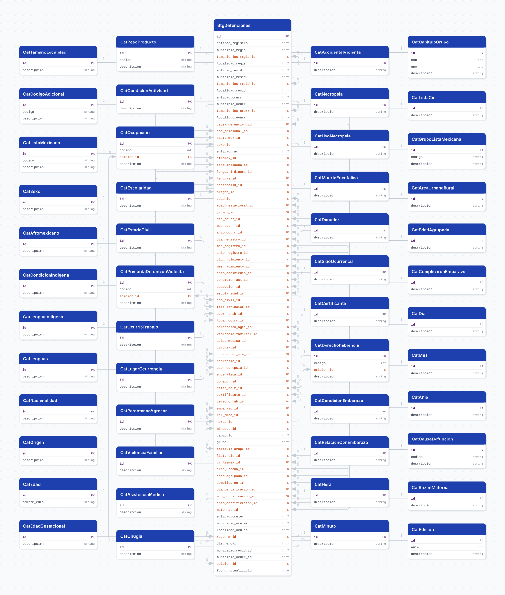

# defunciones

## Descripción general

Registro de defunciones generales de México publicado por la Dirección General de Información en Salud (DGIS) de la Secretaría de Salud, filtrado a residentes de Jalisco (`ent_resid = 14`). Cada fila es una defunción registrada, con su causa (CIE-10 y clasificaciones agregadas), características demográficas y socioeconómicas del fallecido, circunstancias de la muerte y su geografía (registro, residencia y ocurrencia). Se carga desde la edición 2019 en adelante, que es el inicio del esquema de codificación vigente de DGIS.

## Fuente general

http://www.dgis.salud.gob.mx/contenidos/basesdedatos/da_defunciones_gobmx.html

## Fuente específica

Las URLs se descubren automáticamente de la página (no se hardcodean por año). Opcionalmente se puede fijar una edición:

```shell
REGISTRO_URL=http://www.dgis.salud.gob.mx/descargas/datosabiertos/defunciones/registro/DEFUN_2024.zip
CATALOG_URL=http://www.dgis.salud.gob.mx/descargas/datosabiertos/defunciones/catalogos/CATALOGOS_DEFUN_2024.zip
```

## Características de los datos

| Característica | Valor |
|---|---|
| Última fecha disponible | `2024` |
| Frecuencia de actualización | Anual |
| Desagregación | Municipal |
| ¿Tiene update? | Sí |
| Update | Automático |

## Diagrama de entidad relación



## Diccionario de variables

### stg_defunciones

| variable | descripción |
|---|---|
| `id` | Identificador único de la fila (surrogate) |
| `entidad_registro` | Entidad de registro |
| `municipio_regis` | Municipio de registro |
| `tamanio_loc_regis_id` | Tamaño de localidad de registro |
| `localidad_regis` | Localidad de registro |
| `entidad_resid` | Entidad de residencia habitual |
| `municipio_resid` | Municipio de residencia habitual |
| `tamanio_loc_resid_id` | Tamaño de localidad de residencia |
| `localidad_resid` | Localidad de residencia habitual |
| `entidad_ocurr` | Entidad de ocurrencia |
| `municipio_ocurr` | Municipio de ocurrencia |
| `tamanio_loc_ocurr_id` | Tamaño de localidad de ocurrencia |
| `localidad_ocurr` | Localidad de ocurrencia |
| `causa_defuncion_id` | Causa de la defunción (CIE-10, lista detallada) |
| `cod_adicional_id` | Código adicional CIE |
| `lista_mex_id` | Causa de la defunción (lista mexicana) |
| `sexo_id` | Sexo del fallecido |
| `entidad_nac` | Lugar de nacimiento |
| `afromex_id` | Autoadscripción afromexicana |
| `cond_indigena_id` | Autoadscripción indígena |
| `lengua_indigena_id` | Condición de habla lengua indígena |
| `lenguas_id` | Clave de la lengua indígena |
| `nacionalid_id` | Nacionalidad (mexicana / extranjera) |
| `origen_id` | Origen específico (estado si mexicano, país si extranjero) |
| `edad_id` | Edad del fallecido (código DGIS unidad+cantidad) |
| `edad_gestacional_id` | Semanas de gestación |
| `gramos_id` | Peso en gramos (fallecidos con menos de 28 días) |
| `dia_ocurr_id` / `mes_ocurr_id` / `anio_ocurr_id` | Fecha de ocurrencia |
| `dia_registro_id` / `mes_registro_id` / `anio_registro_id` | Fecha de registro |
| `dia_nacimiento_id` / `mes_nacimiento_id` / `anio_nacimiento_id` | Fecha de nacimiento |
| `condicion_act_id` | Condición de actividad económica |
| `ocupacion_id` | Ocupación (catálogo versionado) |
| `escolaridad_id` | Nivel de escolaridad |
| `edo_civil_id` | Estado conyugal |
| `tipo_defuncion_id` | Tipo de defunción / presunta violencia (catálogo versionado) |
| `ocurr_trab_id` | Ocurrió en el desempeño del trabajo |
| `lugar_ocurr_id` | Lugar de ocurrencia de la lesión |
| `parentesco_agre_id` | Parentesco del presunto agresor |
| `violencia_familiar_id` | Violencia familiar |
| `asist_medica_id` | Condición de atención médica |
| `cirugia_id` | Condición de cirugía |
| `accidental_vio_id` | Muerte accidental o violenta |
| `necropsia_id` | Condición de necropsia |
| `uso_necropsia_id` | Uso de la necropsia |
| `encefalica_id` | Condición de muerte encefálica |
| `donador_id` | Condición de donador de órganos |
| `sitio_ocur_id` | Sitio de ocurrencia de la defunción |
| `certificante_id` | Persona que certificó la defunción |
| `derecho_hab_id` | Derechohabiencia (catálogo versionado) |
| `embarazo_id` | Condición de embarazo |
| `rel_emba_id` | Causas relacionadas con el embarazo |
| `horas_id` / `minutos_id` | Hora de la defunción |
| `capitulo` / `grupo` | Capítulo y grupo CIE-10 (crudos) |
| `capitulo_grupo_id` | Clasificación CIE-10 capítulo/grupo (surrogate) |
| `lista_cie_id` | Lista de tabulación 1 para mortalidad de la CIE |
| `gr_lismex_id` | Lista mexicana de enfermedades (grupo) |
| `area_urbana_id` | Área urbana-rural de residencia |
| `edad_agrupada_id` | Edad agrupada |
| `complicaron_id` | Complicaron el embarazo |
| `dia_certificacion_id` / `mes_certificacion_id` / `anio_certificacion_id` | Fecha de certificación |
| `maternas_id` | Defunciones maternas totales |
| `entidad_ocules` / `municipio_ocules` / `localidad_ocules` | Geografía de ocurrencia de la lesión |
| `razon_m_id` | Razón de mortalidad materna |
| `dis_re_oax` | Distritos de registro de Oaxaca |
| `municipio_resid_id` | Municipio de residencia resuelto (cvegeo) |
| `municipio_ocurr_id` | Municipio de ocurrencia resuelto (cvegeo) |
| `edicion_id` | Edición DGIS de la que proviene la fila (procedencia) |
| `fecha_actualizacion` | Fecha de carga ETL |

Cada columna `*_id` es FK a su catálogo (`cat_*`). Las columnas `ent_*` / `mun_*` / `loc_*` son códigos crudos INEGI; `municipio_resid_id` / `municipio_ocurr_id` son el id resuelto contra `cvegeo`.

## Migraciones

| migración | descripción |
|---|---|
| `V1__foreign_tables.sql` | Extensión `postgres_fdw` y foreign tables `cvegeo_states` / `cvegeo_municipalities` (conexión a la BD `cvegeo`) |
| `V2__catalogs_defunciones.sql` | Crea los ~48 catálogos (simples, codificados, versionados, override, compuesto, edición) |
| `V3__tables_defunciones.sql` | Crea la tabla de hechos `stg_defunciones` con sus FK a los catálogos locales |
| `V4__comments_defunciones.sql` | `COMMENT ON TABLE`/`COLUMN` de todas las tablas (documentación en BD desde el diccionario DGIS) |
| `V5__views_defunciones.sql` | Vistas analíticas: `vw_defunciones` (base denormalizada) y agregadas (principales causas, por municipio, mortalidad materna e infantil) |

## Variables de entorno

| variable | descripción |
|---|---|
| `DB_USER` / `DB_PASSWORD` / `DB_HOST` / `DB_PORT` / `DB_NAME` | Conexión a la base del pipeline |
| `CHUNK_SIZE` | Tamaño de lote al insertar la tabla de hechos (default 10000) |
| `BACKFILL_MIN_YEAR` | Año mínimo del backfill en bootstrap (default 2019) |
| `CATALOG_URL` / `REGISTRO_URL` | Opcional: fija una edición específica en vez de descubrir la última |

## Notas metodológicas

### Extract

Descubre las ediciones publicadas scrapeando la página de DGIS (patrón `CATALOGOS_DEFUN_*` / `registro/DEFUN_*`). En **bootstrap** descarga cada edición desde `BACKFILL_MIN_YEAR`; en **update** solo la última. Por cada edición baja el ZIP del registro (~240 MB), lo lee como texto (preservando ceros a la izquierda), lo filtra a residentes de Jalisco y concatena las ediciones. Absorbe las rarezas de la fuente: ZIP anidado (2021), BOM UTF-8 vs us-ascii, filas basura antes del header, tabs/espacios en los valores, y el rename de columna `presunto → tipo_defun` (aplicado por edición antes de concatenar). Los catálogos versionados se leen de **cada** edición; los demás, de la última.

### Transform

Construye los registros de cada familia de catálogo y de la tabla de hechos. Normaliza descripciones (capitalize + acentos vía `apply_accents`, siglas y epónimos en su casing canónico). Renombra las columnas del registro a nombres descriptivos (`causa_defuncion_id`, `entidad_registro`, …). Un guardia de reconciliación avisa columnas de la fuente no modeladas (se ignoran) y columnas modeladas ausentes en la edición (quedan NULL), sin pérdida silenciosa.

### Load

Hace upsert de los catálogos (por `id`, `codigo`, `(codigo, edicion)` o `(cap, gpo)` según la familia). Resuelve en la tabla de hechos: códigos alfanuméricos → id surrogate, códigos versionados → surrogate por `(codigo, edición)`, `capitulo`+`grupo` → surrogate, y entidad+municipio → id de `cvegeo`. Recarga idempotente por año (`DELETE` del año + `bulk_insert` en lotes de `CHUNK_SIZE`).

## Ejecución

Primero aplicar las migraciones:

```shell
just flyway-migrate defunciones
```

**Bootstrap** (carga inicial, todas las ediciones ≥ `BACKFILL_MIN_YEAR`) — DAG `etl_defunciones_bootstrap`, on demand. Se dispara desde Airflow o localmente:

```shell
python dags/etl_defunciones.py
```

**Update** (anual, DAG `etl_defunciones_update`, schedule `0 4 1 7 *`): baja la última edición publicada y la carga de forma idempotente por año (`DELETE` del año + reinserción). Se ejecuta automáticamente en Airflow.

## Notas adicionales

- **Familias de catálogos.** Ningún catálogo tiene id de texto. (1) *Simples*: `id` entero = código fuente. (2) *Codificados* (causa CIE, códigos, listas, peso): el código alfanumérico va en `codigo` con un `id` surrogate. (3) *Versionados* (ocupación, tipo de defunción, derechohabiencia): sus códigos cambian de significado entre ediciones, así que llevan `(codigo, edicion_id)` con id surrogate. (4) *Override* (`razon_materna`): definido a mano porque el archivo de DGIS está inconsistente. (5) *Compuesto* (`capitulo_grupo`): surrogate sobre `(cap, gpo)`, con `gpo = 0` para el capítulo completo.

- **Versionado por edición.** DGIS reutiliza códigos con distinto significado entre años (ej. ocupación `11` = "No trabaja" en 2019, "Funcionarios" en 2024). Cargar histórico contra un solo catálogo produciría etiquetas incorrectas en silencio (misresolución). Por eso esos catálogos se versionan por edición y cada fila se resuelve contra el catálogo de **su** año. El backfill arranca en 2019 porque antes cambió el esquema de codificación.

- **Geografía sin FK.** `cvegeo_municipalities` es una foreign table (FDW), y PostgreSQL no permite FK a foreign tables. Por eso el vínculo geográfico no es una constraint: se resuelve en el load (`entidad + municipio → cvegeo → municipio_id`) usando `core.utils.geo`.

- **Alcance Jalisco.** Se cargan solo defunciones de residentes de Jalisco (`ent_resid = 14`). Cambiar `JALISCO_FILTER_COLUMN` a `ent_ocurr` cargaría por ocurrencia en vez de residencia.

- **Múltiples clasificaciones de causa.** El registro trae la causa a varios niveles (`causa_defuncion` CIE completa, `lista_cie`/`lista_mexicana` listas cortas, `capitulo_grupo`), útiles para tablas de "principales causas" sin manejar los ~10 mil códigos CIE.

- **FDW.** El bootstrap requiere que la BD `cvegeo` exista con las tablas `cvegeo_*` y que `flyway.conf` defina los placeholders `fdw_*`. Sin el FDW, las columnas `municipio_*_id` quedan NULL (degradación elegante) pero el resto carga.
