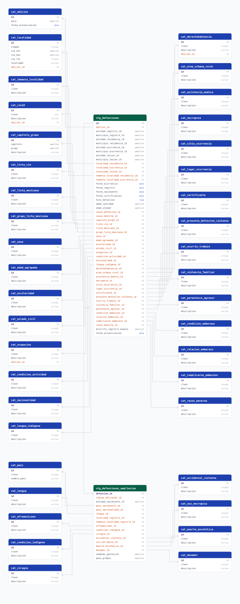

# defunciones_inegi

## Descripción general

Defunciones registradas en México publicadas por INEGI en el programa **EDR** (Estadísticas de Defunciones Registradas). Cada fila es una defunción, con su causa (CIE-10 y clasificaciones agregadas), características demográficas y socioeconómicas de la persona fallecida, circunstancias de la muerte y su geografía en cuatro ámbitos: registro, residencia habitual, ocurrencia y ocurrencia de la lesión. Se carga el país completo desde la edición **2017**, la primera publicada en esta ruta de datos abiertos.

No confundir con el pipeline `defunciones`, que toma los mismos hechos de la **DGIS (Secretaría de Salud)** con un esquema distinto.

## Fuente general

https://www.inegi.org.mx/programas/edr/

## Fuente específica

INEGI renombró el archivo tres veces sin cambiar la ruta. El extract prueba las
tres plantillas en orden hasta que una responde un ZIP real, así que no hay que
tocar nada cuando salga la edición 2025.

```shell
https://www.inegi.org.mx/contenidos/programas/edr/datosabiertos/defunciones/{year}/{archivo}
```

| Plantilla del archivo | Ediciones | Ejemplo |
|---|---|---|
| `conjunto_de_datos_edr{year}_csv.zip` | 2024 | [2024](https://www.inegi.org.mx/contenidos/programas/edr/datosabiertos/defunciones/2024/conjunto_de_datos_edr2024_csv.zip) |
| `conjunto_de_datos_defunciones_registradas_{year}_csv.zip` | 2018 – 2023 | [2023](https://www.inegi.org.mx/contenidos/programas/edr/datosabiertos/defunciones/2023/conjunto_de_datos_defunciones_registradas_2023_csv.zip) |
| `conjunto_de_datos_defunciones_generales_{year}_csv.zip` | 2017 | [2017](https://www.inegi.org.mx/contenidos/programas/edr/datosabiertos/defunciones/2017/conjunto_de_datos_defunciones_generales_2017_csv.zip) |

La raíz y las plantillas son configuración: `SOURCE_BASE_URL` y `SOURCE_URL_TEMPLATES` en el `.env`.

**El código HTTP no basta para saber si un año existe:** INEGI responde `200` con
una página de error (~2 KB de `text/html`) cuando no hay edición. Por eso el
descubrimiento valida el `Content-Type` de la respuesta. Es también la razón por
la que 2016 y años anteriores no se cargan: la ruta responde, pero con HTML.

## Características de los datos

| Característica | Valor |
|---|---|
| Última fecha disponible | `2024` |
| Frecuencia de actualización | Anual |
| Desagregación | Localidad |
| ¿Tiene update? | Sí |
| Update | Automático |

## Diagrama de entidad relación



Se genera con un layout de peine, no con `scripts/generate_erds.py`:

```shell
python scripts/generate_erd_comb.py defunciones_inegi
```

Los layouts de `sqlalchemy-erd` (`star`, `force`, `layered`) encimaban las cajas
porque una tabla de hechos referencia ~30 catálogos casi idénticos. El peine
ordena cada catálogo a la altura de su FK, así las aristas no se cruzan y son
ortogonales. Las tablas de hechos (`stg_*`) van en verde y los catálogos en azul,
con los colores de los temas de la propia librería.

## Diccionario de variables

### stg_defunciones

Variables presentes en **todas** las ediciones desde 2017.

| variable | descripción |
|---|---|
| `id` | Identificador único de la fila (surrogate) |
| `edicion_id` | Edición EDR de la que proviene la fila |
| `entidad_*_id` / `municipio_*_id` | Clave INEGI del ámbito (registro, residencia, ocurrencia, lesión). Se une contra `cvegeo_states.cve_ent` y `cvegeo_municipalities` (`cve_ent` + `cve_mun`) por FDW |
| `localidad_*_id` | Localidad del ámbito, contra `cat_localidad` |
| `tamanio_localidad_*_id` | Tamaño de localidad del ámbito |
| `fecha_ocurrencia` | Fecha de ocurrencia, armada con `dia_ocurr + mes_ocurr + anio_ocur` |
| `fecha_registro` / `fecha_nacimiento` / `fecha_certificacion` | Ídem, con sus propios componentes |
| `hora_defuncion` | Hora de la defunción, armada con `horas + minutos` |
| `edad_cantidad` / `edad_unidad` | Edad descompuesta del código INEGI: unidad `1` horas, `2` días, `3` meses, `4` años |
| `causa_defuncion_id` | Causa de la defunción (CIE-10, lista detallada) |
| `causa_materna_id` | Causa en defunciones maternas (CIE-10) |
| `capitulo_grupo_id` | Capítulo y grupo de causas detalladas CIE |
| `lista_cie_id` | Lista de tabulación 1 para mortalidad de la CIE |
| `lista_mexicana_id` / `grupo_lista_mexicana_id` | Causa según la lista mexicana y su grupo |
| `sexo_id`, `edad_agrupada_id`, `escolaridad_id`, `estado_civil_id` | Características demográficas |
| `ocupacion_id`, `condicion_actividad_id`, `derechohabiencia_id` | Características socioeconómicas |
| `nacionalidad_id`, `lengua_indigena_id`, `area_urbana_rural_id` | Adscripción y contexto |
| `asistencia_medica_id`, `necropsia_id`, `sitio_ocurrencia_id`, `certificante_id` | Circunstancias de la atención |
| `presunta_defuncion_violenta_id`, `lugar_ocurrencia_id`, `ocurrio_trabajo_id`, `violencia_familiar_id`, `parentesco_agresor_id` | Circunstancias de muertes violentas |
| `condicion_embarazo_id`, `relacion_embarazo_id`, `complicaron_embarazo_id`, `razon_materna_id` | Mortalidad materna |
| `distrito_registro_oaxaca` | Distrito de registro de Oaxaca |
| `fecha_actualizacion` | Fecha en que el pipeline cargó la fila |

### stg_defunciones_ampliacion

Variables que INEGI incorporó en **2022**. Relación 1:1 con `stg_defunciones` por `defuncion_id`; no tiene filas para ediciones anteriores.

| variable | descripción |
|---|---|
| `defuncion_id` | Defunción a la que amplía esta fila |
| `codigo_adicional_id` | Código adicional CIE |
| `entidad_nacimiento_id` | Entidad de nacimiento (claves `001`-`032` de `ent_nac`) |
| `pais_nacimiento_id` | País de nacimiento (claves `101`-`535` de `ent_nac`) |
| `pais_nacionalidad_id` | Nacionalidad extranjera |
| `lengua_id` | Clave de la lengua indígena |
| `localidad_registro_id` / `tamanio_localidad_registro_id` | Localidad y tamaño de localidad de registro |
| `afromexicano_id`, `condicion_indigena_id` | Autoadscripción |
| `cirugia_id`, `accidental_violenta_id`, `uso_necropsia_id`, `muerte_encefalica_id`, `donador_id` | Circunstancias de la atención |
| `semanas_gestacion` | Semanas de gestación |
| `peso_gramos` | Peso en gramos de fallecidos con menos de 28 días |

## Migraciones

| migración | descripción |
|---|---|
| `V1__foreign_tables.sql` | Extensión `postgres_fdw` y foreign tables `cvegeo_states` / `cvegeo_municipalities` |
| `V2__catalogs_defunciones_inegi.sql` | Crea los 40 catálogos (codificados, versionados, estructurados y edición) |
| `V3__tables_defunciones_inegi.sql` | Crea `stg_defunciones` y `stg_defunciones_ampliacion` con sus FK e índices |
| `V4__comments_defunciones_inegi.sql` | `COMMENT ON` de tablas y columnas, tomados del diccionario de datos oficial |
| `V5__views_defunciones_inegi.sql` | Vistas `vw_defunciones`, `vw_defunciones_ampliacion` y sus variantes `_jalisco`. Convención: `X_id` es la clave y `X` la descripción |
| `V7__comments_views_defunciones_inegi.sql` | `COMMENT ON` de las cuatro vistas y sus columnas (van aparte porque `V4` corre antes de que las vistas existan) |
| `V6__sentence_case_descripciones.sql` | Pasa a mayúscula inicial las descripciones de `cat_lista_cie` y `cat_grupo_lista_mexicana`, preservando siglas y nombres propios |

## Variables de entorno

| variable | descripción |
|---|---|
| `DB_*` | Conexión a la base `defunciones_inegi` |
| `SOURCE_BASE_URL` | Raíz de los datos abiertos del programa EDR |
| `SOURCE_URL_TEMPLATES` | Plantillas del archivo por año, separadas por coma y probadas en ese orden |
| `BACKFILL_MIN_YEAR` | Primera edición a descubrir y cargar (por defecto `2017`) |
| `DOWNLOAD_TIMEOUT` | Segundos de espera por descarga (por defecto `600`) |
| `CHUNK_SIZE` | Filas por lote al leer el CSV de hechos y al hacer bulk insert |

## Notas metodológicas

### Extract

Descubre las ediciones publicadas sondeando año por año desde 2017. **El código HTTP no basta**: INEGI responde `200` con la página de error cuando el año no existe, así que se valida el `Content-Type` de la respuesta. Deja el ZIP en disco (lo reusa entre corridas) y extrae sólo los catálogos; el CSV de hechos pesa cientos de MB y lo recorre el transform.

### Transform

Consolida los catálogos de todas las ediciones y normaliza los hechos por lotes:

- **Fechas**: `dia + mes + anio` se colapsan en un `DATE`; un centinela (`99`, `9999`) en cualquier componente anula la fecha. `horas + minutos` se colapsan en un `TIME`.
- **Edad**: el código de cuatro dígitos se parte en `edad_unidad` y `edad_cantidad`.
- **Lugar de nacimiento**: `ent_nac` mezcla entidades y países en un solo campo; se separa en dos columnas mutuamente excluyentes.
- **Claves alfanuméricas**: se canonizan quitando el cero a la izquierda. `grupo_lista_mexicana` publica el catálogo como `1` y los hechos como `01` en 2017-2021; sin esto el join se pierde en silencio.

### Load

Inserta primero los catálogos (`ON CONFLICT DO NOTHING`), construye los mapeos clave → `id` desde la base y luego carga los hechos edición por edición con `bulk_insert`. Los `id` de `stg_defunciones` se asignan explícitamente para poder construir la fila 1:1 de la ampliación sin un round-trip, y al final se llama `sync_id_sequence`.

## Ejecución

**Bootstrap** (carga inicial de todas las ediciones):

```shell
just create-db defunciones_inegi
just flyway-migrate defunciones_inegi
python dags/etl_defunciones_inegi.py
```

**Update** (anual, DAG `etl_defunciones_inegi_update`, schedule `0 18 1 12 *`):

Arranca en la edición siguiente a la última cargada, así que no vuelve a descargar lo que ya está en la base.

## Notas adicionales

- **Cambio de metodología en 2022.** Las ediciones 2017-2021 traen 59 columnas y las de 2022 en adelante 73/74. Por eso las 16 variables nuevas viven en `stg_defunciones_ampliacion` en vez de dejar nulos en cinco ediciones. `presunto` (2017-2021) y `tipo_defun` (2022+) son la misma variable renombrada por INEGI, así que va en la tabla base.
- **`vio_fami` falta sólo en 2022**, pero existe en 2017-2021 y 2023-2024. Es un hueco de un año, no un cambio de metodología: la columna vive en `stg_defunciones` y queda nula para esa edición.
- **La edición 2017 nombra los catálogos con prefijo `de`** (`desexo.csv`, `detamloc.csv`) y codifica capítulo y grupo en una sola clave (`101` = capítulo 1, grupo 1). De 2019 en adelante usa la nomenclatura moderna.
- **Entidades y municipios no se copian.** Viven en la base `cvegeo` y se consultan por FDW, según `docs/estandares_datos.md` §2. `cat_localidad` guarda sólo el nivel localidad, que `cvegeo` no cubre. Las claves se conservan en `stg_` porque `cvegeo` desconoce los centinelas (`88` no aplica, `99` no especificada, `33` Estados Unidos).
- **Convención de nombres en las vistas.** `X_id` es la clave (código INEGI o clave del catálogo) y `X` la descripción legible: `entidad_registro_id` = `14`, `entidad_registro` = `Jalisco`.
- **2016 y años anteriores no existen** en esta ruta: el servidor devuelve una página HTML con código `200`.

## Sugerencia de vistas materializadas

Este pipeline entrega **sólo vistas de detalle**. Los agregados analíticos se dejan
deliberadamente fuera: son decisiones del área de análisis, no del ETL.

Las cuatro vistas que sí se entregan (`vw_defunciones`, `vw_defunciones_jalisco`,
`vw_defunciones_ampliacion`, `vw_defunciones_ampliacion_jalisco`) son vistas
normales y **siempre reflejan la última carga**: no hay que refrescarlas. Se
consultan con filtros (`WHERE anio_edicion = 2024 AND entidad_residencia_id = 14`)
y el filtro se empuja hasta `stg_defunciones`, que tiene índices en `edicion_id`
y en las cuatro columnas de entidad.

Para agregados conviene lo contrario: **vistas materializadas** (`mv_*`), porque su
`GROUP BY` se ejecuta antes del `WHERE` del consumidor y recorrería los ~6.4M
registros en cada consulta. El precedente en el proyecto es
`migrations/enoe_microdatos/sql/V6__mv_enoe_tasas.sql`.

### Agregados propuestos

| Vista sugerida | Grano | Para qué |
|---|---|---|
| `mv_defunciones_municipio` | municipio residencia × año × sexo × edad agrupada | Base de tasas de mortalidad, mapas y pirámides |
| `mv_defunciones_principales_causas` | municipio × año × `lista_cie` × sexo | Tablas de principales causas de muerte |
| `mv_defunciones_violentas` | municipio × año × sexo × `presunta_defuncion_violenta` | Homicidios, suicidios y accidentes, con `violencia_familiar` y `parentesco_agresor` |
| `mv_mortalidad_infantil` | municipio × año × sexo × causa | Numerador de la tasa de mortalidad infantil (`cat_edad_agrupada.clave = 1`) |
| `mv_mortalidad_materna` | municipio × año × causa | Razón de mortalidad materna (`cat_razon_materna.clave = 1`) |
| `mv_defunciones_entidad` | entidad residencia × año × sexo × edad agrupada | Comparativos nacionales y ranking de Jalisco |
| `mv_defunciones_residencia_ocurrencia` | residencia × ocurrencia × año | Cuántas defunciones ocurren fuera de la entidad de residencia |

Las dos últimas sólo son posibles en este pipeline: el de DGIS (`defunciones`) está
acotado a residentes de Jalisco.

### Consideraciones para quien las implemente

- **Refresco.** Una `mv_*` no se actualiza sola. Agregar
  `REFRESH MATERIALIZED VIEW` al `finalization` de `DefuncionesInegiLoad`, o
  programarlo después del DAG.
- **Índices.** Indexar al menos `(anio, entidad_residencia_id)`; sin eso se pierde
  buena parte de la ventaja.
- **Geografía por FDW.** Un `JOIN` entre una tabla local y una foránea no se puede
  empujar al servidor remoto: PostgreSQL trae las filas de `cvegeo_municipalities`
  y hace el join localmente. Medido con `EXPLAIN ANALYZE`, ese `Foreign Scan` cuesta
  ~1.4 s (2,475 filas) más ~0.4 s de planeación. Es un costo **fijo por consulta**,
  no proporcional al volumen: pesa en consultas chicas y se vuelve marginal en las
  grandes, donde domina el escaneo de `stg_defunciones`.
- **Son conteos, no tasas.** El denominador (población o nacimientos) vive en las
  bases `conapo` y `censo_poblacion`. Lo natural es calcular la tasa en
  `core/indicadores`, que ya está pensado para cruzar pipelines.
- **Comparabilidad entre ediciones.** Cualquier agregado que use variables de
  `stg_defunciones_ampliacion` sólo tiene datos de 2022 en adelante.
