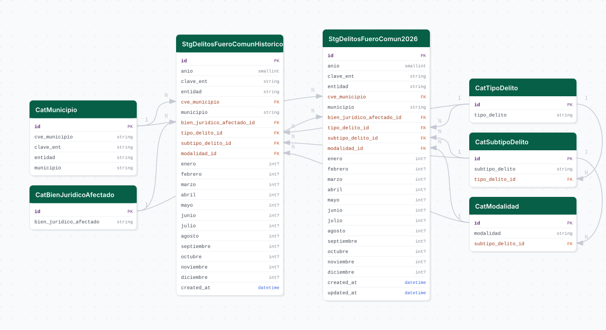

# delitos_fuero_comun

## Descripción general

Pipeline ETL de incidencia delictiva del fuero común a nivel municipal, publicado por el Secretariado Ejecutivo del Sistema Nacional de Seguridad Pública (SESNSP/SSPC). Almacena datos históricos mensuales desde 2015 hasta 2025 en una tabla fija, y los datos del año en curso (2026) en una tabla de actualización mensual.

## Fuente general

https://www.gob.mx/sesnsp

## Fuente específica

```shell
URL_HISTORICO=https://sspcgob-my.sharepoint.com/:u:/g/personal/cni_sspc_gob_mx/IQCb5TfpF_Q0Q7VZ0JLQ6iuxAeDslGC86VBvPvy9T0VSf5o?download=1
URL_2026=https://sspcgob-my.sharepoint.com/:u:/g/personal/cni_sspc_gob_mx/IQDd-W9ogDiVTbtqEmJOcuhfAfvhKP_Ler2jAMpkVWlHUuI?e=8jFc9R&download=1
```

## Características de los datos

| Característica | Valor |
|---|---|
| Última fecha disponible | `2025-12` (histórico) / `2026-MM` (en curso) |
| Frecuencia de actualización | Mensual |
| Desagregación | Nacional, Municipal |
| ¿Tiene update? | Sí (tabla 2026 únicamente) |
| Update | Automático |

## Diagrama de entidad relación



## Diccionario de variables

### stg_delitos_fuero_comun_historico / stg_delitos_fuero_comun_2026

| variable | descripción |
|---|---|
| `anio` | Año del registro |
| `cvegeo` | Clave INEGI del municipio (5 dígitos) |
| `bien_juridico_afectado_id` | FK a catálogo de bienes jurídicos afectados |
| `tipo_delito_id` | FK a catálogo de tipos de delito |
| `subtipo_delito_id` | FK a catálogo de subtipos de delito |
| `modalidad_id` | FK a catálogo de modalidades delictivas |
| `enero` … `diciembre` | Número de incidencias en cada mes |

## Migraciones

| migración | descripción |
|---|---|
| `V1__create_catalogos.sql` | Catálogos de bien jurídico, tipo, subtipo y modalidad de delito |
| `V2__create_stg_2015_2025.sql` | Tabla histórica `stg_delitos_fuero_comun_historico` (2015-2025) |
| `V3__create_stg_2026.sql` | Tabla de año en curso `stg_delitos_fuero_comun_2026` |
| `V4__create_vistas.sql` | Vistas analíticas unificadas |

## Variables de entorno

| variable | descripción |
|---|---|
| `URL_HISTORICO` | URL de descarga del ZIP histórico 2015-2025 |
| `URL_2026` | URL de descarga del ZIP del año en curso |

## Notas metodológicas

### Extract

Descarga los ZIPs desde las URLs de SharePoint del SESNSP. En bootstrap descarga ambos archivos; en update solo descarga `URL_2026`.

### Transform

Extrae el CSV del ZIP, normaliza texto, extrae catálogos de bien jurídico/tipo/subtipo/modalidad, y pivotea los datos al formato anio × mes.

### Load

Bootstrap: inserta catálogos y carga masiva en ambas tablas. Update: trunca y recarga `stg_delitos_fuero_comun_2026` con los datos más recientes.

## Ejecución

**Bootstrap** (histórico 2015-2025 + año en curso):

```shell
just flyway-migrate delitos_fuero_comun
conda run -n etl python -m core.pipelines.delitos_fuero_comun bootstrap
```

**Update mensual** (DAG `etl_delitos_fuero_comun_update`, cron `0 12 1 * *`):

```shell
conda run -n etl python -m core.pipelines.delitos_fuero_comun update
```

## Notas adicionales

Las URLs de SharePoint del SESNSP cambian cada año; cuando publiquen el consolidado 2026, habrá que mover los datos a la tabla histórica y crear una nueva tabla para 2027. El update solo actualiza la tabla del año en curso.
