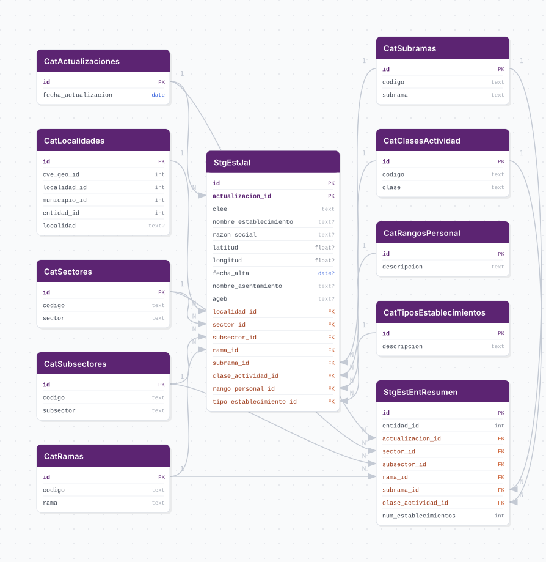

## Breve Descripción
El **DENUE** (Directorio Estadístico Nacional de Unidades Económicas) es una herramienta que permite ubicar, de manera exacta y en mapas digitales, los establecimientos de todos los sectores de actividad del país (con excepción del sector agropecuario).

## ERD

## Diccionario de variables

### stg_establecimientos

| Columna | Descripcion |
|---------|-------------|
| actualizacion_id | Snapshot semestral del DENUE al que pertenece el registro |
| ageb | Area geoestadistica basica (AGEB) del establecimiento |
| cve_geo_id | Clave geografica compuesta: entidad + municipio + localidad |
| codigo | Codigo SCIAN de la actividad economica |

## Fuentes

| Nivel | Archivo | URL |
|-------|---------|-----|
| Nacional | CSV por entidad federativa (`.csv.zip`) | `DENUE_URL` |

- **URL de descarga**: https://www.inegi.org.mx/app/descarga/?ti=6
- **Ultima fecha disponible**: 2023

> A partir de 2023 el DENUE utiliza el catalogo SCIAN 2023, que reemplaza al SCIAN 2018. La estructura de sectores, subsectores, ramas, subramas y clases de actividad refleja esta version.

## Actualizacion

- **Frecuencia**: Semestral
- **¿Tiene update automático?**: Sí
- INEGI publica snapshots del DENUE dos veces al anio (generalmente mayo y noviembre)
