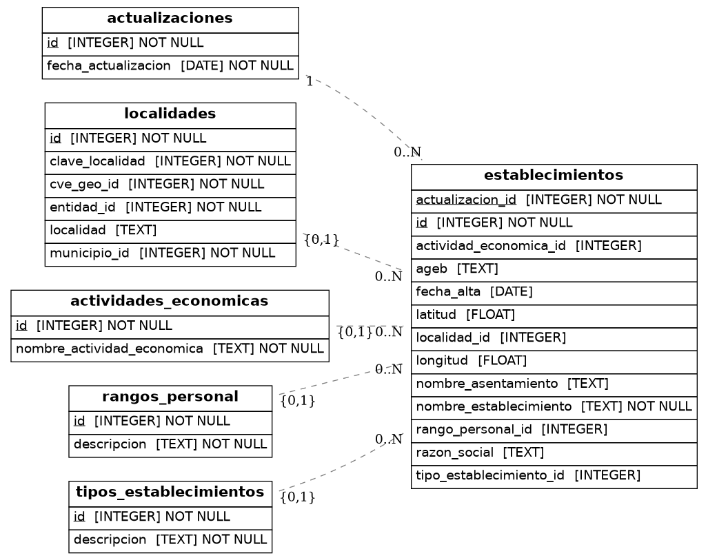

Directorio Nacional de Unidades Económicas (DENUE) - establecimientos activos en México por fecha de actualización.

## Fuentes

| Nivel | Archivo | Variable |
|-------|---------|----------|
| Nacional | CSV por entidad federativa (`.csv.zip`) | `DENUE_URL` |

## Tablas

- `actualizaciones` — fecha de cada snapshot descargado del DENUE
- `localidades` — clave geográfica de localidad (entidad + municipio + localidad)
- `actividades_economicas` — catálogo SCIAN de actividades económicas
- `rangos_personal` — rangos de personal ocupado
- `tipos_establecimientos` — tipo de establecimiento (fijo / semifijo)
- `establecimientos` — unidades económicas activas por snapshot

## ERD

