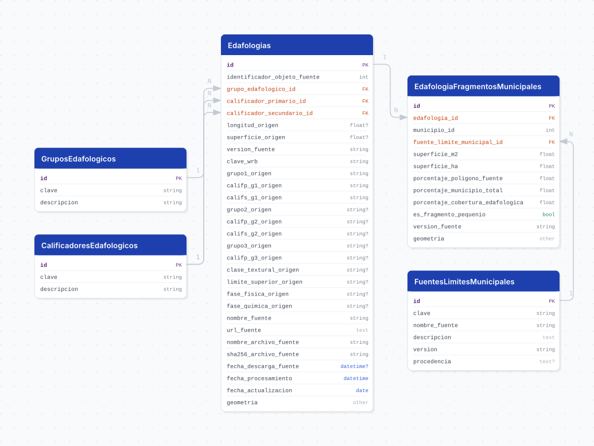

# edafologia

## Descripción general

Pipeline geográfico de la Edafología histórica 1:250 000, Serie III, publicada por INEGI. Conserva los atributos originales, normaliza el grupo y los calificadores mediante catálogos controlados, recorta el conjunto nacional a la unión de las delimitaciones municipales IIEG e INEGI para Jalisco y almacena geometrías `MultiPolygon` en EPSG:6368.

El bootstrap también calcula fragmentos municipales para ambas fuentes de límites. El costo de la intersección espacial se materializa en `edafologia_fragmentos_municipales`; el resumen municipal es una vista SQL normal.

## Fuente general

https://www.inegi.org.mx/temas/edafologia/

## Fuente específica

```shell
SOURCE_URL=https://www.inegi.org.mx/contenidos/productos/prod_serv/contenidos/espanol/bvinegi/productos/geografia/tematicas/Edafologia_hist/1_250_000/serie%20III/794551118313_s.zip
```

La capa canónica es `conj_nac_inf_edaf_esc_250k_ser_III_area`; la capa puntual `*_pto` se inventaría pero no se selecciona.

## Características de los datos

| Característica | Valor |
|---|---|
| Última fecha disponible | Serie III |
| Frecuencia de actualización | Bajo demanda |
| Desagregación | Polígono edafológico y fragmento municipal |
| ¿Tiene update? | No |
| Update | Manual / bootstrap |
| CRS fuente | `ITRF_1992_Lambert_Conformal_Conic` |
| CRS canónico | `EPSG:6368` |
| Cobertura | Jalisco |

## Diagrama de entidad relación



## Diccionario de variables

### grupos_edafologicos

| variable | descripción |
|---|---|
| `clave` | Código controlado observado en `Grupo1` |
| `descripcion` | Nombre controlado del grupo edafológico |

### calificadores_edafologicos

| variable | descripción |
|---|---|
| `clave` | Código unificado usado por `Califp_g1` y `Califs_g1` |
| `descripcion` | Nombre controlado del calificador |

### fuentes_limites_municipales

| variable | descripción |
|---|---|
| `clave` | Fuente territorial: `iieg` o `inegi` |
| `nombre_fuente` | Nombre legible de la fuente territorial |
| `version` | Versión del artefacto institucional `cvegeo` que suministra el límite (`cvegeo V1`) |
| `procedencia` | Columna geométrica remota usada en el overlay |

### edafologias

| variable | descripción |
|---|---|
| `version_fuente` | Versión de la publicación INEGI |
| `identificador_objeto_fuente` | `OBJECTID` original; solo es estable dentro de una versión |
| `grupo_edafologico_id` | FK local al grupo normalizado |
| `calificador_primario_id` | FK local al catálogo unificado en rol primario |
| `calificador_secundario_id` | FK local al catálogo unificado en rol secundario |
| `*_origen` | Valores literales conservados para auditoría |
| `sha256_archivo_fuente` | Hash SHA-256 del ZIP fuente |
| `fecha_descarga_fuente` | Fecha de descarga o reutilización verificable |
| `fecha_procesamiento` | Fecha de transformación |
| `geometria` | Geometría canónica `MultiPolygon,6368` |

### edafologia_fragmentos_municipales

| variable | descripción |
|---|---|
| `edafologia_id` | FK local al polígono edafológico canónico |
| `municipio_id` | `cve_mun` de Jalisco (1-125); relación lógica territorial, no ID sustituto ni FK física |
| `fuente_limite_municipal_id` | FK local a la delimitación IIEG o INEGI |
| `superficie_m2` | Superficie del fragmento en metros cuadrados |
| `superficie_ha` | `superficie_m2 / 10 000` |
| `porcentaje_poligono_fuente` | Área del fragmento / área del polígono canónico |
| `porcentaje_municipio_total` | Área del fragmento / área total del municipio de la fuente seleccionada |
| `porcentaje_cobertura_edafologica` | Área del fragmento / cobertura edafológica municipal de la misma fuente |
| `es_fragmento_pequenio` | Métrica de control; no elimina áreas positivas |
| `geometria` | Intersección `MultiPolygon,6368` |

### vw_edafologia_resumenes_municipales

Vista de solo lectura agrupada por fuente territorial, municipio, versión, grupo y calificadores. Expone `municipio_id`, el nombre `municipio` (`nomgeo`), la clave EEMMM `cvegeo`, `superficie_m2`, `superficie_ha`, `porcentaje_municipio` y `cantidad_fragmentos`; no almacena geometría ni admite un Load independiente. Resuelve el territorio por FDW con `f.municipio_id = m.cve_mun AND m.cve_ent = 14`.

## Migraciones

| migración | descripción |
|---|---|
| `V1__extensions_edafologia.sql` | Habilita PostGIS |
| `V2__catalogs_edafologia.sql` | Crea los catálogos locales |
| `V3__tables_edafologia.sql` | Crea la tabla canónica e índices |
| `V4__municipal_products_edafologia.sql` | Crea fragmentos y la vista de resúmenes |
| `V5__comments_edafologia.sql` | Documenta el esquema |
| `V6__rename_boundary_source_name.sql` | Verifica el nombre específico de la fuente territorial |
| `V7__municipality_reference_edafologia.sql` | Vincula lógicamente los fragmentos con `cvegeo` mediante FDW |
| `V8__cuadernillos_views_edafologia.sql` | Crea las vistas `vw_cuadernillos_*` que alimentan los cuadernillos municipales |

## Variables de entorno

| variable | descripción |
|---|---|
| `DB_USER`, `DB_PASSWORD`, `DB_HOST`, `DB_PORT`, `DB_NAME` | Conexión a PostgreSQL/PostGIS del pipeline |
| `SOURCE_URL` | URL oficial del ZIP de INEGI |
| `SOURCE_VERSION` | Identidad de la publicación |
| `FORCE_DOWNLOAD` | Reconstruye artefactos de Extract de forma controlada |
| `DOWNLOAD_RETRIES` | Número de intentos de descarga |
| `DOWNLOAD_CONNECT_TIMEOUT`, `DOWNLOAD_READ_TIMEOUT` | Timeouts HTTP en segundos |
| `FDW_DB_USER`, `FDW_DB_PASSWORD`, `FDW_DB_HOST`, `FDW_DB_PORT`, `FDW_DB_NAME` | Placeholders Flyway para la foreign table de `cvegeo`; no se almacenan en archivos versionados |
| `CANONICAL_SRID` | SRID canónico, `6368` |
| `CHUNK_SIZE` | Tamaño de lote durante Load |

## Notas metodológicas

### Extract

Descarga o reutiliza el ZIP ya conservado en el directorio raw con validación de integridad, extracción segura e inventario determinístico de capas. Conserva todos los componentes del Shapefile y genera `data/extract/edafologia/manifest.json`. Extrae de `cvegeo` las dos geometrías municipales usando las credenciales PostgreSQL comunes y cambiando únicamente el nombre de base, sin combinarlas ni transformarlas, a capas separadas de un GeoPackage temporal. Los catálogos controlados viven en `mappings.py` y se registran por versión, conteo y hash.

### Transform

Valida los hashes de Extract, repara geometrías inválidas, reproyecta a EPSG:6368 y recorta contra la unión de las coberturas IIEG e INEGI. Conserva toda área poligonal positiva y disuelve por `identificador_objeto_fuente`. Después calcula por separado los overlays IIEG e INEGI, sin elegir una delimitación como correcta. Escribe los productos y manifiestos mediante reemplazo atómico y no accede a red ni PostgreSQL.

### Load

Carga catálogos y polígonos canónicos mediante upsert por `(version_fuente, identificador_objeto_fuente)`. En la misma transacción reemplaza los fragmentos del alcance `(version_fuente, fuente_limite_municipal_id)` y ejecuta `ANALYZE`. El resumen municipal se consulta desde la vista y no tiene Load propio.

## Ejecución

**Bootstrap** (on demand, DAG `etl_edafologia_bootstrap`, `schedule=None`):

```shell
just flyway-migrate edafologia
conda run -n etl python dags/etl_edafologia.py
```

El DAG usa `retries=2`, `retry_delay=20` minutos y `catchup=False`.

## Notas adicionales

- Los límites `geom_iieg` y `geom_inegi` se procesan por separado. Su diferencia simétrica es una diferencia entre fuentes y no se corrige mediante `COALESCE`, promedio o sustitución.
- Los catálogos tienen 24 grupos y 87 calificadores. `N` y `N/A` son valores operativos controlados, distintos de los códigos documentales de INEGI.
- Los datos y manifiestos de ejecución bajo `data/` y el reporte generado por EDA están ignorados por Git.
- Una nueva publicación debe usar otra `version_fuente`; no reemplaza silenciosamente versiones históricas.
