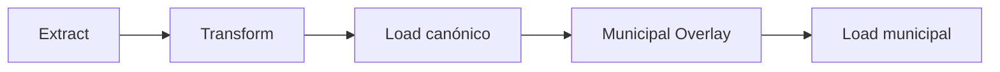
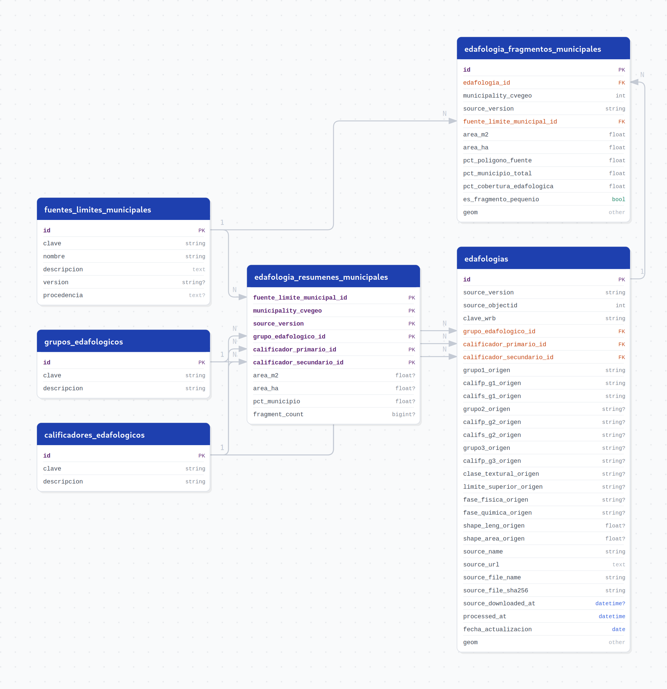

# Edafología

Pipeline geoespacial bootstrap/on-demand para preparar y cargar la Edafología histórica de INEGI, escala
1:250,000, Serie III, recortada a Jalisco, normalizada a EPSG:6368 y enriquecida con catálogos controlados.

El flujo conserva los atributos originales de la fuente, genera una tabla canónica de polígonos edafológicos y
materializa el costo espacial del overlay municipal en una tabla de fragmentos. El resumen municipal es una vista
SQL normal derivada de esos fragmentos.

---

## Fuente

| Campo | Valor |
|---|---|
| Institución | INEGI |
| Producto | Conjunto Nacional de Información Edafológica / Edafología histórica 1:250,000 |
| Versión | Serie III |
| Frecuencia | Histórica / on-demand |
| Formato fuente | ZIP oficial con Shapefile y diccionario PDF |
| Archivo | `794551118313_s.zip` |
| URL configurada | `https://www.inegi.org.mx/contenidos/productos/prod_serv/contenidos/espanol/bvinegi/productos/geografia/tematicas/Edafologia_hist/1_250_000/serie%20III/794551118313_s.zip` |
| SHA-256 ZIP | `9277315fd3bf82ca49f089798428ca1ffa6a23f5b668c74df8ae74a95a087926` |
| Capa canónica seleccionada | `conj_nac_inf_edaf_esc_250k_ser_III_area` |
| Capa excluida | `*_pto` |
| Registros nacionales en la capa poligonal | `73,356` |
| CRS original | `ITRF_1992_Lambert_Conformal_Conic` |
| Diccionario documental | `Diccionario de Datos Edafológicos`, versión 4 |
| Año documental | `2016` |
| SHA-256 PDF | `25a7bd01e2822afea90bf5ff31ecfdac12f349ec18f9ea404c310ca782c53407` |

El PDF se usa como fuente documental y de auditoría. El pipeline productivo no reconstruye `mappings.py`
automáticamente desde el PDF en cada ejecución.

---

## Alcance

| Característica | Valor |
|---|---|
| Cobertura fuente | Nacional |
| Cobertura cargada | Jalisco |
| SRID canónico | EPSG:6368 |
| Geometría canónica | `MultiPolygon` |
| Polígonos canónicos | `3,765` |
| Geometrías fuente reparadas | `23` |
| Geometrías finales inválidas | `0` |
| Geometrías finales nulas o vacías | `0` |
| Source version | `Serie III` |
| Pipeline version | `0.2.0` |

La fuente nacional se recorta con una cobertura canónica formada por la unión de las delimitaciones municipales
IIEG e INEGI. El almacenamiento canónico y los productos municipales usan EPSG:6368.

---

## Arquitectura



| Stage | Clase | Entrada | Salida | Validaciones principales | Idempotencia |
|---|---|---|---|---|---|
| Extract | `EdafologiaExtract` | `SOURCE_URL` o `SOURCE_ZIP_PATH`, conexión a `cvegeo` | `data/extract/edafologia/manifest.json`, ZIP raw, extracción segura, `municipal_boundaries.gpkg` | ZIP legible, SHA-256, inventario de capas, selección determinística `*_area`, límites con 125 municipios por fuente | Reutiliza ZIP y GPKG válidos salvo `FORCE_DOWNLOAD=true` |
| Transform | `EdafologiaTransform` | `manifest.json`, capa Shapefile, `municipal_boundaries.gpkg`, mappings versionados | `data/transform/edafologia/edafologias_transformadas.gpkg`, `transform_manifest.json` | CRS final 6368, `MultiPolygon`, cero nulos/vacíos/inválidos, `source_objectid` único, catálogos completos | Reescribe artefactos con reemplazo atómico |
| Load canónico | `EdafologiaLoad` | GeoPackage y `transform_manifest.json` | Catálogos y `edafologias` en PostgreSQL/PostGIS | Conteos de catálogos, hash fuente, colisión `source_version`/hash, geometrías válidas | Upsert por `(source_version, source_objectid)` |
| Municipal Overlay | `EdafologiaMunicipalOverlay` | GeoPackage canónico y GPKG municipal | `edafologia_fragmentos_municipales.gpkg`, `overlay_manifest.json` | Dos fuentes territoriales, áreas positivas, sin geometrías inválidas, cierre territorial | Reescribe artefactos con reemplazo atómico |
| Load municipal | `EdafologiaMunicipalOverlayLoad` | `overlay_manifest.json` y GPKG de fragmentos | `edafologia_fragmentos_municipales` | Claves lógicas únicas, FKs locales, áreas y hectáreas consistentes | Reemplazo transaccional por `(source_version, fuente_limite_municipal_id)` y `ANALYZE` |

El DAG ejecuta los cinco stages en ese orden. No existe flujo update porque la fuente es histórica y no tiene
periodicidad operativa confirmada.

---

## Metodología Extract

Extract obtiene o reutiliza el ZIP oficial, lo conserva como raw temporal y lo extrae de forma segura. La extracción
rechaza rutas absolutas, path traversal y escrituras fuera del directorio de trabajo. Después genera un inventario
geográfico con capa, formato, tipo geométrico, CRS, conteo, campos y extensión.

La capa canónica se selecciona de forma determinística:

- debe ser poligonal;
- debe contener `Grupo1`, `Califp_g1` y `Califs_g1`;
- debe corresponder a `*_area`;
- nunca se selecciona `*_pto`;
- cero candidatos válidos o candidatos ambiguos detienen el flujo.

Extract también extrae las delimitaciones municipales desde `public.cvegeo_municipalities` para `cve_ent = 14` y
las guarda en `data/extract/edafologia/auxiliary/municipal_boundaries.gpkg` con dos capas:

- `municipios_iieg`, proveniente de `geom_iieg`;
- `municipios_inegi`, proveniente de `geom_inegi`.

Este GPKG auxiliar es una desviación geoespacial aprobada respecto a una plantilla tabular genérica: desacopla
Transform de conexiones remotas, conserva hash y trazabilidad, permite reproducibilidad offline después de Extract
y evita depender de FDW durante el cálculo espacial.

---

## Metodología Transform

Transform lee exclusivamente el manifiesto de Extract, la capa extraída, el GPKG municipal y los mappings
versionados. No accede a red ni a PostgreSQL.

Pasos principales:

1. Lee la capa nacional seleccionada.
2. Valida y lee `municipios_iieg` y `municipios_inegi`.
3. Construye `cobertura_iieg`, `cobertura_inegi` y `cobertura_canonica`.
4. Repara geometrías fuente inválidas cuando es técnicamente procedente.
5. Reproyecta a EPSG:6368.
6. Recorta contra `cobertura_canonica`.
7. Disuelve por `source_objectid` para mantener una geometría canónica por objeto fuente.
8. Convierte la salida a `MultiPolygon` válido.
9. Aplica catálogos después del recorte.
10. Escribe `edafologias_transformadas.gpkg` y `transform_manifest.json` con reemplazo atómico.

Transform conserva todos los componentes poligonales con área positiva. No calcula overlay municipal y no carga a
PostgreSQL.

---

## Catálogos

| Catálogo | Registros | Hash |
|---|---:|---|
| `grupos_edafologicos` | `24` | `7a4d3930bc05f59d74a2cdb20c85c41b31a166db044cb3e7668512dc24be7192` |
| `calificadores_edafologicos` | `87` | `df479e0c8d93437717dee301e7158cf16863209f257063b862f851391019917c` |

Los catálogos están versionados en `core/pipelines/edafologia/mappings.py`. Son una elaboración/transcripción
controlada y auditada para interpretar códigos de la fuente, no archivos estructurados entregados por INEGI.

Decisiones metodológicas:

- `Grupo1` se normaliza contra `grupos_edafologicos`.
- `Califp_g1` y `Califs_g1` usan un único catálogo común: `calificadores_edafologicos`.
- La tabla canónica mantiene dos FKs distintas al mismo catálogo:
  - `calificador_primario_id`;
  - `calificador_secundario_id`.
- `fl` resuelve exactamente a `Ferrálico`, confirmado en el Diccionario de Datos Edafológicos, versión 4, 2016,
  página 57.
- `N` y `N/A` son valores operativos controlados; no se presentan como códigos documentales oficiales.
- La cobertura observada en Jalisco queda completa: `24/24` grupos, `63/63` calificadores primarios y `71/71`
  calificadores secundarios sin códigos faltantes.

---

## Límites Municipales

Se usan las dos geometrías municipales disponibles en `public.cvegeo_municipalities`:

| Fuente | Columna remota | Capa GPKG | Municipios | SRID | Tipo | Índice remoto esperado |
|---|---|---|---:|---:|---|---|
| IIEG | `geom_iieg` | `municipios_iieg` | `125` | `6368` | `MultiPolygon` | `idx_cvegeo_mun_geom_iieg` |
| INEGI | `geom_inegi` | `municipios_inegi` | `125` | `6368` | `MultiPolygon` | `idx_cvegeo_mun_geom_inegi` |

No se fusionan, promedian, sustituyen ni combinan con `COALESCE`. Ninguna delimitación se declara correcta. Cada
fragmento identifica la fuente territorial mediante `fuente_limite_municipal_id`; `municipality_cvegeo` es la
referencia lógica municipal. No hay FK física hacia `cvegeo` porque esa información vive en otra base.

Diagnóstico territorial:

| Métrica | Valor |
|---|---:|
| Área IIEG | `79,231,547,723.91377 m²` |
| Área INEGI | `78,597,716,063.52180 m²` |
| Área común | `75,495,779,531.77454 m²` |
| Área exclusiva IIEG | `3,735,768,192.13941 m²` |
| Área exclusiva INEGI | `3,101,936,531.74608 m²` |
| Diferencia simétrica | `6,837.7047 km²` |
| Cobertura edafológica IIEG | `99.9909087941 %` |
| Cobertura edafológica INEGI | `99.9880131794 %` |

---

## Load Canónico

`EdafologiaLoad` carga:

- `grupos_edafologicos`;
- `calificadores_edafologicos`;
- `fuentes_limites_municipales`;
- `edafologias`.

Los catálogos se sincronizan con upsert por `clave`. La tabla `edafologias` usa upsert por
`(source_version, source_objectid)`. Antes de cargar valida que una `source_version` existente no esté asociada a un
`source_file_sha256` diferente; esto evita reemplazar silenciosamente otra publicación bajo la misma versión.

`source_objectid` se conserva como identificador fuente para Serie III, pero no se asume estable entre publicaciones
futuras.

---

## Overlay Municipal

El overlay se calcula después del Load canónico y antes del Load municipal. Intersecta cada polígono canónico con los
125 municipios de IIEG y con los 125 municipios de INEGI, manteniendo separados ambos resultados.

Reglas:

- se descartan geometrías nulas, vacías, componentes no poligonales y áreas no positivas;
- se conservan todos los componentes poligonales con área positiva;
- no se aplica umbral arbitrario de eliminación;
- los fragmentos se cargan en `edafologia_fragmentos_municipales`;
- el Load municipal reemplaza de forma idempotente el alcance `(source_version, fuente_limite_municipal_id)`;
- al final ejecuta `ANALYZE edafologia_fragmentos_municipales`.

Resultados observados:

| Fuente límite | Fragmentos | Cobertura municipal |
|---|---:|---:|
| IIEG | `5,215` | `99.9909087941 %` |
| INEGI | `5,283` | `99.9880131794 %` |
| Total | `10,498` | N/A |

### Slivers

Los fragmentos pequeños se monitorean, no se eliminan:

| Fuente límite | Fragmentos menores a 1,000 m² | Área acumulada | % fragmentos | % área territorial |
|---|---:|---:|---:|---:|
| IIEG | `23` | `7,413.83 m²` | `0.4410 %` | `0.0000093572 %` |
| INEGI | `34` | `13,304.81 m²` | `0.6436 %` | `0.0000169277 %` |

El impacto territorial es extremadamente pequeño. Cualquier regla futura para eliminar slivers requiere una decisión
metodológica explícita.

---

## Modelo de Datos



### Tablas

| Tabla | Descripción |
|---|---|
| `grupos_edafologicos` | Catálogo de grupos principales observados en `Grupo1`. |
| `calificadores_edafologicos` | Catálogo unificado de calificadores para roles primario y secundario. |
| `fuentes_limites_municipales` | Catálogo local de fuentes territoriales: IIEG e INEGI. |
| `edafologias` | Tabla canónica de polígonos edafológicos recortados a Jalisco, con atributos fuente y trazabilidad. |
| `edafologia_fragmentos_municipales` | Tabla persistente de intersecciones reales entre polígonos edafológicos y municipios por fuente territorial. |

### Vista

| Vista | Descripción |
|---|---|
| `edafologia_resumenes_municipales` | Vista SQL normal, no materializada, que agrega fragmentos por municipio, fuente límite, versión y categoría edafológica. |

La vista no tiene `id`, PK física, geometría ni Load independiente. No debe tratarse como tabla.

### Claves, Índices y Grano

| Objeto | Grano lógico | Restricciones e índices principales |
|---|---|---|
| `grupos_edafologicos` | Una fila por `clave` | PK `id`, `UNIQUE(clave)` |
| `calificadores_edafologicos` | Una fila por `clave` | PK `id`, `UNIQUE(clave)` |
| `fuentes_limites_municipales` | Una fila por fuente límite | PK `id`, `UNIQUE(clave)` |
| `edafologias` | Una fila por `(source_version, source_objectid)` | `UNIQUE(source_version, source_objectid)`, FKs a catálogos, GiST en `geom`, B-tree en versión, objeto y FKs |
| `edafologia_fragmentos_municipales` | Una fila por polígono, municipio y fuente límite | `UNIQUE(edafologia_id, municipality_cvegeo, fuente_limite_municipal_id)`, FKs locales, checks de áreas positivas, GiST en `geom`, B-tree en claves de consulta |
| `edafologia_resumenes_municipales` | Grupo agregado por municipio, fuente, versión, grupo y calificadores | Vista derivada; sin índices propios por no estar materializada |

Todas las geometrías persistentes son `geometry(MultiPolygon, 6368)`.

---

## Áreas y Porcentajes

| Campo | Definición | Denominador |
|---|---|---|
| `area_m2` | Área del fragmento o suma de fragmentos en metros cuadrados | N/A |
| `area_ha` | `area_m2 / 10,000` | N/A |
| `pct_poligono_fuente` | Porcentaje del polígono edafológico canónico representado por el fragmento | Área total del polígono canónico |
| `pct_municipio_total` | Porcentaje del territorio municipal cubierto por el fragmento | Área completa del municipio de la fuente IIEG o INEGI correspondiente |
| `pct_cobertura_edafologica` | Porcentaje de la cobertura edafológica municipal representado por el fragmento | Suma de fragmentos positivos del municipio para la misma fuente territorial |
| `pct_municipio` | Campo de la vista; suma de `pct_municipio_total` | Área completa del municipio de la fuente territorial correspondiente |
| `fragment_count` | Número de fragmentos persistentes incluidos en el agregado | N/A |

---

## Migraciones

| Migración | Descripción |
|---|---|
| `V1__extensions_edafologia.sql` | Habilita PostGIS conforme a la convención del repo. |
| `V2__catalogs_edafologia.sql` | Crea `grupos_edafologicos`, `calificadores_edafologicos` y `fuentes_limites_municipales`. |
| `V3__tables_edafologia.sql` | Crea `edafologias`, FKs, `UNIQUE(source_version, source_objectid)` e índices. |
| `V4__municipal_products_edafologia.sql` | Crea `edafologia_fragmentos_municipales` y la vista `edafologia_resumenes_municipales`. |
| `V5__comments_edafologia.sql` | Documenta tablas, vista y columnas con `COMMENT ON`. |

Validación V5 aplicada:

- objetos esperados/comentados: `6/6`;
- columnas esperadas/comentadas: `63/63`;
- `flyway validate`: 5 migraciones validadas.

---

## Variables de Entorno

Definidas en `core/pipelines/edafologia/.env.example`. Los valores reales deben ir en `.env` local ignorado por Git.

| Variable | Requerida | Default real | Uso | Ejemplo sanitizado / nota |
|---|---:|---|---|---|
| `LOG_LEVEL` | No | `INFO` | Local/Docker | `INFO` |
| `DB_USER` | Sí | N/A | Local/Docker | Usuario de la base `edafologia` |
| `DB_PASSWORD` | Sí | N/A | Local/Docker | No commitear |
| `DB_HOST` | Sí | N/A | Local/Docker | Local: `localhost`; Docker: `host.docker.internal` o host institucional |
| `DB_PORT` | Sí | N/A | Local/Docker | Local observado: `5433` |
| `DB_NAME` | No | `edafologia` | Local/Docker | Base destino |
| `SOURCE_URL` | Sí | N/A | Extract | URL oficial del ZIP INEGI |
| `SOURCE_VERSION` | No | `Serie III` | Todas las fases | Identidad de versión fuente |
| `CANONICAL_SRID` | No | `6368` | Transform/Load | SRID canónico |
| `CHUNK_SIZE` | No | `10000` | Load | Tamaño de lote |
| `SOURCE_ZIP_PATH` | No | vacío | Extract | Ruta local opcional para reutilizar ZIP válido |
| `FORCE_DOWNLOAD` | No | `false` | Extract | Fuerza reconstrucción controlada |
| `DOWNLOAD_RETRIES` | No | `5` | Extract | Reintentos de descarga |
| `DOWNLOAD_CONNECT_TIMEOUT` | No | `30` | Extract | Timeout de conexión, segundos |
| `DOWNLOAD_READ_TIMEOUT` | No | `300` | Extract | Timeout de lectura, segundos |
| `CVEGEO_DB_USER` | Sí | N/A | Extract | Usuario de base `cvegeo` |
| `CVEGEO_DB_PASSWORD` | Sí | N/A | Extract | No commitear |
| `CVEGEO_DB_HOST` | Sí | N/A | Extract | Local: `localhost`; Docker: `host.docker.internal` o host configurado |
| `CVEGEO_DB_PORT` | No | `5433` | Extract | Puerto de `cvegeo` |
| `CVEGEO_DB_NAME` | No | `cvegeo` | Extract | Base territorial |

---

## Ejecución Local

Requisitos:

- Python 3.12;
- PostgreSQL 17 + PostGIS;
- Flyway;
- base `edafologia`;
- base `cvegeo` reconstruida con sus migraciones;
- Git LFS para reconstruir insumos versionados de `cvegeo` cuando aplique;
- `.env` local ignorado por Git.

Comandos reales del Justfile:

```shell
just env-init edafologia
just flyway-config edafologia
just create-db edafologia
just flyway-migrate edafologia
just flyway-validate edafologia
python dags/etl_edafologia.py
```

Para una ejecución local con `postgres-dev` expuesto al host, usar `localhost` y el puerto publicado. Para ejecución
dentro de Docker, `localhost` apunta al contenedor; usar `host.docker.internal` o el host PostgreSQL configurado para
Airflow.

Docker Airflow todavía queda como validación final pendiente; no se documenta como validado.

---

## Ejecución con Airflow

| Campo | Valor |
|---|---|
| DAG | `etl_edafologia_bootstrap` |
| Schedule | `None` |
| Catchup | `False` |
| Retries | `2` |
| Retry delay | `20` minutos |
| Start date | `2026-01-01` |
| Tipo | On-demand / bootstrap |
| Task | `run_bootstrap` |

El DAG ejecuta:

1. `EdafologiaExtract`
2. `EdafologiaTransform`
3. `EdafologiaLoad`
4. `EdafologiaMunicipalOverlay`
5. `EdafologiaMunicipalOverlayLoad`

La ausencia de DAG update es deliberada: la fuente es histórica y una publicación futura requeriría revisar campos,
catálogos, hashes y contrato espacial antes de cargarla.

---

## Artefactos

| Ruta | Función | Versionado |
|---|---|---|
| `data/extract/edafologia/raw/794551118313_s.zip` | ZIP fuente conservado para trazabilidad | Ignorado por Git |
| `data/extract/edafologia/manifest.json` | Contrato de Extract consumido por Transform | Ignorado por Git |
| `data/extract/edafologia/extracted/` | Shapefile y PDF extraídos | Ignorado por Git |
| `data/extract/edafologia/auxiliary/municipal_boundaries.gpkg` | Límites IIEG/INEGI inventariados para Transform offline | Ignorado por Git |
| `data/transform/edafologia/edafologias_transformadas.gpkg` | GeoPackage canónico temporal | Ignorado por Git |
| `data/transform/edafologia/transform_manifest.json` | Contrato de Transform consumido por Load y overlay | Ignorado por Git |
| `data/transform/edafologia/municipal_overlay/edafologia_fragmentos_municipales.gpkg` | GeoPackage temporal de fragmentos municipales | Ignorado por Git |
| `data/transform/edafologia/municipal_overlay/overlay_manifest.json` | Contrato de overlay consumido por Load municipal | Ignorado por Git |
| `core/pipelines/edafologia/eda/reporte_eda.json` | Reporte EDA reproducible versionado | Versionado |
| `core/pipelines/edafologia/assets/er_edafologia.png` | Diagrama ER | Versionado |

Los artefactos temporales contienen hashes que enlazan las fases y se regeneran durante la ejecución. Se conservan
durante el pipeline por trazabilidad, pero no son productos versionados.

---

## Resultados Esperados

Estos conteos corresponden al ZIP, hash y `source_version` documentados. Una publicación futura puede cambiar los
valores.

| Resultado | Conteo |
|---|---:|
| Grupos edafológicos | `24` |
| Calificadores edafológicos | `87` |
| Fuentes de límites | `2` |
| Edafologías canónicas | `3,765` |
| Fragmentos IIEG | `5,215` |
| Fragmentos INEGI | `5,283` |
| Fragmentos totales | `10,498` |
| Resúmenes IIEG | `2,915` |
| Resúmenes INEGI | `2,939` |
| Resúmenes totales | `5,854` |

---

## Consultas SQL de Ejemplo

Los nombres municipales deben resolverse mediante `cvegeo` u otra capa territorial externa. No hay FK física hacia
`cvegeo_municipalities`.

### A. Resumen por Grupo para un Municipio y Fuente Territorial

```sql
SELECT
    r.municipality_cvegeo,
    l.clave AS fuente_limite,
    g.clave AS grupo_clave,
    g.descripcion AS grupo_descripcion,
    SUM(r.area_m2) AS area_m2,
    SUM(r.area_ha) AS area_ha,
    SUM(r.pct_municipio) AS pct_municipio,
    SUM(r.fragment_count) AS fragment_count
FROM edafologia_resumenes_municipales AS r
JOIN fuentes_limites_municipales AS l
    ON l.id = r.fuente_limite_municipal_id
JOIN grupos_edafologicos AS g
    ON g.id = r.grupo_edafologico_id
WHERE r.source_version = 'Serie III'
  AND r.municipality_cvegeo = 14039
  AND l.clave = 'iieg'
GROUP BY
    r.municipality_cvegeo,
    l.clave,
    g.clave,
    g.descripcion
ORDER BY area_m2 DESC;
```

### B. Comparación IIEG frente a INEGI para un Municipio

```sql
SELECT
    r.municipality_cvegeo,
    g.clave AS grupo_clave,
    cp.clave AS calificador_primario,
    cs.clave AS calificador_secundario,
    SUM(r.area_m2) FILTER (WHERE l.clave = 'iieg') AS area_iieg_m2,
    SUM(r.area_m2) FILTER (WHERE l.clave = 'inegi') AS area_inegi_m2,
    SUM(r.area_m2) FILTER (WHERE l.clave = 'iieg')
        - SUM(r.area_m2) FILTER (WHERE l.clave = 'inegi') AS diferencia_m2
FROM edafologia_resumenes_municipales AS r
JOIN fuentes_limites_municipales AS l
    ON l.id = r.fuente_limite_municipal_id
JOIN grupos_edafologicos AS g
    ON g.id = r.grupo_edafologico_id
JOIN calificadores_edafologicos AS cp
    ON cp.id = r.calificador_primario_id
JOIN calificadores_edafologicos AS cs
    ON cs.id = r.calificador_secundario_id
WHERE r.source_version = 'Serie III'
  AND r.municipality_cvegeo = 14039
GROUP BY
    r.municipality_cvegeo,
    g.clave,
    cp.clave,
    cs.clave
ORDER BY ABS(
    SUM(r.area_m2) FILTER (WHERE l.clave = 'iieg')
        - SUM(r.area_m2) FILTER (WHERE l.clave = 'inegi')
) DESC NULLS LAST;
```

### C. Consulta Detallada de Fragmentos con Geometría

```sql
SELECT
    f.municipality_cvegeo,
    l.clave AS fuente_limite,
    e.source_version,
    e.source_objectid,
    e.clave_wrb,
    g.descripcion AS grupo,
    cp.descripcion AS calificador_primario,
    cs.descripcion AS calificador_secundario,
    f.area_m2,
    f.area_ha,
    f.pct_poligono_fuente,
    f.pct_municipio_total,
    f.pct_cobertura_edafologica,
    f.geom
FROM edafologia_fragmentos_municipales AS f
JOIN edafologias AS e
    ON e.id = f.edafologia_id
JOIN fuentes_limites_municipales AS l
    ON l.id = f.fuente_limite_municipal_id
JOIN grupos_edafologicos AS g
    ON g.id = e.grupo_edafologico_id
JOIN calificadores_edafologicos AS cp
    ON cp.id = e.calificador_primario_id
JOIN calificadores_edafologicos AS cs
    ON cs.id = e.calificador_secundario_id
WHERE e.source_version = 'Serie III'
  AND f.municipality_cvegeo = 14039
  AND l.clave = 'inegi'
ORDER BY f.area_m2 DESC
LIMIT 100;
```

### D. Distribución Estatal por Grupo y Fuente

```sql
SELECT
    l.clave AS fuente_limite,
    g.clave AS grupo_clave,
    g.descripcion AS grupo_descripcion,
    SUM(r.area_m2) AS area_m2,
    SUM(r.area_ha) AS area_ha,
    SUM(r.fragment_count) AS fragment_count
FROM edafologia_resumenes_municipales AS r
JOIN fuentes_limites_municipales AS l
    ON l.id = r.fuente_limite_municipal_id
JOIN grupos_edafologicos AS g
    ON g.id = r.grupo_edafologico_id
WHERE r.source_version = 'Serie III'
GROUP BY
    l.clave,
    g.clave,
    g.descripcion
ORDER BY
    l.clave,
    area_m2 DESC;
```

Estas consultas usan la vista y la tabla de fragmentos; no ejecutan `ST_Intersection`.

---

## Validaciones

Validaciones de Extract:

- ZIP legible y SHA-256 estable;
- inventario con 2 candidatos geográficos;
- selección de la capa poligonal `*_area`;
- campos requeridos presentes;
- límites IIEG/INEGI con 125 municipios, 125 `cvegeo` únicos, SRID 6368, `MultiPolygon`, cero nulos y cero inválidos.

Validaciones de Transform:

- conteo fuente `73,356`;
- conteo final `3,765`;
- CRS final EPSG:6368;
- solo `MultiPolygon`;
- cero geometrías nulas, vacías o inválidas;
- cero áreas no positivas;
- `source_objectid` único;
- cero códigos observados sin mapping;
- todas las geometrías intersectan la cobertura canónica.

Validaciones de Load y overlay:

- catálogos con conteos esperados `24`, `87` y `2`;
- colisión de `source_version`/hash detectada antes de cargar;
- reemplazo idempotente de fragmentos por versión y fuente territorial;
- tabla de fragmentos con áreas positivas;
- vista de resumen derivada sin carga directa;
- `ANALYZE` después de la carga municipal.

Validaciones de documentación:

- ERD versionado en `assets/er_edafologia.png`;
- EDA versionado en `eda/reporte_eda.json`;
- comentarios V5 en 6 objetos y 63 columnas;
- suite Edafología validada: `83 passed, 1 skipped`;
- hooks de commit con Ruff, formato, Prettier y commitlint aprobados.

---

## Reproducibilidad e Idempotencia

Identificadores reproducibles:

| Elemento | SHA-256 |
|---|---|
| ZIP fuente | `9277315fd3bf82ca49f089798428ca1ffa6a23f5b668c74df8ae74a95a087926` |
| PDF documental | `25a7bd01e2822afea90bf5ff31ecfdac12f349ec18f9ea404c310ca782c53407` |
| GPKG municipal auxiliar | `76ff4353fc2a3a9d84589a74249e1bb4fd7b8ec4aad5085db87db777239e4ec3` |
| GPKG canónico transformado | `572ad73f65f843d9971e161612855f1f67199b3add2ba5f9e5518767cd133cac` |
| Reporte EDA | `3341de2d4f3ad58f997bbfd8b8375e3fb6bcbd8e76a9cbd7c9a8dec31a34884e` |

`edafologia-hash-v1` usa:

- algoritmo `sha256`;
- codificación UTF-8;
- separador de campos `U+001F`;
- separador de filas `\n`;
- token nulo `<NULL>`;
- orden lexicográfico por claves lógicas;
- geometría como `ST_AsEWKB(geom, 'NDR')` en hexadecimal minúsculo;
- exclusión de IDs `SERIAL`, usando claves lógicas y claves de catálogos.

Hashes canónicos actuales:

| Hash | Valor |
|---|---|
| `canonical_geometry` | `daa46329c032430757a44f2cfbe55d0aba02752fc3f4ce9792e8de2287ca2954` |
| `canonical_relations` | `8a1a6ac417513609a5de3c503b34fd3300569ecb1d7edcac54bb0bcd4f85d1cd` |
| `overlay_geometry_iieg` | `f027b9236e44a50a443a00ab4e3dc1e6162769349318ddea6ab4257c329726f3` |
| `overlay_geometry_inegi` | `878af884b3f522076b99ac92b8bfb4b4e5beb3d4460baa0445285b04fa8d5433` |
| `overlay_logical_iieg` | `255d13f816d212b1ee0904834e785aaf403de2ba89c4551e27e28efba767e4dd` |
| `overlay_logical_inegi` | `f02c8b5bceae0c2cc4c5d3969c29448ad84a5742c2808c64e98a559e40ad7301` |

El bootstrap integral fue validado dos veces desde base limpia en el entorno local de desarrollo:

| Corrida | Tiempo |
|---|---:|
| Primera | `89.22 s` |
| Segunda | `86.60 s` |

Estos tiempos son referencia local, no un SLA.

---

## Limitaciones

- La fuente es histórica y no iterable.
- No hay update automático.
- `source_objectid` solo se considera estable dentro de `source_version`.
- Los mappings están versionados manualmente y no se regeneran desde el PDF en runtime.
- Las delimitaciones IIEG e INEGI difieren; ambas se conservan.
- `municipality_cvegeo` es referencia lógica sin FK física remota.
- La vista municipal no está materializada.
- Los slivers con área positiva se conservan.
- Los artefactos intermedios requieren espacio en `data/`.
- Docker Airflow queda pendiente de validación final.
- Una publicación futura de INEGI puede requerir revisar campos, catálogos, hashes y contrato espacial.

---

## Actualización Futura

Ante una nueva publicación:

1. Registrar la nueva fuente con un `source_version` distinto si corresponde.
2. Validar que la capa poligonal, campos y CRS sigan siendo compatibles.
3. Auditar los catálogos contra los códigos observados.
4. Revisar si `source_objectid` sigue siendo una clave útil dentro de la nueva versión.
5. Regenerar Extract, Transform y overlay.
6. Cargar sin borrar silenciosamente versiones anteriores.
7. Actualizar hashes, EDA y documentación.

---

## Decisiones Específicas frente a la Plantilla Genérica

Este pipeline aplica decisiones aprobadas por su carácter geoespacial:

- usa nombres plurales sin prefijos `cat_`, `stg_` ni `v_`, conforme al contrato aprobado para Edafología;
- usa GPKG municipal trazable en lugar de depender de FDW durante Transform;
- divide el flujo en cinco stages porque el overlay municipal es un producto geoespacial derivado;
- es bootstrap-only;
- implementa el resumen municipal como vista SQL normal, no como tabla ni vista materializada;
- conserva artefactos temporales durante la ejecución para trazabilidad por hashes;
- mantiene dos fuentes municipales separadas y no declara una como correcta.

Estas decisiones son parte del diseño del pipeline, no incumplimientos accidentales de la plantilla tabular.
