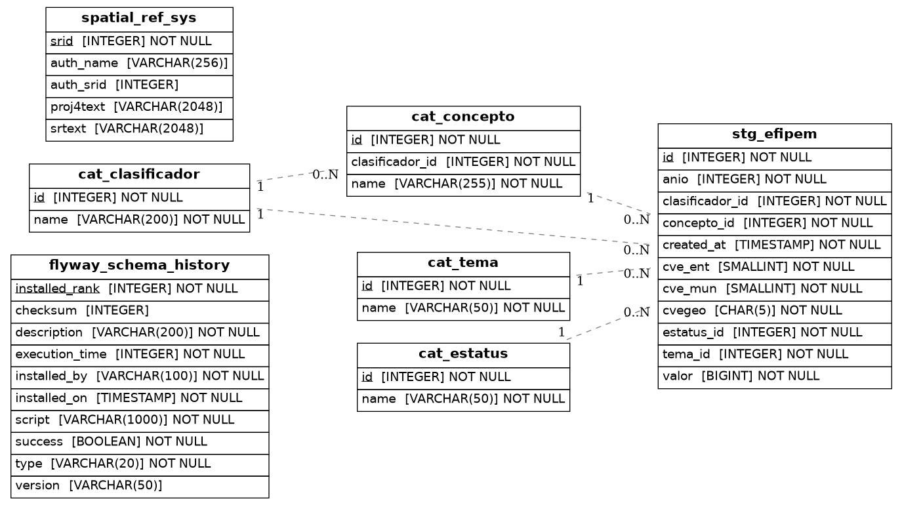

# efipem

> Pipeline ETL de las Estadísticas de Finanzas Públicas Estatales y Municipales (EFIPEM) del INEGI. Contiene datos anuales de ingresos, egresos y deuda de los municipios de Jalisco (`cve_ent = 14`), clasificados por tema, clasificador y concepto presupuestario, y expone 11 vistas materializadas para consumo GIS.

---

## Fuente

| Campo        | Valor                                                                 |
|--------------|-----------------------------------------------------------------------|
| Proveedor    | INEGI                                                                 |
| URL          | https://www.inegi.org.mx/contenidos/programas/finanzas/datosabiertos/conjunto_de_datos_efipem_municipal_csv.zip |
| Formato      | ZIP con CSVs anuales (`efipem_municipal_anual_tr_cifra_*.csv`)       |
| Frecuencia   | Anual                                                                 |
| Último dato  | 2023 (con rezago de ~1 año)                                           |

---

## Dependencias

Este pipeline depende de que las siguientes bases estén creadas, migradas y, en su caso, pobladas:

| Pipeline | Requerimiento                                                                  |
|----------|--------------------------------------------------------------------------------|
| `cvegeo` | Migración aplicada (proporciona `cvegeo_municipalities` y `cvegeo_states` vía FDW). |
| `conapo` | Migración + DAG bootstrap (proporciona `stg_poblacion_mitad_anio` vía FDW).    |
| `inpc`   | Migración + bootstrap (proporciona `inpc_nacional` y `objetos_gasto` vía FDW). |

---

## Esquema de Base de Datos



### Tablas catálogo

| Tabla               | Descripción                                                    |
|---------------------|----------------------------------------------------------------|
| `cat_tema`          | Temas financieros: `Ingresos`, `Egresos`.                      |
| `cat_clasificador`  | Nivel de clasificación: `Tema`, `Capítulo`, `Concepto`, etc.   |
| `cat_concepto`      | Concepto presupuestario; depende de `clasificador_id`.         |
| `cat_estatus`       | Estatus de la cifra (por ejemplo, `Definitivo`).               |

### Tabla principal

| Tabla         | Descripción                                                                    |
|---------------|--------------------------------------------------------------------------------|
| `stg_efipem`  | Registro principal anual por municipio: año, cvegeo, tema, clasificador, concepto, valor y estatus. |

### Vista de integración

| Vista        | Descripción                                                           |
|--------------|-----------------------------------------------------------------------|
| `vw_efipem`  | Desnormalización de `stg_efipem` con nombres de catálogos resueltos.  |

### Vistas materializadas GIS

| Vista | Descripción |
|-------|-------------|
| `ingresos_totales` | Ingresos municipales totales en pesos corrientes. |
| `ingresos_totales_reales_precios_2023` | Ingresos totales deflactados con INPC (base implícita 2023). |
| `ingresos_totales_reales_per_capita_precios_2023` | Ingresos reales per cápita (deflactado / población CONAPO). |
| `ingresos_participaciones` | Monto de participaciones federales recibidas. |
| `ingresos_financiamiento` | Ingresos por financiamiento / deuda pública. |
| `porcentaje_ingresos_participaciones` | % de participaciones sobre ingresos totales. |
| `porcentaje_ingresos_financiamiento` | % de financiamiento sobre ingresos totales. |
| `porcentaje_ingresos_propios` | % de ingresos propios (`Impuestos + Productos + Aprovechamientos`) sobre ingresos totales. |
| `egresos_totales` | Egresos municipales totales en pesos corrientes. |
| `egresos_deuda_publica` | Pago de deuda pública (capital + intereses). |
| `porcentaje_egresos_deuda_publica` | % de pago de deuda sobre egresos totales. |

---

## Implementación ETL

| Modo        | Implementado | Tipo                       |
|-------------|:------------:|----------------------------|
| Bootstrap   | ✅           | Carga histórica completa   |
| Update      | ❌           | No aplica (dataset anual)  |

---

## Diagrama de archivos

```
core/pipelines/efipem/
├── config.py
├── consts.py
├── schemas.py
├── .env.example
├── README.md  ← este archivo
├── queries/
│   ├── __init__.py
│   └── views.py
├── stages/
│   ├── extract.py
│   ├── transform.py
│   └── load.py
└── assets/
    ├── erd.svg
    └── er_efipem.png

dags/
└── etl_efipem.py

migrations/efipem/sql/
├── V1__foreign_tables.sql
├── V2__catalogs_efipem.sql
├── V3__table_efipem.sql
├── V4__view_efipem.sql
├── V5__fdw_postgis_conapo_inpc.sql
├── V6__vistas_materializadas_efipem.sql
└── V7__comments_efipem.sql
```

---

## Metodología ETL

### Extract

Descarga el ZIP desde `EFIPEM_SOURCE_URL`, extrae todos los CSVs anuales (`efipem_municipal_anual_tr_cifra_*.csv`) y verifica que existan.

### Transform

Lee y concatena los CSVs anuales, filtra solo registros de Jalisco (`cve_ent = 14`), normaliza headers, convierte tipos, ajusta `cvegeo` a 5 dígitos, colapsa duplicados sumando `valor`, y extrae los catálogos (`tema`, `clasificador`, `estatus`, `concepto`).

### Load

- Inserta los catálogos con `insert_records` (upsert por llave natural).
- Inserta los registros principales con `bulk_insert` en `stg_efipem`.
- Refresca las 11 vistas materializadas vía `refresh_materialized_views`.

---

## Variables de entorno

Definidas en `.env.example`. Crear `.env` local con los valores reales (no commitear).

| Variable                  | Descripción                                          |
|---------------------------|------------------------------------------------------|
| `DB_USER`                 | Usuario de PostgreSQL.                               |
| `DB_PASSWORD`             | Contraseña de PostgreSQL.                            |
| `DB_HOST`                 | Host de PostgreSQL.                                  |
| `DB_PORT`                 | Puerto de PostgreSQL.                                |
| `DB_NAME`                 | Nombre de la base de datos (por defecto `efipem`).   |
| `EFIPEM_SOURCE_URL`       | URL del ZIP con los CSVs anuales del EFIPEM municipal. |
| `EFIPEM_LOAD_BATCH_SIZE`  | Tamaño de lote para inserción masiva.                |
| `LOG_LEVEL`               | Nivel de log.                                        |

---

## Pasos manuales requeridos

1. Levantar un servidor PostgreSQL/PostGIS (por ejemplo, `just build-dev --user=test --pass=test --db=test --port=5432`).
2. Crear y migrar las dependencias en orden:
   ```bash
   just pipeline-deploy cvegeo
   just pipeline-deploy conapo
   just pipeline-deploy inpc
   just pipeline-deploy efipem
   ```
3. Poblar las dependencias:
   ```bash
   conda run -n etl python dags/etl_conapo.py
   conda run -n etl python -c "from dags.etl_inpc import run_bootstrap; run_bootstrap()"
   ```
4. Ejecutar el bootstrap de `efipem`:
   ```bash
   conda run -n etl python dags/etl_efipem.py
   ```

---

## Notas metodológicas

- **Deflactado**: las vistas reales usan `inpc_nacional.objeto_gasto_id = 1` (`Índice general`). El bootstrap de `inpc` en este repo inicia en `2000`, por lo que los años 1989–1999 quedan con `valor = NULL` en las vistas reales y per cápita.
- **Per cápita**: la población se obtiene sumando `pob_total` de `conapo_poblacion` por `municipio_id` y `anio`.
- **Ingresos propios**: se definen como `Impuestos + Productos + Aprovechamientos` (clasificador `Capítulo`).
- **Consistencia de porcentajes**: la suma `participaciones + propios + financiamiento` no necesariamente es 100 %, ya que el total de ingresos incluye otros capítulos (aportaciones, transferencias, otros ingresos, etc.).
- **Geometrías**: las vistas incluyen `geom_iieg` y `geom_inegi` (SRID 6368) desde `cvegeo_municipalities`.

---

## Ejecución

**Bootstrap** (carga histórica completa):

```bash
just pipeline-deploy efipem
conda run -n etl python dags/etl_efipem.py
```

No tiene flujo `update` automatizado.
