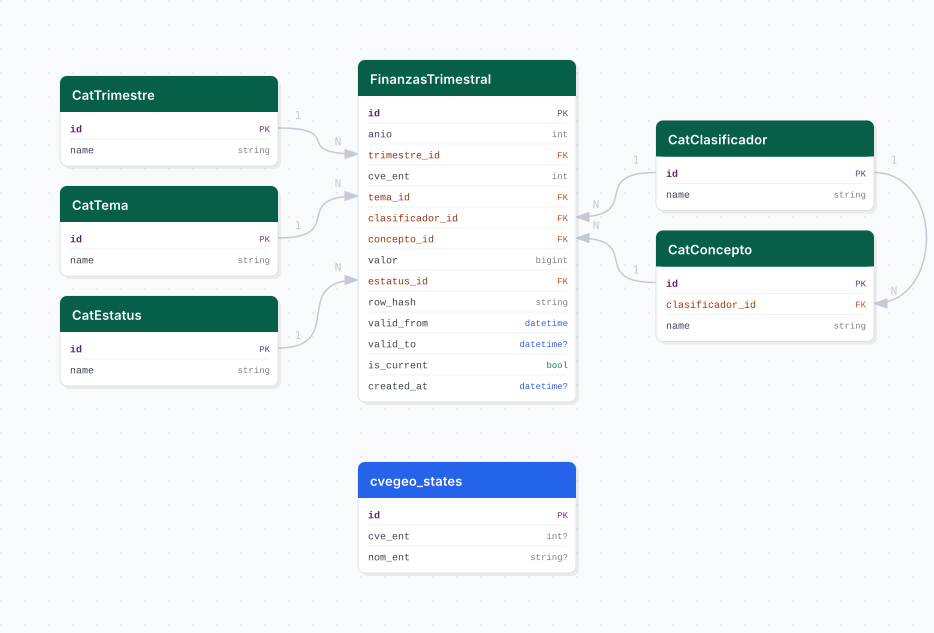

# efipem

## Descripción general

Pipeline ETL de las Estadísticas de Finanzas Públicas Estatales y Municipales (EFIPEM) del INEGI. Contiene datos anuales de ingresos, egresos y deuda de los municipios de Jalisco (`cve_ent = 14`), clasificados por tema, clasificador y concepto presupuestario, y expone 11 vistas materializadas para consumo GIS.

## Fuente general

https://www.inegi.org.mx/programas/finanzas/

## Fuente específica

```shell
EFIPEM_SOURCE_URL=https://www.inegi.org.mx/contenidos/programas/finanzas/datosabiertos/conjunto_de_datos_efipem_municipal_csv.zip
```

## Características de los datos

| Característica | Valor |
|---|---|
| Última fecha disponible | `2024` |
| Frecuencia de actualización | Anual |
| Desagregación | Municipal |
| ¿Tiene update? | No |
| Update | No aplica (dataset anual) |

## Diagrama de entidad relación



## Diccionario de variables

### cat_tema

| variable | descripción |
|---|---|
| `id` | Identificador único del tema |
| `name` | Nombre del tema: `Ingresos`, `Egresos` |

### cat_clasificador

| variable | descripción |
|---|---|
| `id` | Identificador único del clasificador |
| `name` | Nivel de clasificación: `Tema`, `Capítulo`, `Concepto`, etc. |

### cat_concepto

| variable | descripción |
|---|---|
| `id` | Identificador único del concepto |
| `clasificador_id` | FK a `cat_clasificador` |
| `name` | Concepto presupuestario |

### cat_estatus

| variable | descripción |
|---|---|
| `id` | Identificador único del estatus |
| `name` | Estatus de la cifra (por ejemplo, `Definitivo`) |

### stg_efipem

| variable | descripción |
|---|---|
| `id` | Identificador único de la fila (surrogate) |
| `anio` | Año de la cifra |
| `cvegeo` | Clave geográfica municipal de 5 dígitos (INEGI) |
| `cve_ent` | Clave de entidad federativa (siempre 14 = Jalisco) |
| `cve_mun` | Clave de municipio (3 dígitos) |
| `tema_id` | FK a `cat_tema` |
| `clasificador_id` | FK a `cat_clasificador` |
| `concepto_id` | FK a `cat_concepto` |
| `valor` | Monto en pesos corrientes |
| `estatus_id` | FK a `cat_estatus` |
| `created_at` | Timestamp de carga |

## Migraciones

| migración | descripción |
|---|---|
| `V1__foreign_tables.sql` | FDW hacia `cvegeo`, `conapo` e `inpc` |
| `V2__catalogs_efipem.sql` | Catálogos `cat_tema`, `cat_clasificador`, `cat_concepto`, `cat_estatus` |
| `V3__table_efipem.sql` | Tabla principal `stg_efipem` |
| `V4__view_efipem.sql` | Vista de integración `vw_efipem` |
| `V5__fdw_postgis_conapo_inpc.sql` | Extensión PostGIS, FDWs y foreign tables para consumo GIS |
| `V6__vistas_materializadas_efipem.sql` | 11 vistas materializadas con geometrías y deflactado INPC/CONAPO |
| `V7__comments_efipem.sql` | Comentarios en vistas materializadas |

## Vistas materializadas (consumo GIS)

11 vistas materializadas con geometrías (`geom_iieg`, `geom_inegi` SRID 6368) desde `cvegeo_municipalities`, deflactadas con INPC y per cápita con CONAPO.

| vista | descripción |
|---|---|
| `ingresos_totales` | Ingresos municipales totales en pesos corrientes |
| `ingresos_totales_reales_precios_2023` | Ingresos totales deflactados con INPC (base implícita 2023) |
| `ingresos_totales_reales_per_capita_precios_2023` | Ingresos reales per cápita (deflactado / población CONAPO) |
| `ingresos_participaciones` | Monto de participaciones federales recibidas |
| `ingresos_financiamiento` | Ingresos por financiamiento / deuda pública |
| `porcentaje_ingresos_participaciones` | % de participaciones sobre ingresos totales |
| `porcentaje_ingresos_financiamiento` | % de financiamiento sobre ingresos totales |
| `porcentaje_ingresos_propios` | % de ingresos propios (`Impuestos + Productos + Aprovechamientos`) sobre ingresos totales |
| `egresos_totales` | Egresos municipales totales en pesos corrientes |
| `egresos_deuda_publica` | Pago de deuda pública (capital + intereses) |
| `porcentaje_egresos_deuda_publica` | % de pago de deuda sobre egresos totales |

Las vistas se refrescan automáticamente después de cada carga (bootstrap) mediante `refresh_materialized_views` en la etapa de load.

## Variables de entorno

| variable | descripción |
|---|---|
| `DB_USER` / `DB_PASSWORD` / `DB_HOST` / `DB_PORT` / `DB_NAME` | Conexión a la base del pipeline |
| `EFIPEM_SOURCE_URL` | URL del ZIP con los CSVs anuales del EFIPEM municipal |
| `EFIPEM_LOAD_BATCH_SIZE` | Tamaño de lote para inserción masiva |
| `LOG_LEVEL` | Nivel de log |

## Notas metodológicas

### Extract

Descarga el ZIP desde `EFIPEM_SOURCE_URL`, extrae todos los CSVs anuales (`efipem_municipal_anual_tr_cifra_*.csv`) y verifica que existan.

### Transform

Lee y concatena los CSVs anuales, filtra solo registros de Jalisco (`cve_ent = 14`), normaliza headers, convierte tipos, ajusta `cvegeo` a 5 dígitos, colapsa duplicados sumando `valor`, y extrae los catálogos (`tema`, `clasificador`, `estatus`, `concepto`).

### Load

- Inserta los catálogos con `insert_records` (upsert por llave natural).
- Inserta los registros principales con `bulk_insert` en `stg_efipem`.
- Refresca las 11 vistas materializadas vía `refresh_materialized_views`.

## Ejecución

**Bootstrap** (carga histórica completa):

```shell
just flyway-migrate efipem
conda run -n etl python dags/etl_efipem.py
```

No tiene flujo `update` automatizado.

## Notas adicionales

- **Dependencias.** El pipeline requiere que `cvegeo`, `conapo` e `inpc` estén migrados y poblados previamente, ya que las vistas materializadas usan sus tablas vía FDW.
- **Deflactado.** Usa `inpc_nacional.objeto_gasto_id = 1` (`Índice general`). El bootstrap de `inpc` inicia en `2000`, por lo que los años 1989–1999 quedan con `valor = NULL` en las vistas reales y per cápita.
- **Per cápita.** La población se obtiene sumando `pob_total` de `conapo_poblacion` por `municipio_id` y `anio`.
- **Ingresos propios.** Se definen como `Impuestos + Productos + Aprovechamientos` (clasificador `Capítulo`).
- **Consistencia de porcentajes.** La suma `participaciones + propios + financiamiento` no necesariamente es 100 %, ya que el total de ingresos incluye otros capítulos (aportaciones, transferencias, otros ingresos, etc.).
