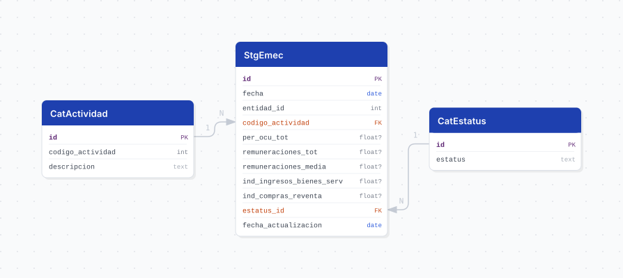

# emec

## Descripción general

Pipeline ETL de la **Encuesta Mensual sobre Empresas Comerciales (EMEC), Serie 2018** del INEGI. Reporta, con periodicidad **mensual desde enero de 2008**, los indicadores de coyuntura de los sectores de comercio al por mayor y al por menor por entidad federativa.

> **Todas las variables son ÍNDICES con base 2018 = 100, no valores absolutos.** No representan pesos, personas ni unidades: son números índice y solo tienen sentido comparados contra la base o entre periodos.

La EMEC es **Información de Interés Nacional** por decreto desde mayo de 2016.

## Fuente general

https://www.inegi.org.mx/programas/emec/2018/#datos_abiertos

## Fuente específica

```shell
EMEC_URL=https://www.inegi.org.mx/contenidos/programas/emec/2018/datosabiertos/conjunto_de_datos_emec_mensual_entidad_federativa_csv.zip
```

Un solo ZIP contiene toda la serie. Estructura relevante:

```
conjunto_de_datos/tr_emec_entidad_federativa_indice_2008_{year}.csv   -> datos
catalogos/tc_actividad.csv                                            -> catálogo SCIAN
diccionario_de_datos/ | metadatos/ | modelo_entidad_relacion/
```

## Características de los datos

| Característica | Valor |
|---|---|
| Primer periodo disponible | `2008-01` |
| Frecuencia de actualización | Mensual |
| Desagregación | Estatal (32 entidades) |
| ¿Tiene update? | Sí |
| Update | Automático (`@monthly`) |
| Estrategia de carga | `upsert_records` |

Las cifras recientes se publican como **preliminares** y el INEGI las reemplaza por revisadas o definitivas en ediciones posteriores; por eso la carga es un upsert sobre `(fecha, entidad_id, codigo_actividad)` y no un append.

## Diagrama de entidad relación



## Diccionario de variables

### stg_emec

| variable | descripción |
|---|---|
| `fecha` | Primer día del mes de referencia (derivado de `ANIO` + `MES`) |
| `entidad_id` | Clave de la entidad federativa, 1 a 32 (ref. `cvegeo_states.cve_ent`) |
| `codigo_actividad` | Código SCIAN 2013 de la actividad; FK a `cat_actividad.codigo_actividad` |
| `per_ocu_tot` | Personal ocupado total — Índice (fuente: `H000W_I000W`) |
| `remuneraciones_tot` | Remuneraciones totales — Índice (fuente: `J000W`) |
| `remuneraciones_media` | Remuneración media — Índice (fuente: `REMUNERACION_MEDIA`) |
| `ind_ingresos_bienes_serv` | Ingresos totales por suministro de bienes y servicios — Índice (fuente: `M000W`) |
| `ind_compras_reventa` | Mercancías compradas para su reventa sin transformación — Índice (fuente: `K100W`) |
| `estatus_id` | FK a `cat_estatus`; cifras definitivas, revisadas o preliminares |
| `fecha_actualizacion` | Fecha en que el pipeline cargó o actualizó el registro |

Los textos completos del diccionario del INEGI viven en los `COMMENT ON COLUMN` de `V3__tables_emec.sql`.

### Catálogos

| tabla | contenido |
|---|---|
| `cat_estatus` | `Cifras definitivas`, `Cifras revisadas`, `Cifras preliminares` |
| `cat_actividad` | Las 56 actividades del clasificador SCIAN 2013 que cubre el programa |

`cat_estatus` se **siembra** con los tres valores del diccionario en orden fijo (`mappings.py::ESTATUS_SEED`) aunque la edición actual solo publique dos: así los ids no se recorren el día que aparezca `Cifras revisadas` y las filas ya cargadas no terminan apuntando a otro estatus. Un valor imprevisto se agrega igual.

`cat_actividad` se carga completo desde `catalogos/tc_actividad.csv`, **no** se deriva de los datos: el conjunto por entidad federativa solo desglosa los sectores `43` y `46`, pero el catálogo oficial trae las 56 actividades.

## Migraciones

| migración | descripción |
|---|---|
| `V1__foreign_tables.sql` | FDW hacia la base `cvegeo` (`cvegeo_states`) |
| `V2__catalogs_emec.sql` | Catálogos de estatus y actividad económica |
| `V3__tables_emec.sql` | Tabla principal `stg_emec` |
| `V4__views_emec.sql` | Vistas `vw_emec` (32 entidades) y `vw_emec_jalisco` |

## Vistas

| vista | alcance |
|---|---|
| `vw_emec` | Las 32 entidades federativas, para comparativos nacionales |
| `vw_emec_jalisco` | Solo Jalisco (`entidad_id = 14`), sin la columna de entidad por ser constante |

## Variables de entorno

| variable | descripción |
|---|---|
| `EMEC_URL` | URL del ZIP del conjunto |
| `EMEC_CSV` | Plantilla del miembro con los datos; el `{}` se sustituye por el año |
| `EMEC_CATALOG_CSV` | Ruta del catálogo SCIAN dentro del ZIP |
| `DOWNLOAD_TIMEOUT` | Timeout de descarga en segundos |
| `CHUNK_SIZE` | Tamaño de lote para el upsert |

## Notas metodológicas

### Extract

`EmecExtract.source()` descarga el ZIP desde `EMEC_URL`. La ruta es **fija**: lo que cambia cada año no es la URL sino el **nombre del archivo dentro del ZIP** (`..._indice_2008_2026.csv` pasa a `..._indice_2008_2027.csv`).

> **Cuidado con el status code.** INEGI responde **HTTP 200 con una página HTML** cuando el archivo no existe, así que `raise_for_status()` no detecta una ruta muerta. La validación se hace sobre la firma del archivo (`PK`), no sobre el código de respuesta.

`helpers/members.py::resolve_dataset_member` intenta primero el miembro que dicta `EMEC_CSV` con el año en curso y, si no está, cae al **año más alto presente en el ZIP** dejando un warning. Ese fallback es lo que evita una caída el 1 de enero sin que nadie toque el `.env`.

> **La fuente es UTF-8, no latin-1.** Es la excepción entre los conjuntos del INEGI que consume este repo (ESGRM sí es latin-1). Leerla como latin-1 **no falla**: produce mojibake (`Ciudad de México`), que después no cruza contra `cvegeo_states` y descarta 7 entidades y ~3,100 filas en silencio. Hay pruebas de regresión en `test_extract.py`.

### Transform

Castea los índices con `pd.to_numeric` **antes** de limpiar nulos, arma `fecha` con `core/utils/periods.py::build_fecha` (combina `ANIO` y `MES`, que viene con tabuladores de relleno) y deriva los catálogos. No resuelve la entidad: eso necesita la base.

### Load

La fuente publica el **nombre** de la entidad, no su clave. `_resolve_entidad` lo cruza contra la tabla foránea `cvegeo_states` con `get_cvegeo_mapping`, normalizando el texto. Se lee de `cvegeo` y no de un diccionario en código para que este pipeline no pueda desviarse del catálogo contra el que se une el resto de la plataforma; un nombre sin correspondencia se descarta con warning nominal, porque `entidad_id` es `NOT NULL`.

`cat_estatus` se inserta con `insert_records` (`DO NOTHING`) para que los ids nunca se muevan; `cat_actividad` se hace upsert sobre `codigo_actividad` porque el INEGI reescribe las descripciones SCIAN entre ediciones mientras que el código —la llave a la que apunta `stg_emec`— no cambia.

## Ejecución

**Bootstrap** (carga inicial 2008 a la fecha):

```shell
just flyway-migrate emec
python dags/etl_emec.py
```

**Update mensual** (DAG `etl_emec_update`, `@monthly`): mismo flujo. El ZIP trae toda la serie, así que el upsert agrega los meses nuevos y reescribe las cifras preliminares que el INEGI haya revisado.

## Notas adicionales

- El conjunto por entidad federativa solo desglosa los sectores `43` (comercio al por mayor) y `46` (comercio al por menor): 2 actividades × 32 entidades × mes.
- Los datos se cargan para las 32 entidades; el filtro a Jalisco vive en la vista, no en la tabla, para no perder la base comparativa nacional.
- Los índices no son aditivos entre actividades ni entre entidades: no se suman.
