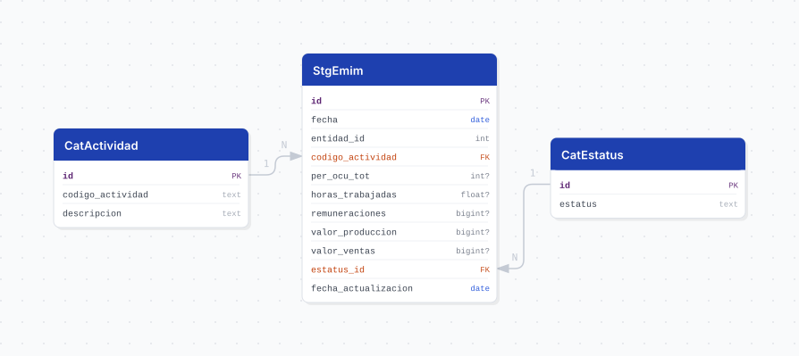

# emim

## Descripción general

Pipeline ETL de la **Encuesta Mensual de la Industria Manufacturera (EMIM), Serie 2018** del INEGI. Reporta, con periodicidad **mensual desde enero de 2018**, personal ocupado, horas trabajadas, remuneraciones, valor de producción y valor de ventas de los establecimientos manufactureros, por entidad federativa y subsector.

> **A diferencia de `emec` y `ems`, este conjunto publica VALORES ABSOLUTOS, no índices base 2018 = 100.** No confundir al comparar entre los tres pipelines.

## Fuente general

https://www.inegi.org.mx/programas/emim/2018/#datos_abiertos

## Fuente específica

```shell
EMIM_URL=https://www.inegi.org.mx/contenidos/programas/emim/2018/datosabiertos/conjunto_de_datos_emim_variables_entidad_csv.zip
```

Estructura relevante del ZIP:

```
conjunto_de_datos/tr_variable_total_entidad_mensual_2018_{year}.csv   -> datos
catalogos/tc_actividad.csv                                            -> catálogo SCIAN 2018
diccionario_de_datos/ | metadatos/ | modelo_entidad_relacion/
```

> **El miembro no lleva "emim" en el nombre.** Se llama `tr_variable_total_entidad_mensual_...`, a diferencia de EMEC y EMS que sí nombran su programa. Y como en ellos, el nombre carga **dos años**: `2018` es el inicio de la serie (fijo) y el segundo es la **edición** (cambia cada enero).

## Características de los datos

| Característica | Valor |
|---|---|
| Primer periodo disponible | `2018-01` |
| Frecuencia de actualización | Mensual |
| Desagregación | Estatal (32 entidades) × sector y subsector |
| ¿Tiene update? | Sí |
| Update | Automático (`@monthly`) |
| Estrategia de carga | `upsert_records` |

## Diagrama de entidad relación



## Diccionario de variables

### stg_emim

| variable | descripción |
|---|---|
| `fecha` | Primer día del mes de referencia (derivado de `ANIO` + `MES`) |
| `entidad_id` | Clave de la entidad federativa, 1 a 32 (`CODIGO_ENTIDAD`; ref. `cvegeo_states.cve_ent`) |
| `codigo_actividad` | **TEXTO**. Código SCIAN 2018; FK a `cat_actividad.codigo_actividad` |
| `per_ocu_tot` | Personal ocupado total (fuente: `H001A`) |
| `horas_trabajadas` | Horas trabajadas por el personal ocupado total (fuente: `H001D`) |
| `remuneraciones` | Remuneraciones pagadas al personal dependiente (fuente: `J000A`) |
| `valor_produccion` | Total de valor de producción de los productos elaborados (fuente: `O101A`) |
| `valor_ventas` | Total de valor de ventas de los productos elaborados (fuente: `M312A`) |
| `estatus_id` | FK a `cat_estatus` |
| `fecha_actualizacion` | Fecha en que el pipeline cargó o actualizó el registro |

Los textos completos del diccionario del INEGI viven en los `COMMENT ON COLUMN` de `V3__tables_emim.sql`.

> ⚠️ **La fuente no declara las unidades de las variables monetarias.** Ni el diccionario de datos ni los metadatos dicen si `remuneraciones`, `valor_produccion` y `valor_ventas` están en pesos o en miles de pesos. Los `COMMENT ON` reproducen el diccionario **al pie de la letra** en vez de inventar una unidad. Las magnitudes son consistentes con **miles de pesos** (para Aguascalientes 2018-01: 1,153,818 entre 79,150 personas ocupadas dan ~14,578 pesos por persona al mes, cifra plausible; en pesos serían 14 pesos), pero **eso es una inferencia, no un dato de la fuente**: confirmar contra los tabulados publicados del INEGI antes de usarlas en un reporte.

`ENTIDAD` (el nombre) se descarta: `CODIGO_ENTIDAD` ya trae la clave y el nombre lo aporta la vista al unir contra `cvegeo_states`.

### Catálogos

| tabla | contenido |
|---|---|
| `cat_estatus` | `Cifras definitivas`, `Cifras revisadas`, `Cifras preliminares` |
| `cat_actividad` | Los 314 niveles del SCIAN 2018 manufacturero (sector, subsector, rama y clase) |

`cat_actividad` se carga completo desde el catálogo del ZIP. Los datos por entidad solo desglosan **22 códigos**: el sector `31-33` y sus 21 subsectores (`311`–`339`).

`cat_estatus` se siembra con los **tres** valores que la fuente publica. El diccionario menciona un cuarto caso como *"Cifras ajustadas y/o Cifras corregidas"*, pero esa redacción no dice si la etiqueta publicada es una cadena o dos; sembrar una ortografía adivinada crearía una fila basura que nunca cruza. Si aparece, entra por el upsert dinámico.

## Migraciones

| migración | descripción |
|---|---|
| `V1__foreign_tables.sql` | FDW hacia la base `cvegeo` (`cvegeo_states`) |
| `V2__catalogs_emim.sql` | Catálogos de estatus y actividad manufacturera |
| `V3__tables_emim.sql` | Tabla principal `stg_emim` |
| `V4__views_emim.sql` | Vistas `vw_emim` (32 entidades) y `vw_emim_jalisco` |

## Vistas

| vista | alcance |
|---|---|
| `vw_emim` | Las 32 entidades federativas, para comparativos nacionales |
| `vw_emim_jalisco` | Solo Jalisco (`entidad_id = 14`), sin la columna de entidad por ser constante |

## Variables de entorno

| variable | descripción |
|---|---|
| `EMIM_URL` | URL del ZIP del conjunto |
| `EMIM_CSV` | Plantilla del miembro con los datos; el `{}` se sustituye por el año de edición |
| `EMIM_CATALOG_CSV` | Ruta del catálogo SCIAN dentro del ZIP |
| `DOWNLOAD_TIMEOUT` | Timeout de descarga en segundos |
| `CHUNK_SIZE` | Tamaño de lote para el upsert |

## Notas metodológicas

### `codigo_actividad` es TEXTO, no un entero

El sector manufacturero se publica como el **rango `31-33`**, no como un número. Ese es el motivo de que `cat_actividad.codigo_actividad` y `stg_emim.codigo_actividad` sean `TEXT` y no `INTEGER` como en `emec` y `ems`.

Consecuencia menos obvia: `NULL_VALUES` incluye `-`, `--` y `---`. `list_values_to_null` compara **valores completos y no subcadenas**, así que `31-33` sobrevive — pero el código está a un guion de desaparecer en silencio, y por eso hay una prueba que lo fija (`test_the_hyphen_is_not_swallowed_by_null_cleaning`).

Tampoco se usa `drop_duplicates_col` para el catálogo: esa utilidad hace `.str.lower()`, y aquí el código es una llave, no una etiqueta.

### Montos en BIGINT

El diccionario declara un máximo de `99,999,999` para las variables monetarias, pero **la fuente ya lo rebasa**: el máximo observado es `128,968,800`. `INTEGER` alcanzaría hoy, pero es un techo demasiado cercano para una serie que crece; se usa `BIGINT`.

### Extract

`EmimExtract.source()` descarga el ZIP desde `EMIM_URL`. La ruta es fija; lo que cambia cada año es el nombre del miembro.

> **Cuidado con el status code.** INEGI responde **HTTP 200 con una página HTML** cuando el archivo no existe, así que `raise_for_status()` no detecta una ruta muerta. La validación se hace sobre la firma del archivo (`PK`).

La resolución del miembro vive en `core/utils/zip_members.py`, compartida con `emec` y `ems`: se intenta el miembro que dicta `EMIM_CSV` con el año en curso y, si no está, se cae al año más alto presente en el ZIP.

La fuente es **UTF-8**. El catálogo nombra su columna `DESCRIPCION`, **no** `DESCRIPCION_ACTIVIDAD` como EMEC y EMS.

### Transform

Castea las medidas con `pd.to_numeric` antes de limpiar nulos y arma `fecha` con `core/utils/periods.py::build_fecha`. `MES` viene **sin padding** (`1`, no `01`) y `CODIGO_ENTIDAD` viene **con tabulador** (`\t01`); ambos casos los absorbe `build_fecha` y el cast numérico.

## Ejecución

**Bootstrap** (carga inicial 2018 a la fecha):

```shell
just flyway-migrate emim
python dags/etl_emim.py
```

**Update mensual** (DAG `etl_emim_update`, `@monthly`): mismo flujo. El ZIP trae toda la serie, así que el upsert agrega los meses nuevos y reescribe las cifras preliminares que el INEGI haya revisado.

## Notas adicionales

- Los datos se cargan para las 32 entidades; el filtro a Jalisco vive en la vista, no en la tabla.
- Hay ceros legítimos en las variables monetarias (el diccionario declara el rango desde 0); no confundirlos con nulos.
- Nulos reales en la edición 2026: `per_ocu_tot` 108, `horas_trabajadas` 151, `remuneraciones` 1,310, `valor_produccion` 2,592, `valor_ventas` 2,557 de 34,845 filas.
