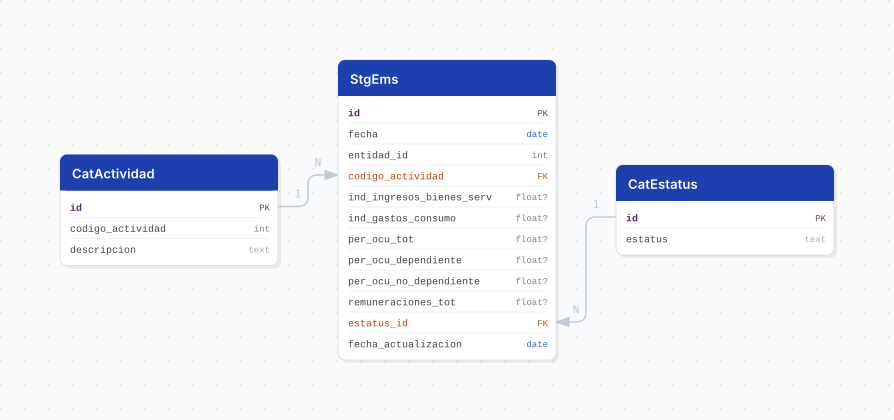

# ems

## Descripción general

Pipeline ETL de la **Encuesta Mensual de Servicios (EMS), Serie 2018** del INEGI. Reporta, con periodicidad **mensual desde enero de 2013**, los indicadores de coyuntura de los **servicios privados no financieros** por entidad federativa.

> **Todas las variables son ÍNDICES con base 2018 = 100, no valores absolutos.** No representan pesos ni personas: son números índice y solo tienen sentido comparados contra la base o entre periodos. **No son aditivos** entre sectores ni entre entidades.

## Fuente general

https://www.inegi.org.mx/programas/ems/2018/#datos_abiertos

## Fuente específica

```shell
EMS_URL=https://www.inegi.org.mx/contenidos/programas/ems/2018/datosabiertos/conjunto_de_datos_ems_mensual_entidad_federativa_csv.zip
```

Un solo ZIP contiene toda la serie. Estructura relevante:

```
conjunto_de_datos/tr_ems_entidad_federativa_indice_2013_{year}.csv   -> datos
catalogos/tc_actividad.csv                                           -> catálogo SCIAN 2018
diccionario_de_datos/ | metadatos/ | modelo_entidad_relacion/
```

> El nombre del archivo carga **dos años**: `2013` es el inicio de la serie (fijo) y el segundo es la **edición** (cambia cada enero). El patrón de descubrimiento está anclado al segundo; hay una prueba que lo verifica.

## Características de los datos

| Característica | Valor |
|---|---|
| Primer periodo disponible | `2013-01` |
| Frecuencia de actualización | Mensual |
| Desagregación | Estatal (32 entidades) |
| ¿Tiene update? | Sí |
| Update | Automático (`@monthly`) |
| Estrategia de carga | `upsert_records` |

Las cifras recientes se publican como **preliminares** y el INEGI las reemplaza por revisadas o definitivas en ediciones posteriores; por eso la carga es un upsert sobre `(fecha, entidad_id, codigo_actividad)` y no un append.

## Diagrama de entidad relación



## Diccionario de variables

### stg_ems

| variable | descripción |
|---|---|
| `fecha` | Primer día del mes de referencia (derivado de `ANIO` + `MES`) |
| `entidad_id` | Clave de la entidad federativa, 1 a 32 (`CVEGEO` de la fuente; ref. `cvegeo_states.cve_ent`) |
| `codigo_actividad` | Código SCIAN 2018 del sector; FK a `cat_actividad.codigo_actividad` |
| `ind_ingresos_bienes_serv` | Ingresos totales por suministro de bienes y servicios — Índice (fuente: `M000`) |
| `ind_gastos_consumo` | Gastos totales por consumo de bienes y servicios — Índice (fuente: `K000`) |
| `per_ocu_tot` | Personal ocupado total — Índice (fuente: `H000A`) |
| `per_ocu_dependiente` | Personal ocupado dependiente de la razón social — Índice (fuente: `H000`) |
| `per_ocu_no_dependiente` | Personal no dependiente de la razón social — Índice (fuente: `I000A`) |
| `remuneraciones_tot` | Remuneraciones totales — Índice (fuente: `J000`) |
| `estatus_id` | FK a `cat_estatus`; cifras definitivas, revisadas o preliminares |
| `fecha_actualizacion` | Fecha en que el pipeline cargó o actualizó el registro |

Los textos completos del diccionario del INEGI viven en los `COMMENT ON COLUMN` de `V3__tables_ems.sql`.

> **Los nulos son reales, no un error de carga.** `per_ocu_dependiente` y `per_ocu_no_dependiente` vienen vacíos en 5,280 de 14,168 filas (~37%); el resto de los índices en 1,020. El INEGI no publica ese desglose para todos los cortes.

`NOM_ENT` de la fuente **se descarta**: `CVEGEO` ya trae la clave y el nombre lo aporta la vista al unir contra `cvegeo_states`.

### Catálogos

| tabla | contenido |
|---|---|
| `cat_estatus` | `Cifras definitivas`, `Cifras revisadas`, `Cifras preliminares` |
| `cat_actividad` | Los 7 sectores de servicios del SCIAN 2018 que cubre el programa |

Los siete sectores: `51` información en medios masivos, `53` inmobiliarios y alquiler, `54` profesionales científicos y técnicos, `61` educativos, `62` salud y asistencia social, `71` esparcimiento, `72` alojamiento y preparación de alimentos.

`cat_estatus` se **siembra** en orden fijo (`mappings.py::ESTATUS_SEED`). EMS sí publica los tres hoy, pero cuáles aparecen depende de la edición: derivar el orden de los datos recorrería los ids la primera vez que un estatus deje de publicarse.

## Migraciones

| migración | descripción |
|---|---|
| `V1__foreign_tables.sql` | FDW hacia la base `cvegeo` (`cvegeo_states`) |
| `V2__catalogs_ems.sql` | Catálogos de estatus y sector de servicios |
| `V3__tables_ems.sql` | Tabla principal `stg_ems` |
| `V4__views_ems.sql` | Vistas `vw_ems` (32 entidades) y `vw_ems_jalisco` |

## Vistas

| vista | alcance |
|---|---|
| `vw_ems` | Las 32 entidades federativas, para comparativos nacionales |
| `vw_ems_jalisco` | Solo Jalisco (`entidad_id = 14`), sin la columna de entidad por ser constante |

## Variables de entorno

| variable | descripción |
|---|---|
| `EMS_URL` | URL del ZIP del conjunto |
| `EMS_CSV` | Plantilla del miembro con los datos; el `{}` se sustituye por el año de edición |
| `EMS_CATALOG_CSV` | Ruta del catálogo SCIAN dentro del ZIP |
| `DOWNLOAD_TIMEOUT` | Timeout de descarga en segundos |
| `CHUNK_SIZE` | Tamaño de lote para el upsert |

## Notas metodológicas

### Extract

`EmsExtract.source()` descarga el ZIP desde `EMS_URL`. La ruta es **fija**: lo que cambia cada año es el **nombre del archivo dentro del ZIP**.

> **Cuidado con el status code.** INEGI responde **HTTP 200 con una página HTML** cuando el archivo no existe, así que `raise_for_status()` no detecta una ruta muerta. La validación se hace sobre la firma del archivo (`PK`), no sobre el código de respuesta.

La resolución del miembro vive en `core/utils/zip_members.py`, compartida con `emec`: `resolve_year_member` intenta el miembro que dicta `EMS_CSV` con el año en curso y, si no está, cae al **año más alto presente en el ZIP** dejando un warning. Eso evita una caída el 1 de enero sin que nadie toque el `.env`.

> **La fuente es UTF-8, no latin-1**, igual que EMEC y a diferencia de ESGRM. Leerla como latin-1 no falla: mojibakea los acentos y ensucia el catálogo en silencio.

### Transform

Castea los índices con `pd.to_numeric` **antes** de limpiar nulos y arma `fecha` con `core/utils/periods.py::build_fecha` (combina `ANIO` y `MES`, que viene con tabuladores de relleno).

A diferencia de `emec`, **no hay resolución de entidad**: la fuente publica `CVEGEO` directo, así que `entidad_id` sale de un cast y desaparece el cruce contra `cvegeo_states` como punto de falla.

### Load

`cat_estatus` se inserta con `insert_records` (`DO NOTHING`) para que los ids nunca se muevan; `cat_actividad` se hace upsert sobre `codigo_actividad` porque el INEGI reescribe las descripciones SCIAN entre ediciones mientras que el código —la llave a la que apunta `stg_ems`— no cambia.

## Ejecución

**Bootstrap** (carga inicial 2013 a la fecha):

```shell
just flyway-migrate ems
python dags/etl_ems.py
```

**Update mensual** (DAG `etl_ems_update`, `@monthly`): mismo flujo. El ZIP trae toda la serie, así que el upsert agrega los meses nuevos y reescribe las cifras preliminares que el INEGI haya revisado.

## Notas adicionales

- Los datos se cargan para las 32 entidades; el filtro a Jalisco vive en la vista, no en la tabla, para no perder la base comparativa nacional.
- La cobertura no es un producto cartesiano: no todas las entidades tienen los 7 sectores en todos los meses.
- EMS y EMEC comparten la estructura del ZIP pero **no las columnas**: EMS no tiene remuneración media ni compras para reventa, y a cambio publica gastos por consumo y el desglose de personal dependiente / no dependiente.
