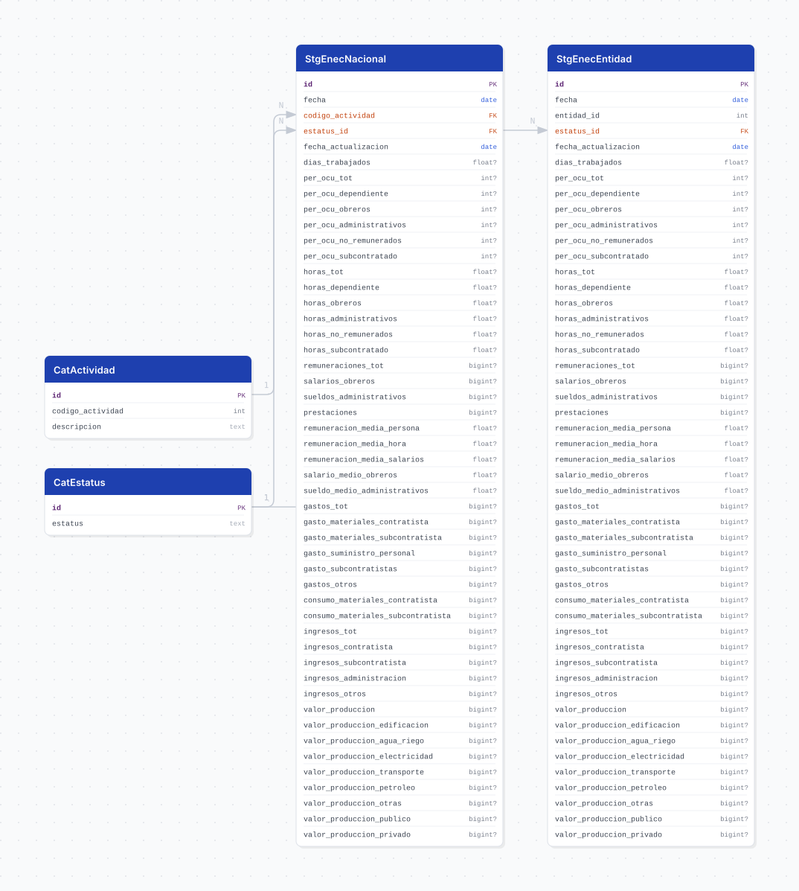

# enec

## Descripción general

Pipeline ETL de la **Encuesta Nacional de Empresas Constructoras (ENEC), Serie 2018** del INEGI. Reporta, con periodicidad **mensual desde enero de 2018**, 44 variables de las empresas constructoras: personal ocupado, horas trabajadas, remuneraciones, gastos, ingresos y valor de producción.

> **Publica VALORES ABSOLUTOS, no índices** (como `emim`, a diferencia de `emec` y `ems`).

## Fuente general

https://www.inegi.org.mx/programas/enec/2018/#datos_abiertos

## Fuente específica

```shell
ENEC_URL=https://www.inegi.org.mx/contenidos/programas/enec/2018/datosabiertos/conjunto_de_datos_enec_mensual_csv.zip
```

El ZIP trae **tres** conjuntos y **ninguna carpeta de catálogos**:

```
conjunto_de_datos/enec_absoluto_nacional_2018_{year}.csv          -> se carga
conjunto_de_datos/enec_absoluto_entidad_2018_{year}.csv           -> se carga
conjunto_de_datos/enec_absoluto_obra_especifico_2018_{year}.csv   -> fuera de alcance
diccionario_de_datos/ | metadatos/
```

`obra_especifico` queda fuera: son 101 filas × 94 medidas, **solo nacional** (sin desglose por entidad) y es un pivote ancho de tipo de obra × sector que, bien modelado, sería una tabla larga `(fecha, tipo_obra, sector, valor)`. Es otro diseño, no una columna más.

Como en el resto de la familia, el nombre del miembro carga **dos años**: `2018` es el inicio de la serie (fijo) y el segundo es la edición (cambia cada enero).

## Características de los datos

| Característica | Valor |
|---|---|
| Primer periodo disponible | `2018-01` |
| Frecuencia de actualización | Mensual |
| Desagregación | Nacional × actividad, y estatal (solo sector 23) |
| ¿Tiene update? | Sí |
| Update | Automático (`@monthly`) |
| Estrategia de carga | `upsert_records` |

## Diagrama de entidad relación



## Dos tablas staging, no una

Los dos conjuntos comparten **las mismas 44 medidas** y difieren solo en su llave:

| tabla | grano | llave única | filas |
|---|---|---|---|
| `stg_enec_nacional` | total nacional × actividad | `(fecha, codigo_actividad)` | 404 |
| `stg_enec_entidad` | entidad federativa (solo sector 23) | `(fecha, entidad_id)` | 3,333 |

Meterlos en una sola tabla obligaría a convivir dos granos distintos —en unas filas varía la entidad con actividad fija, en otras al revés— y a usar el upsert para tapar el traslape. Separados, cada tabla pierde además la columna que en ella sería constante.

En Python las 44 medidas viven en un mixin (`schemas.py::EnecMeasures`) que ambos modelos heredan: escribirlas dos veces es como se desincronizan.

### El agregado nacional que viene dentro del conjunto estatal

El archivo por entidad trae `CVEGEO 00` (Nacional), **byte-idéntico** a las filas de actividad 23 del archivo nacional. Esas 101 filas se descartan al transformar: guardar el total nacional en dos tablas es guardarlo dos veces y dejar que se separen.

### `33 — Obra en el extranjero` sí se queda

No es una entidad federativa y no cruza contra `cvegeo_states`, pero **sí forma parte del total nacional**. Verificado contra la fuente: `32 entidades + obra en el extranjero = nacional`, con diferencia exactamente 0; excluirla descuadra el valor de producción. Las vistas la etiquetan con un `CASE` en lugar de perderla en el join.

## Diccionario de variables

Las 44 medidas, con la unidad que declara la descripción del diccionario del INEGI:

| familia | columnas | unidad |
|---|---|---|
| Días trabajados | `dias_trabajados` | Número de días |
| Personal ocupado | `per_ocu_tot`, `per_ocu_dependiente`, `per_ocu_obreros`, `per_ocu_administrativos`, `per_ocu_no_remunerados`, `per_ocu_subcontratado` | Número de personas |
| Horas trabajadas | `horas_tot`, `horas_dependiente`, `horas_obreros`, `horas_administrativos`, `horas_no_remunerados`, `horas_subcontratado` | Miles de horas |
| Remuneraciones | `remuneraciones_tot`, `salarios_obreros`, `sueldos_administrativos`, `prestaciones` | Miles de pesos corrientes |
| Remuneraciones medias | `remuneracion_media_persona`, `remuneracion_media_hora`, `remuneracion_media_salarios`, `salario_medio_obreros`, `sueldo_medio_administrativos` | Pesos corrientes |
| Gastos | `gastos_tot`, `gasto_materiales_contratista`, `gasto_materiales_subcontratista`, `gasto_suministro_personal`, `gasto_subcontratistas`, `gastos_otros`, `consumo_materiales_contratista`, `consumo_materiales_subcontratista` | Miles de pesos corrientes |
| Ingresos | `ingresos_tot`, `ingresos_contratista`, `ingresos_subcontratista`, `ingresos_administracion`, `ingresos_otros` | Miles de pesos corrientes |
| Valor de producción | `valor_produccion` y su desglose | Miles de pesos corrientes |

El valor de producción se desglosa dos veces, y ambos desgloses suman exactamente el total:

- **por tipo de obra**: `valor_produccion_edificacion`, `_agua_riego`, `_electricidad`, `_transporte`, `_petroleo`, `_otras`
- **por sector**: `valor_produccion_publico`, `valor_produccion_privado`

Los textos completos del diccionario viven en los `COMMENT ON COLUMN` de `V3__tables_enec.sql`, generados desde el propio diccionario de la fuente.

> Los montos son **pesos corrientes**, sin deflactar: comparar dos periodos sin ajustar por inflación mide precios además de volumen.

### Catálogos

| tabla | contenido |
|---|---|
| `cat_estatus` | `Cifras definitivas`, `Cifras revisadas`, `Cifras preliminares` |
| `cat_actividad` | 23 construcción, 236 edificación, 237 obras de ingeniería civil, 238 trabajos especializados |

**El ZIP no trae carpeta de catálogos**, a diferencia de `emec`, `ems` y `emim`. `cat_actividad` se deriva del campo `DESCRIPCION_ACTIVIDAD` que la fuente incluye en línea con los datos del conjunto nacional.

## Migraciones

| migración | descripción |
|---|---|
| `V1__foreign_tables.sql` | FDW hacia la base `cvegeo` (`cvegeo_states`) |
| `V2__catalogs_enec.sql` | Catálogos de estatus y actividad |
| `V3__tables_enec.sql` | `stg_enec_nacional` y `stg_enec_entidad` |
| `V4__views_enec.sql` | Las tres vistas |

## Vistas

| vista | alcance |
|---|---|
| `vw_enec_nacional` | Total nacional con desglose por actividad |
| `vw_enec_entidad` | Las 32 entidades + obra en el extranjero |
| `vw_enec_jalisco` | Solo Jalisco (`entidad_id = 14`) |

## Variables de entorno

| variable | descripción |
|---|---|
| `ENEC_URL` | URL del ZIP del conjunto |
| `ENEC_NACIONAL_CSV` | Plantilla del miembro nacional; el `{}` se sustituye por el año de edición |
| `ENEC_ENTIDAD_CSV` | Plantilla del miembro por entidad |
| `DOWNLOAD_TIMEOUT` | Timeout de descarga en segundos |
| `CHUNK_SIZE` | Tamaño de lote para el upsert |

## Notas metodológicas

### El encabezado trae `"J000A "` con un espacio al final

Literal, así viene el CSV. Sin hacer `strip` de los encabezados el rename no encuentra la columna, `remuneraciones_tot` se carga como puros nulos y **no hay error ni advertencia**. `extract._read_member` normaliza los encabezados y hay dos pruebas de regresión que lo fijan.

### `O110B` se descarta

Es **byte-idéntica a `O110A`**: repite el total del valor de producción como encabezado del desglose por sector. Guardarla sería una columna duplicada sin información.

### Extract

`EnecExtract.source()` descarga el ZIP desde `ENEC_URL`. La ruta es fija; lo que cambia cada año es el nombre de los miembros.

> **Cuidado con el status code.** INEGI responde **HTTP 200 con una página HTML** cuando el archivo no existe, así que `raise_for_status()` no detecta una ruta muerta. La validación se hace sobre la firma del archivo (`PK`).

La resolución de miembros usa `core/utils/zip_members.py`, compartida con `emec`, `ems` y `emim`. Aquí se invoca dos veces, una por conjunto, con patrones que no se cruzan entre sí ni con `obra_especifico`.

La fuente es **UTF-8**.

### Transform

Castea las medidas con `pd.to_numeric` antes de limpiar nulos y arma `fecha` con `core/utils/periods.py::build_fecha`. `MES` y `CVEGEO` vienen con tabulador de relleno; el strip y el cast los absorben.

## Ejecución

**Bootstrap** (carga inicial 2018 a la fecha):

```shell
just flyway-migrate enec
python dags/etl_enec.py
```

**Update mensual** (DAG `etl_enec_update`, `@monthly`): mismo flujo. El ZIP trae toda la serie, así que el upsert agrega los meses nuevos y reescribe las cifras preliminares que el INEGI haya revisado.

## Notas adicionales

- El conjunto por entidad solo cubre el sector `23`; el desglose por actividad existe únicamente a nivel nacional.
- Hay ceros legítimos en las medidas (por ejemplo, obra en el extranjero en enero de 2018); no confundirlos con nulos.
- Cero valores nulos en la edición 2026: los 3,737 registros vienen completos en las 44 medidas.
