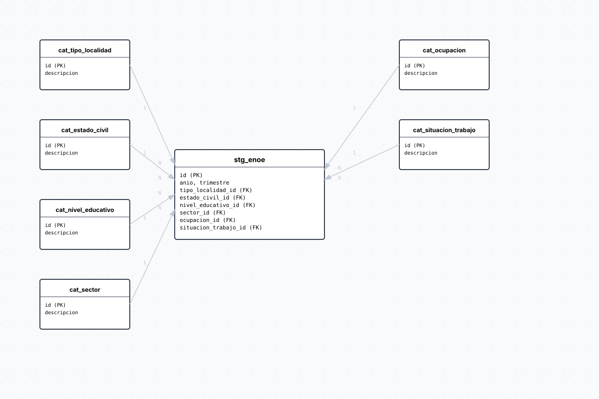

# enoe

## ERD

## Diccionario de variables

### stg_enoe

| variable | descripción |
|---|---|
| `cd_a` | Componente de clave de persona: ciudad o área de levantamiento |
| `con` | Componente de clave de persona: número de conglomerado |
| `v_sel` | Componente de clave de persona: número de vivienda seleccionada |
| `n_hog` | Componente de clave de persona: número de hogar dentro de vivienda |
| `h_mud` | Componente de clave de persona: indicador de mudanza del hogar |
| `n_ent` | Componente de clave de persona: número de entrevista del hogar |
| `n_ren` | Componente de clave de persona: número de renglón (identificador de persona dentro del hogar) |
| `tipo_localidad_id` | FK a catálogo de tamaño de localidad de residencia (variable t_loc_tri SDEM) |
| `eda` | Edad en años cumplidos al momento del levantamiento |
| `sex` | Sexo (1=hombre, 2=mujer) |
| `n_inf` | Número de hijos nacidos vivos (mujeres; variable n_hij SDEM) |
| `estado_civil_id` | FK a catálogo de estado civil o conyugal (variable e_con SDEM) |
| `nivel_educativo_id` | FK a catálogo de nivel de instrucción máximo alcanzado (variable cs_p13_1 SDEM) |
| `cs_p13_2` | Grado cursado dentro del nivel educativo |
| `clase1` | Clasificación de actividad económica: 1=PEA (Población Económicamente Activa), 2=PNEA (variable clase1 SDEM) |
| `clase2` | Subclasificación de condición de actividad: 1=ocupado, 2=desocupado, 3=PNEA disponible, 4=PNEA no disponible (variable clase2 SDEM) |
| `clase3` | Subclasificación adicional de condición de actividad (variable clase3 SDEM) |
| `dur9c` | Horas trabajadas en la semana de referencia agrupadas en 9 categorías (variable dur9c SDEM) |
| `hrsocup` | Horas trabajadas en el empleo principal durante la semana de referencia |
| `ingocup` | Ingreso mensual por ocupación en pesos corrientes (variable ingocup SDEM) |
| `ma48me1sm` | Múltiplo del salario mínimo mensual correspondiente al ingreso (variable ma48me1sm SDEM) |
| `emp_ppal` | Posición en el trabajo principal (variable emp_ppal SDEM): obrero, empleador, cuenta propia, etc. |
| `sector_id` | FK a catálogo de sector económico del empleo principal (variable rama_est1 SDEM, 4 valores primario–terciario) |
| `ocupacion_id` | FK a catálogo de grupo de ocupación principal en 11 categorías (variable c_ocu11c SDEM) |
| `situacion_trabajo_id` | FK a catálogo de clasificación informal/formal del empleo principal (variable tue_ppal SDEM). Base para metodología TIL1 |
| `seg_soc` | Acceso a seguridad social por el trabajo: 1=con acceso, 2=sin acceso, 3=no especificado (variable seg_soc SDEM) |
| `pre_asa` | Prestaciones laborales: 1=con prestaciones, 2=sin prestaciones, 3=no especificado (variable pre_asa SDEM) |
| `fac` | Factor de expansión trimestral (variable fac_tri SDEM). Pondera microdatos a universo de población |
| `es_pea` | Indicador derivado: pertenece a la PEA (clase1=1) |
| `es_ocupado` | Indicador derivado: está ocupado (clase2=1) |
| `es_desocupado` | Indicador derivado: está desocupado dentro de la PEA (clase2=2) |
| `es_informal` | Indicador derivado según metodología TIL1 INEGI: ocupado (clase2=1) AND en sector informal (situacion_trabajo_id=1) |

## Fuentes

| nivel | tabla | url |
|---|---|---|
| Persona | SDEM (Sociodemográfico y de Empleo) | `ENOE_URL` en `.env`: `https://www.inegi.org.mx/contenidos/programas/enoe/15ymas/datosabiertos/{anio}/conjunto_de_datos_enoe_{anio}_{trimestre}t_csv.zip` |

**Alcance:** Jalisco (entidad_id = 14)

## Actualización

| característica | valor |
|---|---|
| Frecuencia | Trimestral |
| Tipo de actualización | Automático (DAG programado) |
| Bootstrap | Bajo demanda, carga histórica desde 2005 T1 a trimestre más reciente disponible |
| DAG actualización | `etl_enoe_update` — día 10 de cada trimestre (marzo, junio, septiembre, diciembre) a las 03:00 UTC |
| Justificación | ENOE es una encuesta trimestral del INEGI. Publicación típicamente en el día 70 del trimestre siguiente. Updates automáticas cada 10 de mes inicio de trimestre |

## Catálogos

Seis catálogos de referencia con mapeos SDEM:

- **cat_sector** — Sector económico (4 valores: no aplica, primario, secundario, terciario)
- **cat_ocupacion** — Grupo ocupacional (11 categorías: profesionales, técnicos, educadores, etc.)
- **cat_situacion_trabajo** — Clasificación formal/informal (no aplica, sector informal, fuera sector informal)
- **cat_tipo_localidad** — Tamaño de localidad (mayores 100k, 15k–99k, 2.5k–14k, menores 2.5k)
- **cat_estado_civil** — Estado civil o conyugal (6 valores más "no sabe")
- **cat_nivel_educativo** — Nivel educativo máximo alcanzado (0–9 más "no sabe")

## Vistas

- **v_enoe_jalisco** — Vista person-level con catálogos decodificados y nombre de municipio vía FDW `cvegeo_municipalities`
- **v_enoe_indicadores_municipio** — Indicadores agregados por año/trimestre/municipio: totales, ponderados (con factor de expansión), tasas de desocupación e informalidad (TIL1), ingreso promedio
