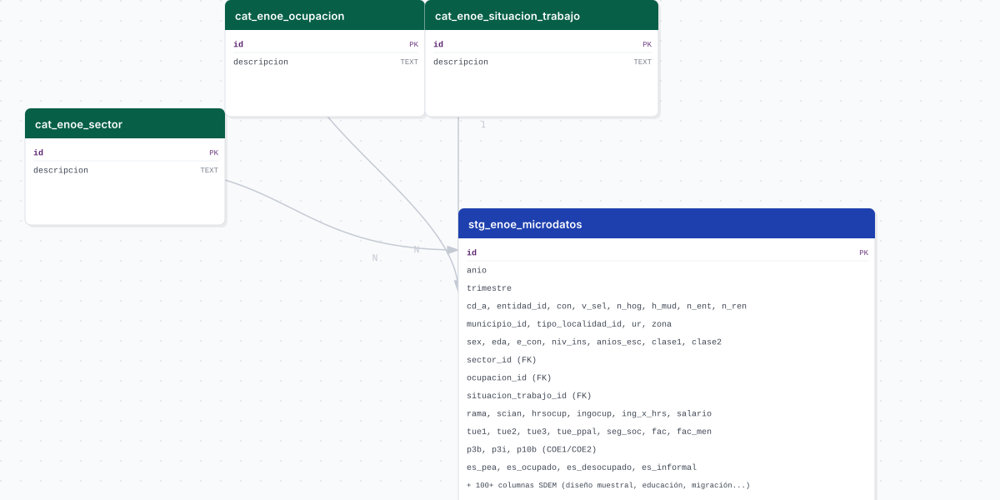

# enoe_microdatos

## Descripción general

Pipeline ETL de los microdatos completos de la Encuesta Nacional de Ocupación y Empleo (ENOE) del INEGI a nivel persona para Jalisco (SDEM + COE1 + COE2). A diferencia del pipeline `enoe` (solo tabla SDEM), este incluye el diseño muestral completo, variables de educación, migración, búsqueda de empleo e informalidad laboral (TIL1), además de las 11 tasas oficiales de ocupación y desocupación del INEGI calculadas en vistas materializadas. Disponible desde el primer trimestre de 2005, con un hueco entre 2020 T2 y 2022 T4 por la pausa COVID-19/ETOE.

## Fuente general

https://www.inegi.org.mx/programas/enoe/15ymas/microdatos/

## Fuente específica

```shell
MICRODATOS_URL=https://www.inegi.org.mx/contenidos/programas/enoe/15ymas/microdatos/enoe_{anio}_trim{trimestre}_csv.zip
```

## Características de los datos

| Característica | Valor |
|---|---|
| Última fecha disponible | `2026-Q1` |
| Frecuencia de actualización | Trimestral |
| Desagregación | Municipal |
| ¿Tiene update? | Sí |
| Update | Automático |

## Diagrama de entidad relación



## Diccionario de variables

### stg_enoe_microdatos

| variable | descripción |
|---|---|
| `anio` | Año de levantamiento de la encuesta (2005-presente) |
| `trimestre` | Trimestre de levantamiento (1-4) |
| `cd_a` | Ciudad o área de levantamiento; parte de la clave natural del registro |
| `entidad_id` | Clave de la entidad federativa (siempre 14 para Jalisco) |
| `con` | Número de control del hogar; parte de la clave natural |
| `v_sel` | Vivienda seleccionada; parte de la clave natural |
| `n_hog` | Número del hogar dentro de la vivienda |
| `h_mud` | Indica si el hogar se mudó (hogar sustituto) |
| `n_ent` | Número de la entrevista dentro del hogar |
| `n_ren` | Número de renglón (persona dentro del hogar) |
| `municipio_id` | Clave del municipio (FK implícita a `cvegeo_municipalities`) |
| `tipo_localidad_id` | Tamaño de localidad trimestral |
| `ur` | Zona urbano/rural (1=Urbano, 2=Rural) |
| `zona` | Zona geográfica de la encuesta |
| `sex` | Sexo (1=Hombre, 2=Mujer) |
| `eda` | Edad en años cumplidos |
| `nac_dia`, `nac_mes`, `nac_anio` | Fecha de nacimiento (día, mes, año) |
| `e_con` | Estado conyugal (1=Unido, 2=Separado, 3=Divorciado, 4=Viudo, 5=Soltero) |
| `niv_ins` | Nivel de instrucción recodificado |
| `anios_esc` | Años de escolaridad aprobados |
| `clase1` | Condición de actividad (1=PEA, 2=PNEA) |
| `clase2` | Condición de ocupación (1=Ocupado, 2=Desocupado) |
| `clase3` | Condición de ocupación desagregada |
| `seg_soc` | Acceso a servicios de salud por ocupación principal (1=Con, 2=Sin) |
| `rama` | Rama de actividad económica (1 dígito SCIAN adaptado ENOE) |
| `rama_est2` | Rama de actividad económica estrato 2 (versiones históricas) |
| `scian` | Clave de subsector SCIAN de la actividad principal |
| `hrsocup` | Horas trabajadas en la semana de referencia (ocupación principal) |
| `ingocup` | Ingreso mensual por trabajo (pesos corrientes) |
| `ing_x_hrs` | Ingreso por hora trabajada (pesos corrientes) |
| `salario` | Salario mínimo general diario de referencia |
| `tue1`, `tue2`, `tue3` | Componentes de la tasa de informalidad laboral (TIL1) |
| `tue_ppal` | Trabajo informal en ocupación principal (1=Informal, 2=Formal) |
| `emp_ppal` | Características de la empresa en la ocupación principal |
| `trans_ppal` | Tipo de transacción en la ocupación principal |
| `sub_o` | Subocupación (1=Subocupado, 2=No subocupado) |
| `fac` | Factor de expansión trimestral |
| `fac_men` | Factor de expansión mensual |
| `sector_id` | FK a `cat_enoe_sector` — derivado de `rama_est1` |
| `ocupacion_id` | FK a `cat_enoe_ocupacion` — derivado de `c_ocu11c` |
| `situacion_trabajo_id` | FK a `cat_enoe_situacion_trabajo` — derivado de `pos_ocu` |
| `p3b` | COE1 — Número de trabajadores en el establecimiento (codificado por rangos) |
| `p3i` | COE1 — Tiene contrato escrito (1=Sí indefinido, 2=Sí temporal, 3=No) |
| `p10b` | COE2 — Razón por la que no trabajó la semana de referencia |
| `es_pea` | TRUE si la persona pertenece a la Población Económicamente Activa (`clase1=1`) |
| `es_ocupado` | TRUE si la persona está ocupada (`clase2=1`) |
| `es_desocupado` | TRUE si la persona está desocupada (`clase2=2`) |
| `es_informal` | TRUE si el trabajo principal es informal (`clase2=1` y `tue_ppal=1`) |

### cat_enoe_sector

| variable | descripción |
|---|---|
| `id` | Identificador del sector (0=No aplica, 1=Primario, 2=Secundario, 3=Terciario, 4=No especificado) |
| `descripcion` | Nombre del sector económico |

### cat_enoe_ocupacion

| variable | descripción |
|---|---|
| `id` | Identificador del grupo de ocupación (0-11) |
| `descripcion` | Descripción del grupo ocupacional (ej. Profesionales técnicos y trabajadores del arte) |

### cat_enoe_situacion_trabajo

| variable | descripción |
|---|---|
| `id` | Identificador de la situación (0=No aplica, 1=Subordinados remunerados, 2=Empleadores, 3=Cuenta propia, 4=Sin pago, 5=No especificado) |
| `descripcion` | Descripción de la situación en el trabajo |

## Migraciones

| migración | descripción |
|---|---|
| `V1__foreign_tables.sql` | FDW hacia `cvegeo` (estados y municipios) |
| `V2__catalogs_enoe_microdatos.sql` | Catálogos: sector, ocupación, situación de trabajo |
| `V3__table_enoe_microdatos.sql` | Tabla principal `stg_enoe_microdatos` |
| `V4__views_enoe_microdatos.sql` | Vista materializada `mv_enoe_microdatos` con joins resueltos |
| `V5__comments_enoe_microdatos.sql` | Comentarios en tablas, catálogos y tablas foráneas |
| `V6__mv_enoe_tasas.sql` | Vista materializada `mv_enoe_tasas` (11 tasas por municipio y trimestre) |
| `V7__mv_enoe_tasas_jalisco.sql` | Vista materializada `mv_enoe_tasas_jalisco` (11 tasas a nivel estado) |
| `V8__mv_enoe_tasas_por_sexo.sql` | Recrea `mv_enoe_tasas` y `mv_enoe_tasas_jalisco` con desagregación por sexo |
| `V9__comments_mv_tasas.sql` | Comentarios en las vistas materializadas de tasas |

## Vistas materializadas

Tres vistas con diferentes niveles de agregación:

| Vista | Granularidad | Filas aprox. |
|---|---|---|
| `mv_enoe_microdatos` | 1 fila = 1 persona encuestada (microdatos con joins resueltos) | ~1,090,806 |
| `mv_enoe_tasas` | 1 fila = municipio × trimestre | ~3,250 |
| `mv_enoe_tasas_jalisco` | 1 fila = trimestre (estado completo) | 74 |

> **Nota estadística**: ENOE no es representativa a nivel municipio. El diseño muestral opera por `cd_a` (ciudad/área). Por ejemplo, `cd_a = 2` corresponde a la Zona Metropolitana de Guadalajara (Guadalajara, Zapopan, Tlaquepaque, Tonalá, Tlajomulco de Zúñiga, El Salto). Para valores que coincidan con cifras oficiales INEGI usar `mv_enoe_tasas_jalisco`.

Las vistas `mv_enoe_tasas` y `mv_enoe_tasas_jalisco` incluyen las 11 tasas y poblaciones base desagregadas por sexo con sufijos `_h` (hombres, `sex=1`) y `_m` (mujeres, `sex=2`). Ejemplo: `td_h`, `td_m`, `pea_h`, `pea_m`.

Se refrescan automáticamente (`REFRESH MATERIALIZED VIEW CONCURRENTLY`) al final de cada carga (bootstrap/update) en la etapa de load.

## Tasas INEGI — metodología

Las 11 tasas siguen la metodología de *ENOE. Conociendo la base de datos* (INEGI, 2023).

### Criterio general poblacional

Aplica a todas las tasas:

```
r_def = 0          -- entrevista completa
c_res IN (1, 3)    -- residente habitual o nuevo residente
eda BETWEEN 15 AND 98
```

### Poblaciones base

Las poblaciones se obtienen sumando el factor de expansión trimestral (`fac` = FAC_TRI). **Nunca contar registros — siempre sumar `fac`.**

| Población | Criterio adicional |
|---|---|
| P15yMAS | Sin filtro adicional |
| PEA | `clase1 = 1` |
| PD | `clase2 = 2` |
| PO | `clase2 = 1` |
| PONA | `clase2 = 1 AND ambito1 <> 1` |

### Fórmulas de las 11 tasas

| # | Tasa | Columna | Fórmula |
|---|---|---|---|
| I | Tasa de Participación | `tp` | PEA / P15yMAS × 100 |
| II | Tasa de Desocupación | `td` | PD / PEA × 100 |
| III | Tasa de Ocupación Parcial y Desocupación | `topd` | (PD + O<15hrs) / PEA × 100 |
| IV | Tasa de Presión General | `tprg` | (PD + POBOT) / PEA × 100 |
| V | Tasa de Trabajo Asalariado | `tta` | PASA / PO × 100 |
| VI | Tasa de Subocupación | `tsub` | PSUB_O / PO × 100 |
| VII | Tasa de Condiciones Críticas de Ocupación | `tcco` | PCCO / PO × 100 |
| VIII | Tasa de Ocupación en el Sector Informal 1 | `tosi1` | POSI / PO × 100 |
| IX | Tasa de Informalidad Laboral 1 | `til1` | POI / PO × 100 |
| X | Tasa de Ocupación en el Sector Informal 2 | `tosi2` | POSI / PONA × 100 |
| XI | Tasa de Informalidad Laboral 2 | `til2` | POINA / PONA × 100 |

Donde:
- **O<15hrs**: `clase2=1 AND dur9c=2`
- **POBOT**: `clase2=1 AND tpg_p8a=1`
- **PASA**: `clase2=1 AND remune2c=1`
- **PSUB_O**: `clase2=1 AND sub_o=1`
- **PCCO**: `clase2=1 AND tcco IN (1,2,3)`
- **POSI**: `clase2=1 AND tue2=5`
- **POI**: `clase2=1 AND emp_ppal=1`
- **POINA**: `clase2=1 AND emp_ppal=1 AND ambito1<>1`

## Variables de entorno

| variable | descripción |
|---|---|
| `MICRODATOS_URL` | URL principal de descarga, patrón vigente desde 2023 (template `{anio}`, `{trimestre}`) |
| `MICRODATOS_URL_ENOE_N` | URL alterna para 2021-2022 (prefijo `enoe_n_`, encuesta no publicada oficialmente por COVID-19) |
| `MICRODATOS_URL_LEGACY` | URL alterna para 2005-2020 (sin prefijo) |
| `BOOTSTRAP_START_YEAR` | Año de inicio del bootstrap histórico (`2005`) |
| `BOOTSTRAP_START_TRIMESTRE` | Trimestre de inicio del bootstrap histórico (`1`) |

## Notas metodológicas

### Extract

Descarga el ZIP CSV con SDEM + COE1 + COE2 por año y trimestre, probando en orden `MICRODATOS_URL`, `MICRODATOS_URL_ENOE_N` y `MICRODATOS_URL_LEGACY` según la nomenclatura vigente en cada periodo. Filtra las filas a Jalisco (`entidad_id = 14`) antes de guardar. En modo update, omite los trimestres que ya existen en la base de datos.

### Transform

Castea columnas numéricas y enteras, limpia valores nulos (`NULL_VALUES`), renombra columnas (`RENAME_HEADER`) para unificar nomenclatura entre periodos (`ent`/`cve_ent`, `mun`/`cve_mun`, `t_loc`/`t_loc_tri`, `rama_est1`→`sector_id`, `c_ocu11c`→`ocupacion_id`, `pos_ocu`→`situacion_trabajo_id`, `fac_tri`→`fac`), agrega `anio`/`trimestre`, y calcula los indicadores `es_pea`, `es_ocupado`, `es_desocupado` y `es_informal` (metodología TIL1 del INEGI, con base en `tue_ppal`).

### Load

Upsert de catálogos con `insert_records` e inserción de microdatos en `stg_enoe_microdatos` con `insert_records`, evitando duplicados por la clave natural de persona (`anio`, `trimestre`, `cd_a`, `entidad_id`, `con`, `v_sel`, `n_hog`, `h_mud`, `n_ent`, `n_ren`). Al finalizar, refresca las tres vistas materializadas (`mv_enoe_microdatos`, `mv_enoe_tasas`, `mv_enoe_tasas_jalisco`).

## Ejecución

**Bootstrap** (carga inicial, histórico desde 2005 T1):

```shell
just flyway-migrate enoe_microdatos
conda run -n etl python -m core.pipelines.enoe_microdatos bootstrap
```

**Update** (trimestral, DAG `etl_enoe_microdatos_incremental`, schedule `0 0 10 3,6,9,12 *`):

```shell
conda run -n etl python -m core.pipelines.enoe_microdatos update
```

## Notas adicionales

Alcance geográfico: Jalisco (`entidad_id = 14`). Los periodos 2020 T2 a 2022 T4 no están disponibles por la pausa COVID-19/ETOE. ENOE no es representativa a nivel municipio — el diseño muestral opera por `cd_a` (ciudad/área) — por lo que para comparar contra cifras oficiales del INEGI a nivel estatal debe usarse `mv_enoe_tasas_jalisco`.
