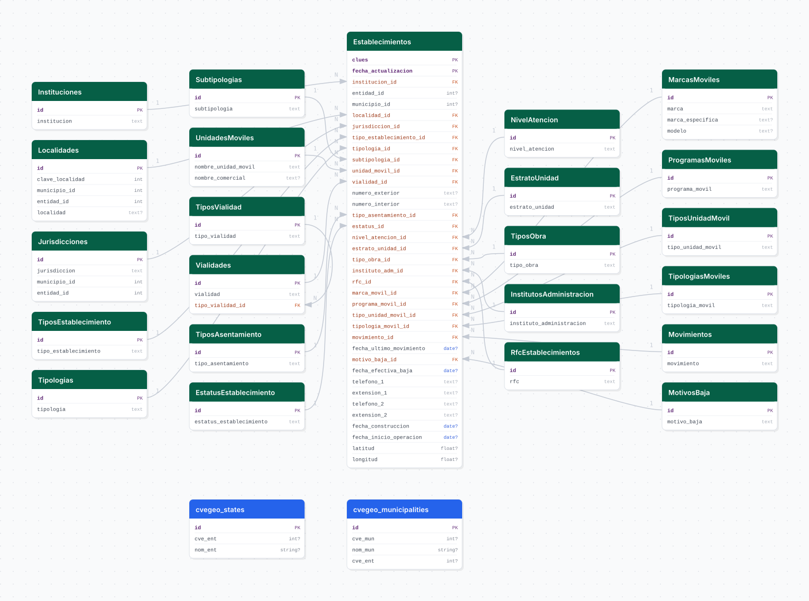

# establecimientos_de_salud

## Descripción general

Pipeline ETL del Catálogo de Establecimientos de Salud (CLUES) de la Secretaría de Salud. Descarga mensualmente el inventario de establecimientos de salud en México, incluyendo tipo de servicio, institución, tipología, geolocalización y estatus, con historial desde mayo de 2017.

## Fuente general

https://www.gob.mx/salud/documentos/clues-sistema-unico-de-informacion-de-infraestructura-de-la-salud

## Fuente específica

```shell
ESTABLECIMIENTOS_URL=https://gobi.salud.gob.mx/historico_clues/ESTABLECIMIENTO_SALUD_{year}{month}.xlsx?v=1.1
```

## Características de los datos

| Característica | Valor |
|---|---|
| Última fecha disponible | `2025-04` |
| Frecuencia de actualización | Mensual |
| Desagregación | Nacional, Estatal, Municipal, Localidad |
| ¿Tiene update? | Sí |
| Update | Automático |

## Diagrama de entidad relación



## Diccionario de variables

### establecimientos

| variable | descripción |
|---|---|
| `clues` | Clave Única de Establecimientos de Salud (PK) |
| `fecha_actualizacion` | Mes del corte (PK compuesta con `clues`) |
| `institucion_id` | FK a institución de salud (IMSS, ISSSTE, SSA, etc.) |
| `localidad_id` | FK a localidad |
| `jurisdiccion_id` | FK a jurisdicción sanitaria |
| `tipo_establecimiento_id` | FK a tipo de establecimiento |
| `tipologia_id` | FK a tipología de unidad |
| `subtipologia_id` | FK a subtipología |
| `unidad_movil_id` | FK a unidad móvil (si aplica) |
| `vialidad_id` | FK a vialidad del domicilio |

## Migraciones

| migración | descripción |
|---|---|
| `V1__foreign_tables.sql` | FDW hacia la base `cvegeo` |
| `V2__catalogs_establecimientos.sql` | Catálogos de instituciones, tipologías, jurisdicciones, estatus y niveles |
| `V3__table_establecimientos.sql` | Tabla principal `establecimientos` |
| `V4__view_establecimientos.sql` | Vista desnormalizada nacional |
| `V5__view_estab_jal.sql` | Vista filtrada a Jalisco |
| `V6__view_estab_jal_activos.sql` | Vista de establecimientos activos en Jalisco |

## Variables de entorno

| variable | descripción |
|---|---|
| `ESTABLECIMIENTOS_URL` | URL con parámetros `{year}` y `{month}` para el XLSX mensual |
| `BOOTSTRAP_START_YEAR` | Año inicial del bootstrap (ej. `2017`) |
| `BOOTSTRAP_START_MONTH` | Mes inicial del bootstrap (ej. `5`) |

## Notas metodológicas

### Extract

Genera la lista de periodos mensuales desde `(BOOTSTRAP_START_YEAR, BOOTSTRAP_START_MONTH)` hasta el mes actual y descarga el XLSX de cada periodo. En update, calcula el siguiente mes desde el último registro en BD.

### Transform

Lee el XLSX, aplica mapeo de columnas, normaliza texto (titlecase/capitalize), parsea fechas y claves geográficas, y extrae catálogos.

### Load

Upsert en la tabla `establecimientos` usando `(clues, fecha_actualizacion)` como clave natural. Los catálogos se sincronizan antes de la carga principal.

## Ejecución

**Bootstrap** (desde mayo 2017):

```shell
just flyway-migrate establecimientos_de_salud
conda run -n etl python -m core.pipelines.establecimientos_de_salud bootstrap
```

**Update mensual** (DAG `etl_establecimientos_de_salud_update`, `@monthly`):

```shell
conda run -n etl python -m core.pipelines.establecimientos_de_salud update
```

## Notas adicionales

El XLSX mensual contiene el inventario completo, no solo los cambios. La tabla crece con un snapshot por mes, lo que permite análisis de altas y bajas de establecimientos. El bootstrap desde 2017 puede tardar varias horas.
