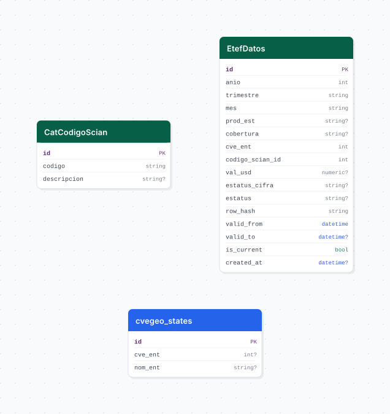

# etef

## Descripción general

Pipeline ETL de las Estadísticas de la Industria de Exportación (ETEF) del INEGI. Descarga datos trimestrales de exportaciones de la industria maquiladora y manufacturera de exportación por entidad federativa, implementando SCD Tipo 2 para rastrear cambios históricos en las cifras.

## Fuente general

https://www.inegi.org.mx/programas/exporta_ef/

## Fuente específica

```shell
ETEF_SOURCE_URL=https://www.inegi.org.mx/contenidos/programas/exporta_ef/datosabiertos/conjunto_de_datos_eef_trimestral_csv.zip
```

## Características de los datos

| Característica | Valor |
|---|---|
| Última fecha disponible | `2025-Q1` |
| Frecuencia de actualización | Trimestral |
| Desagregación | Nacional, Estatal |
| ¿Tiene update? | Sí |
| Update | Automático |

## Diagrama de entidad relación



## Diccionario de variables

### etef_datos

| variable | descripción |
|---|---|
| `trimestre` | Clave del trimestre (ej. `T1`) |
| `mes` | Mes dentro del trimestre |
| `prod_est` | Producto/estado de la industria exportadora |
| `cobertura` | Cobertura geográfica |
| `val_usd` | Valor de exportación en dólares (USD) |
| `estatus_cifra` | Estatus de la cifra (preliminar, definitiva, etc.) |
| `estatus` | Estatus del registro |
| `row_hash` | Hash SHA-256 de la fila (para SCD2) |
| `valid_from` | Timestamp de inicio de vigencia (SCD2) |
| `valid_to` | Timestamp de fin de vigencia (SCD2, nulo si es actual) |
| `is_current` | Indica si el registro es la versión vigente |

## Migraciones

| migración | descripción |
|---|---|
| `V1__foreign_tables.sql` | FDW hacia la base `cvegeo` |
| `V2__catalogs_etef.sql` | Catálogo de códigos SCIAN |
| `V3__table_etef.sql` | Tabla principal `etef_datos` con columnas SCD2 |
| `V4__view_etef.sql` | Vista de registros vigentes |

## Variables de entorno

| variable | descripción |
|---|---|
| `ETEF_SOURCE_URL` | URL del ZIP con el CSV trimestral del ETEF |
| `ETEF_LOAD_BATCH_SIZE` | Tamaño de lote para inserción masiva |

## Notas metodológicas

### Extract

Descarga el ZIP desde `ETEF_SOURCE_URL`, detecta dinámicamente el CSV dentro del ZIP (prioriza la carpeta `conjunto_de_datos/`) y lo extrae al directorio de trabajo.

### Transform

Lee el CSV, normaliza columnas, extrae catálogos SCIAN, calcula el hash SHA-256 de cada fila con las columnas clave para identificar cambios (SCD2).

### Load

Compara hashes con los registros actuales en BD. Los registros sin cambios se omiten; los modificados se cierran (`is_current=False`, `valid_to=now()`) y se insertan como nuevas versiones; los nuevos se insertan directamente.

## Ejecución

**Bootstrap** (carga inicial completa):

```shell
just flyway-migrate etef
conda run -n etl python -m core.pipelines.etef bootstrap
```

**Update trimestral** (DAG `etl_etef_update`, `@quarterly`):

```shell
conda run -n etl python -m core.pipelines.etef update
```

## Notas adicionales

El INEGI revisa y corrige cifras trimestrales con rezago; el SCD2 preserva el histórico de correcciones. La detección dinámica del CSV en el ZIP garantiza compatibilidad ante cambios en la estructura del archivo.
