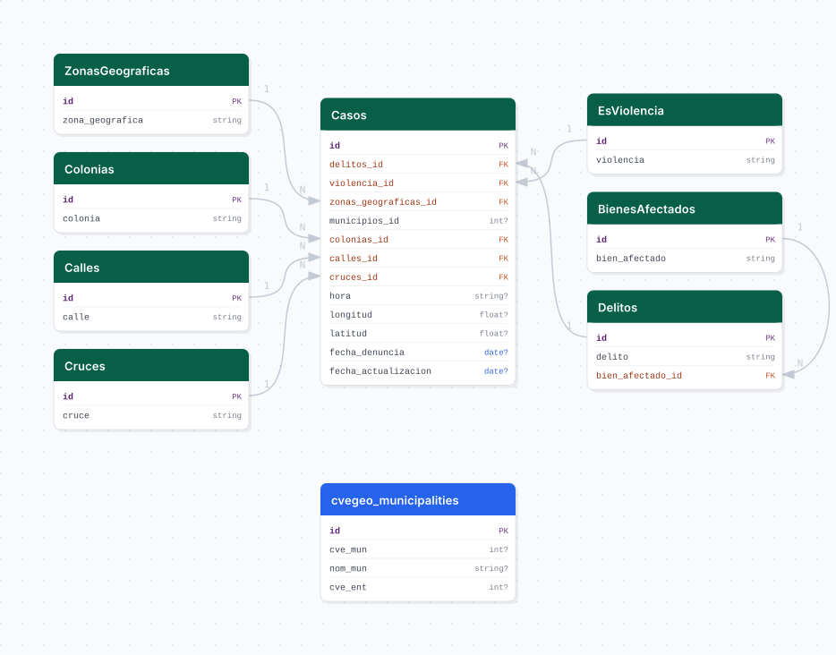

# fiscalia

## Descripción general

Pipeline ETL de carpetas de investigación de la Fiscalía General del Estado de Jalisco. Ingesta datos de casos denunciados incluyendo delito, zona geográfica, municipio, colonia, calle, fecha y coordenadas geográficas. Los archivos se obtienen desde Google Drive mediante cuenta de servicio.

## Fuente general

https://fiscaliajalisco.gob.mx

## Fuente específica

Los archivos se encuentran en una carpeta de Google Drive compartida. La cuenta de servicio requiere acceso previo.

```shell
GDRIVE_FOLDER_ID=
HISTORICAL_FILENAME=
```

## Características de los datos

| Característica | Valor |
|---|---|
| Última fecha disponible | `2025` |
| Frecuencia de actualización | Mensual |
| Desagregación | Municipal |
| ¿Tiene update? | Sí |
| Update | Manual |

## Diagrama de entidad relación



## Diccionario de variables

### casos

| variable | descripción |
|---|---|
| `delitos_id` | FK a catálogo de delitos |
| `violencia_id` | FK a catálogo de tipo de violencia |
| `zonas_geograficas_id` | FK a zona geográfica de la Fiscalía |
| `municipios_id` | FK a municipio (puede ser nulo) |
| `colonias_id` | FK a catálogo de colonias |
| `calles_id` | FK a catálogo de calles |
| `cruces_id` | FK a catálogo de cruces |
| `hora` | Hora del evento (HH:MM) |
| `longitud` / `latitud` | Coordenadas geográficas del hecho |
| `fecha_denuncia` | Fecha en que se presentó la denuncia |
| `fecha_actualizacion` | Fecha del corte del archivo |

## Migraciones

| migración | descripción |
|---|---|
| `V1__foreign_tables.sql` | FDW hacia la base `cvegeo` |
| `V2__catalogos_fiscalia.sql` | Catálogos de delitos, bienes afectados, violencia y zonas geográficas |
| `V3__tabla_casos.sql` | Tabla principal `casos` |
| `V4__vista_fiscalia.sql` | Vista analítica desnormalizada |

## Variables de entorno

| variable | descripción |
|---|---|
| `GDRIVE_FOLDER_ID` | ID de la carpeta de Google Drive con los archivos |
| `GDRIVE_CLIENT_EMAIL` | Email de la cuenta de servicio de Google |
| `GDRIVE_PRIVATE_KEY` | Clave privada de la cuenta de servicio |
| `HISTORICAL_FILENAME` | Nombre del archivo histórico consolidado |

## Notas metodológicas

### Extract

Descarga los archivos de la carpeta de Google Drive usando la cuenta de servicio. En bootstrap descarga el archivo histórico consolidado más los archivos anuales. En update descarga solo el archivo más reciente.

### Transform

Aplica titlecase a campos de texto, normaliza nulos, parsea hora y fecha de denuncia, extrae catálogos de colonias/calles/cruces y resuelve IDs foráneos.

### Load

Upsert de catálogos e inserción masiva de casos con `bulk_insert`. Los registros se agregan incrementalmente (append-only).

## Ejecución

**Bootstrap** (historial completo):

```shell
just flyway-migrate fiscalia
conda run -n etl python -m core.pipelines.fiscalia bootstrap
```

**Update mensual** (DAG `etl_fiscalia_update`, `@monthly`):

```shell
conda run -n etl python -m core.pipelines.fiscalia update
```

## Notas adicionales

La Fiscalía actualiza la carpeta de Drive manualmente; el pipeline verifica la existencia de nuevos archivos antes de procesar. Las credenciales de Google (`GDRIVE_PRIVATE_KEY`) son sensibles y no deben incluirse en el `.env.example`.
