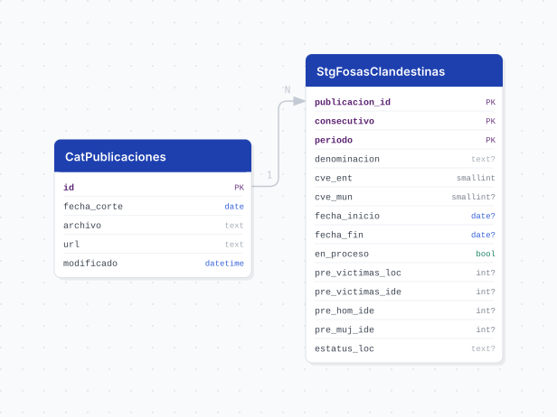

# fosas_clandestinas

## Descripción general

Pipeline ETL del Registro Estatal de Fosas Clandestinas publicado mensualmente por la Fiscalía Especial en Personas Desaparecidas de Jalisco. Descarga los PDFs de autoindex desde el servidor de la Fiscalía, extrae tablas de inhumaciones clandestinas, normaliza los datos, resuelve municipios contra el catálogo INEGI, y almacena snapshots completos de cada publicación. Los datos son preliminares y revisables.

## Fuente general

https://fiscaliaenpersonasdesaparecidas.jalisco.gob.mx/

## Fuente específica

```shell
UPLOADS_URL=https://fiscaliaenpersonasdesaparecidas.jalisco.gob.mx/wp-content/uploads/
FIRST_YEAR=2022
```

Los archivos se descubren automáticamente de un autoindex HTTP (directorio indexado) ordenado por año/mes. Cada PDF contiene un Registro Estatal completo desde 2018; no son incrementales.

## Características de los datos

| Característica | Valor |
|---|---|
| Última fecha disponible | Última publicación disponible en el servidor |
| Frecuencia de actualización | Mensual (aproximadamente) |
| Desagregación | Estatal, Municipal |
| ¿Tiene update? | Sí |
| Update | Automático |

## Diagrama de entidad relación



## Diccionario de variables

### cat_publicaciones

| variable | descripción |
|---|---|
| `fecha_corte` | Mes de corte de los datos (primer día del mes), extraído del nombre del archivo |
| `archivo` | Nombre del PDF en el servidor |
| `url` | URL de descarga del PDF |
| `modificado` | Fecha de modificación del PDF según el listado del servidor (TIMESTAMP) |

### stg_fosas_clandestinas

| variable | descripción |
|---|---|
| `publicacion_id` | Publicación (corte) de la que proviene el registro |
| `consecutivo` | Número del sitio en la publicación (0 para el sitio impreso como "oct-18") |
| `periodo` | Número del periodo de procesamiento dentro del sitio (celdas combinadas en el PDF) |
| `denominacion` | Nombre del sitio; NULL en ediciones que no lo publican |
| `cve_ent` | Clave de la entidad federativa (14 para Jalisco) |
| `cve_mun` | Clave del municipio dentro de la entidad (resuelto contra cvegeo_municipalities) |
| `fecha_inicio` | Mes de inicio del procesamiento |
| `fecha_fin` | Mes de fin del procesamiento; NULL si sigue en proceso o no se publica |
| `en_proceso` | Verdadero cuando el PDF indica que el procesamiento no ha concluido |
| `pre_victimas_loc` | Total preliminar de víctimas localizadas (PFSI, osamentas y segmentos) |
| `pre_victimas_ide` | Total preliminar de víctimas identificadas |
| `pre_hom_ide` | Hombres preliminarmente identificados |
| `pre_muj_ide` | Mujeres preliminarmente identificados |
| `estatus_loc` | Texto publicado en lugar del total de víctimas localizadas (ej. COMPETENCIA FGR, IJCF PROCESANDO) |

## Migraciones

| migración | descripción |
|---|---|
| `V1__foreign_tables.sql` | Tablas foráneas para acceso al catálogo cvegeo (municipios INEGI) |
| `V2__catalogs.sql` | Tabla `cat_publicaciones` (cortes mensuales del registro) |
| `V3__tables.sql` | Tabla `stg_fosas_clandestinas` (snapshots de sitios por publicación) |
| `V4__views.sql` | Vistas analíticas `vw_fosas_clandestinas` y `vw_fosas_clandestinas_municipio` |
| `V5__vwm_fosas_clandestinas_mensual.sql` | Vista materializada `vwm_fosas_clandestinas_mensual` (agrega por mes de inicio) |

## Variables de entorno

| variable | descripción |
|---|---|
| `UPLOADS_URL` | URL del directorio indexado donde se publican los PDFs (default: https://fiscaliaenpersonasdesaparecidas.jalisco.gob.mx/wp-content/uploads/) |
| `FIRST_YEAR` | Primer año a indexar en la búsqueda de publicaciones (default: 2022) |
| `HTTP_TIMEOUT` | Timeout en segundos para descargas HTTP (default: 60) |

## Notas metodológicas

### Extract

Descubre los PDFs iterando automáticamente el autoindex HTTP del servidor (año/mes/archivo). Identifica archivos que coinciden con `TABLA.*PDF`, `FOSAS.*PDF` o `INHUMACIONES.*PDF` (case-insensitive). Extrae la fecha de corte del nombre del archivo usando regex (detecta meses en español completos o abreviados: `ENERO`, `FEBRERO`, ... `DICIEMBRE`, `ENE`, `FEB`, ... `DIC`), y cae de vuelta al mes anterior a la carpeta si no encuentra fecha en el nombre. Descarga cada PDF, valida que sea `Content-Type: application/pdf`, y persiste en `data/extract/fosas_clandestinas/`.

### Transform

Lee cada PDF con `pdfplumber`, extrae todas las tablas de todas las páginas, identifica la fila de encabezado cuando contiene la palabra "municipio", mapea los headers a columnas de destino usando palabras clave (denominacion, inicio, fin, localizadas, identificadas, hombres, mujeres), y valida que cada fila de datos contenga una fecha de inicio. Normaliza textos, aplica title-case y acentos a denominaciones, resuelve fechas en formato MM/YY o MM/YYYY, identifica filas continuadas (celdas combinadas) y las propaga hacia arriba, detecta el estado en_proceso cuando el texto de fecha_fin contiene "PROCES*", y parsea conteos numéricos con validación de rango. Cada PDF genera un snapshot completo de todos los sitios activos desde 2018, marcados con la fecha de corte del PDF.

### Load

En bootstrap: trunca y resetea identidades de ambas tablas. En ambos modos: inserta o actualiza `cat_publicaciones` con conflicto en `fecha_corte` (no duplicar publicaciones), resuelve municipios normalizados contra `cvegeo_municipalities` y mapea `cve_mun`, elimina todos los registros anteriores de cada publicación (para idempotencia en reruns), e inserta los datos transformados. Finalmente, refresca la vista materializada `vwm_fosas_clandestinas_mensual`.

## Ejecución

**Bootstrap** (carga inicial):

```shell
just flyway-migrate fosas_clandestinas
conda run -n etl python -m core.pipelines.fosas_clandestinas bootstrap
```

**Update mensual** (DAG `etl_fosas_clandestinas_update`, cron `schedule_for("etl_fosas_clandestinas_update")`):

```shell
conda run -n etl python -m core.pipelines.fosas_clandestinas update
```

## Notas adicionales

Cada PDF publicado por la Fiscalía reemite el Registro Estatal completo desde 2018, no solo lo nuevo ese mes. Por eso en cada update se borra la publicación completa anterior y se carga la nueva entera (idempotencia por publicacion_id). Las cifras son preliminares y sujetas a revisión; la Fiscalía corrige y reedita PDFs antiguos sin cambiar su fecha de corte. Los municipios se resuelven por búsqueda normalizada contra cvegeo; si la Fiscalía publica un nombre no reconocido, quedan con `cve_mun = NULL` y un warning en el log. Las vistas regulares (`vw_fosas_clandestinas`, `vw_fosas_clandestinas_municipio`) siempre operan sobre la publicación más reciente; la vista materializada (`vwm_fosas_clandestinas_mensual`) agrega por mes de inicio de procesamiento usando solo el corte más reciente para evitar doble conteo.
