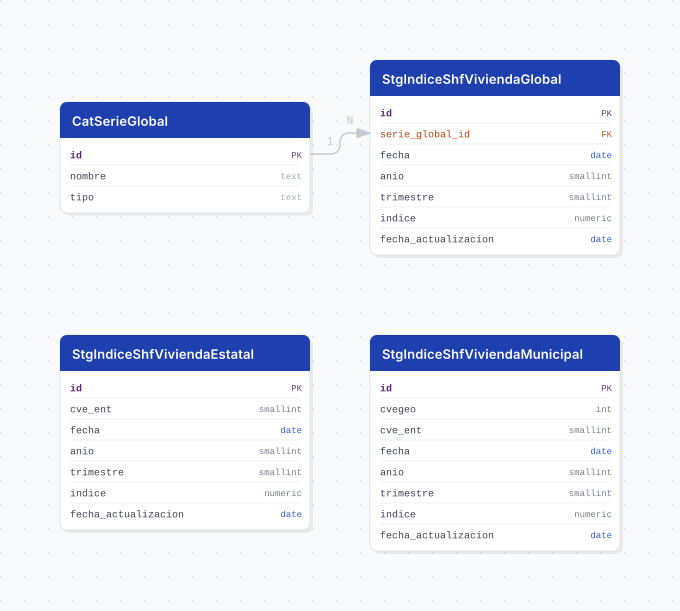

# indice_shf_vivienda

## Descripción general

Pipeline ETL del **Índice SHF de Precios de la Vivienda en México**, que publica la Sociedad
Hipotecaria Federal con periodicidad **trimestral desde el primer trimestre de 2005**. Mide la
evolución de los precios de la vivienda con garantía hipotecaria y se publica en 121 series: 15 sin
desglose geográfico (nacional, por condición, por tipo de vivienda, por segmento y 8 zonas
metropolitanas), 32 por entidad federativa y una selección de municipios (74 en la edición del
2T 2026).

> **El valor es un ÍNDICE con año base 2017 = 100, no un precio.** No representa pesos ni metros
> cuadrados: el promedio de los cuatro trimestres de 2017 es exactamente 100.00 en las 121 series.

La fuente reparte la geografía en tres columnas mutuamente excluyentes (`Global`, `Estado`,
`Municipio`): cuando una trae valor, las otras van vacías. El pipeline la parte en una tabla por
nivel, y así ninguna columna queda con nulos estructurales.

## Fuente general

https://www.gob.mx/shf/archivo/documentos → "Índice SHF de Precios de la Vivienda en México"

## Fuente específica

```shell
SHF_URL=https://www.gob.mx/cms/uploads/attachment/file/1097035/Indice_SHF_datos_abiertos_2_trim_2026.xlsx
```

Un solo XLSX con una hoja única, `Indice SHF datos abiertos`, contiene los tres niveles y toda la
serie desde 2005. El nombre del archivo carga el trimestre (`_2_trim_2026.xlsx`) y la ruta el id
que le asigna el CMS (`file/1097035/`): **ambos cambian en cada publicación**.

## Características de los datos

| Característica | Valor |
|---|---|
| Primer periodo disponible | `2005-T1` |
| Última fecha disponible | `2026-T2` |
| Frecuencia de actualización | Trimestral |
| Desagregación | Nacional, zona metropolitana, estatal y municipal |
| ¿Tiene update? | No |
| Update | Manual (DAG `etl_indice_shf_vivienda_bootstrap`, `schedule=None`) |
| Estrategia de carga | `upsert_records` |

Cada publicación reemite la serie completa desde 2005, así que no hay carga incremental que
construir: la corrida completa es la actualización, y el upsert hace que repetirla sea inofensivo.

## Diagrama de entidad relación



## Diccionario de variables

### cat_serie_global

| variable | descripción |
|---|---|
| `id` | Identificador interno de la serie |
| `nombre` | Nombre de la serie tal como lo publica SHF: `Nacional`, `Nueva`, `Usada`, `Casa sola`, `Casa en condominio - depto.`, `Económica - Social`, `Media - Residencial` y 8 zonas metropolitanas |
| `tipo` | Concepto que agrupa a la serie: `nacional`, `condicion`, `tipo_vivienda`, `segmento` o `zona_metropolitana`. SHF mezcla los cinco en una sola columna; esta clasificación permite consultarlos por separado sin parsear el nombre |

### stg_indice_shf_vivienda_global

| variable | descripción |
|---|---|
| `id` | Identificador interno del registro |
| `serie_global_id` | Serie a la que corresponde la medición; FK a `cat_serie_global.id` |
| `fecha` | Primer día del trimestre de referencia (T1 = 01-01, T2 = 04-01, T3 = 07-01, T4 = 10-01) |
| `anio` | Año de referencia de la medición |
| `trimestre` | Trimestre de referencia de la medición (1 a 4) |
| `indice` | Valor del índice de precios de la vivienda, con año base 2017 = 100 |
| `fecha_actualizacion` | Fecha en que el pipeline cargó o actualizó el registro |

### stg_indice_shf_vivienda_estatal

| variable | descripción |
|---|---|
| `id` | Identificador interno del registro |
| `entidad_id` | Clave de la entidad federativa, 1 a 32 (ref. `cvegeo_states.cve_ent`) |
| `fecha` | Primer día del trimestre de referencia |
| `anio` | Año de referencia de la medición |
| `trimestre` | Trimestre de referencia de la medición (1 a 4) |
| `indice` | Valor del índice, con año base 2017 = 100 |
| `fecha_actualizacion` | Fecha en que el pipeline cargó o actualizó el registro |

### stg_indice_shf_vivienda_municipal

| variable | descripción |
|---|---|
| `id` | Identificador interno del registro |
| `municipio_id` | Clave geoestadística del municipio, `cve_ent * 1000 + cve_mun` (ref. `cvegeo_municipalities.cvegeo`) |
| `entidad_id` | Entidad a la que pertenece el municipio (ref. `cvegeo_states.cve_ent`). Se conserva porque la fuente identifica al municipio solo por nombre y hay nombres repetidos entre entidades: `Benito Juárez` (Ciudad de México y Quintana Roo) y `Juárez` (Chihuahua y Nuevo León) |
| `fecha` | Primer día del trimestre de referencia |
| `anio` | Año de referencia de la medición |
| `trimestre` | Trimestre de referencia de la medición (1 a 4) |
| `indice` | Valor del índice, con año base 2017 = 100 |
| `fecha_actualizacion` | Fecha en que el pipeline cargó o actualizó el registro |

Ni `entidad_id` ni `municipio_id` declaran llave foránea: apuntan a tablas foráneas (`postgres_fdw`),
que no admiten referencias declaradas. La integridad se garantiza en la carga, que aborta si un
nombre no resuelve su clave.

`fecha`, `anio` y `trimestre` describen el mismo periodo: `fecha` es la forma ordenable y unible
contra el resto de la plataforma, `anio` y `trimestre` son los que publica la fuente y con los que
se define la restricción única de cada nivel.

## Migraciones

| migración | descripción |
|---|---|
| `V1__foreign_tables.sql` | FDW hacia la base `cvegeo` (`cvegeo_states` y `cvegeo_municipalities`) |
| `V2__catalogs_indice_shf_vivienda.sql` | Catálogo `cat_serie_global` |
| `V3__tables_indice_shf_vivienda.sql` | Las tres tablas `stg_` con sus restricciones únicas |
| `V4__views_indice_shf_vivienda.sql` | Las cuatro vistas |

## Vistas

| vista | alcance |
|---|---|
| `vw_indice_shf_vivienda_global` | Series sin desglose geográfico, con nombre y tipo resueltos |
| `vw_indice_shf_vivienda_estatal` | Serie por entidad, con el nombre oficial del INEGI |
| `vw_indice_shf_vivienda_municipal` | Serie por municipio, con nombres de municipio y entidad |
| `vw_indice_shf_vivienda_jalisco` | Corte de Jalisco: sus 4 municipios, la entidad y la serie `ZM Guadalajara`, apilados con una columna `nivel` |

## Variables de entorno

| variable | descripción |
|---|---|
| `SHF_URL` | URL directa del XLSX. Cambia en cada publicación trimestral |
| `DOWNLOAD_TIMEOUT` | Timeout de descarga en segundos |
| `CHUNK_SIZE` | Tamaño de lote para el upsert |

## Notas metodológicas

### Extract

`IndiceShfViviendaExtract.source()` descarga el XLSX desde `SHF_URL` y lee la hoja
`Indice SHF datos abiertos` completa como texto.

> **Cuidado con el status code.** gob.mx responde **HTTP 200 con una página de reto de su WAF**
> (1.8 KB) cuando decide bloquear al cliente, así que `raise_for_status()` no detecta un rechazo.
> La validación se hace sobre la firma del archivo (`PK`, un XLSX es un ZIP), no sobre el código de
> respuesta. Si la URL queda obsoleta el extract falla con un `FileNotFoundError` que nombra la
> página de origen.

La columna `Consecutivo` se descarta: es el número de renglón del Excel y se reinicia en cada
publicación.

### Transform

Recorta los nombres (22 municipios se publican con un espacio al final: `"Jesús María "`,
`"Zihuatanejo de Azueta "`; sin el strip no cruzan contra `cvegeo`), castea `anio`, `trimestre` e
`indice` con `pd.to_numeric` y arma `fecha` con `core/utils/periods.py::build_fecha_trimestre`,
que traduce el trimestre a su primer mes (T2 es abril, no febrero).

Después parte la hoja en los tres niveles con máscaras sobre `Global`, `Estado` y `Municipio`. Se
verifica que las máscaras sean disjuntas y cubran todas las filas: si SHF llenara dos columnas a
la vez, eso debe fallar en voz alta y no duplicar o descartar la fila en silencio.

### Load

Siembra las 15 series de `cat_serie_global` con `insert_records` (`DO NOTHING`) para que sus ids
no se muevan entre ediciones, y resuelve las claves geográficas contra las tablas foráneas de
`cvegeo` con `get_cvegeo_mapping`, normalizando el texto.

El municipio se resuelve **dentro de su entidad**, no a nivel nacional: los nombres de municipio no
son únicos en el país. Los alias de entidad (`ENTITY_NAME_ALIASES` en `mappings.py`) se aplican solo
a la columna de estado, porque `Veracruz` nombra a la vez a la entidad y al municipio del puerto.

`_require_resolved` **aborta la carga si un nombre no resuelve su clave**, en vez de insertar la
fila con `NULL`: la clave es la identidad del registro y perderla en silencio deja filas imposibles
de atribuir. El upsert va sobre `(anio, trimestre)` más la llave de cada nivel.

## Ejecución

**Bootstrap** (carga completa 2005 a la fecha):

```shell
just create-db indice_shf_vivienda
just flyway-migrate indice_shf_vivienda
python dags/etl_indice_shf_vivienda.py
```

**Update** (trimestral y manual, DAG `etl_indice_shf_vivienda_bootstrap`, `schedule=None`): se
actualiza `SHF_URL` en el `.env` y se dispara el mismo DAG. No hay calendario porque la URL no
admite plantilla: el id de archivo y el trimestre cambian cada vez, igual que el bienio en el slug
de la página que la contiene.

## Notas adicionales

- **SHF publica una selección de municipios, no los 2,469 del país**: 74 en la edición del 2T 2026,
  de los cuales 4 son de Jalisco (Guadalajara, Zapopan, San Pedro Tlaquepaque y Tlajomulco de
  Zúñiga).
- **SHF usa nombres de uso común para tres entidades** donde el Marco Geoestadístico usa el oficial:
  `Coahuila`, `Michoacán` y `Veracruz`. Se resuelven con `ENTITY_NAME_ALIASES` en `mappings.py`; ahí
  se agrega cualquier otro nombre que la carga reporte sin resolver.
- Los índices no son aditivos entre series ni entre niveles: no se suman.
