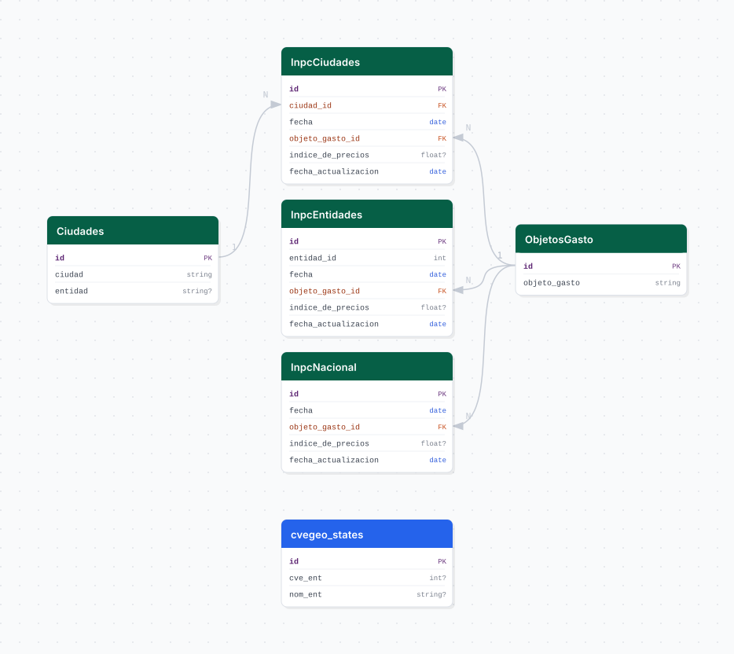

# inpc

## Descripción general

Pipeline ETL del Índice Nacional de Precios al Consumidor (INPC) publicado por el INEGI. Descarga series mensuales de precios por ciudad, entidad federativa y nivel nacional, desglosadas por objeto del gasto (rubro), disponible desde el año 2000.

## Fuente general

https://www.inegi.org.mx/temas/inpc/

## Fuente específica

```shell
INPC_BASE_URL=https://www.inegi.org.mx/app/indicesdepreciosv2/Exportacion.aspx
INPC_URL_NODOS=https://www.inegi.org.mx/app/indicesdepreciosv2/servicios/ArbolAjaxInteraccion.asmx/ObtieneNodosV2
```

## Características de los datos

| Característica | Valor |
|---|---|
| Última fecha disponible | `2025-04` |
| Frecuencia de actualización | Mensual |
| Desagregación | Nacional, Estatal, Ciudad |
| ¿Tiene update? | Sí |
| Update | Automático |

## Diagrama de entidad relación



## Diccionario de variables

### inpc_ciudades

| variable | descripción |
|---|---|
| `ciudad_id` | FK a catálogo de ciudades |
| `fecha` | Fecha del periodo (primer día del mes) |
| `objeto_gasto_id` | FK a objeto del gasto (rubro de precios) |
| `indice_de_precios` | Índice de precios del periodo |
| `fecha_actualizacion` | Fecha de descarga del dato |

### inpc_entidades

| variable | descripción |
|---|---|
| `fecha` | Fecha del periodo |
| `objeto_gasto_id` | FK a objeto del gasto |
| `indice_de_precios` | Índice de precios del periodo |

### inpc_nacional

| variable | descripción |
|---|---|
| `fecha` | Fecha del periodo |
| `objeto_gasto_id` | FK a objeto del gasto |
| `indice_de_precios` | Índice de precios del periodo |

## Migraciones

| migración | descripción |
|---|---|
| `V1__foreign_tables.sql` | FDW hacia la base `cvegeo` |
| `V2__catalogs_inpc.sql` | Catálogos de ciudades y objetos del gasto |
| `V3__tables_inpc.sql` | Tablas `inpc_ciudades`, `inpc_entidades` e `inpc_nacional` |
| `V4__views_inpc.sql` | Vistas analíticas unificadas |

## Variables de entorno

| variable | descripción |
|---|---|
| `INPC_BASE_URL` | URL base de exportación de series del INEGI |
| `INPC_URL_NODOS` | URL del servicio web que retorna los nodos del árbol de series |
| `BOOTSTRAP_START_YEAR` | Año inicial de la descarga (ej. `2000`) |

## Notas metodológicas

### Extract

Descubre los IDs de series disponibles consultando el árbol de nodos de la API del INEGI. Descarga los CSVs de cada serie (ciudades, entidades y nacional) iterando por año desde `BOOTSTRAP_START_YEAR`. Guarda los datos en archivos `.pkl` por nivel geográfico.

### Transform

Lee los pickles, renombra cabeceras, parsea meses en español, construye el catálogo de ciudades con su entidad correspondiente, y pivotea las series temporales al formato fecha × objeto_gasto × índice.

### Load

Upsert de catálogos e inserción masiva en las tres tablas con `bulk_insert`. En update carga solo los registros más recientes.

## Ejecución

**Bootstrap** (desde `BOOTSTRAP_START_YEAR`):

```shell
just flyway-migrate inpc
conda run -n etl python -m core.pipelines.inpc bootstrap
```

**Update mensual** (DAG `etl_inpc_update`, `@monthly`):

```shell
conda run -n etl python -m core.pipelines.inpc update
```

## Notas adicionales

El INEGI puede modificar retroactivamente cifras del INPC; el update recarga los últimos 3 meses para capturar revisiones. La API de nodos puede variar; si el bootstrap falla, verificar la estructura del árbol de series.
