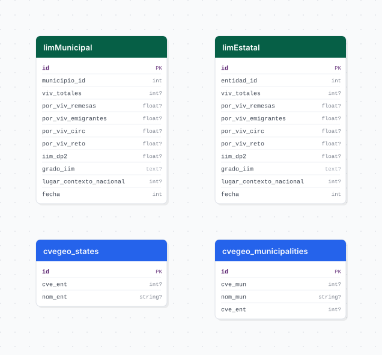

# intensidad_migratoria

## Descripción general

Pipeline ETL del Índice de Intensidad Migratoria México-EUA del CONAPO. Carga indicadores de intensidad migratoria a nivel municipal (2010 y 2020) y estatal (2020), incluyendo porcentajes de viviendas con remesas, emigrantes, migrantes circulares, migrantes de retorno e índices de intensidad.

## Fuente general

https://www.gob.mx/conapo

## Fuente específica

```shell
IIM_URL_MUNICIPAL_2010=https://repodatos.atdt.gob.mx/api_update/conapo/indice_intensidad_migratoria/05_iim_mex_eeuu_2010_municipio.csv
IIM_URL_MUNICIPAL_2020=https://repodatos.atdt.gob.mx/api_update/conapo/indice_intensidad_migratoria/06_iim_mex_eeuu_2020_municipio.csv
IIM_URL_ESTATAL_2020=https://repodatos.atdt.gob.mx/api_update/conapo/indice_intensidad_migratoria/03_iim_mex_eeuu_2020_entidad.csv
```

## Características de los datos

| Característica | Valor |
|---|---|
| Última fecha disponible | `2020` |
| Frecuencia de actualización | Decenal |
| Desagregación | Nacional, Estatal, Municipal |
| ¿Tiene update? | No |
| Update | No aplica |

## Diagrama de entidad relación



## Diccionario de variables

### iim_municipal

| variable | descripción |
|---|---|
| `municipio_id` | Clave INEGI del municipio |
| `viv_totales` | Total de viviendas |
| `por_viv_remesas` | % de viviendas que reciben remesas |
| `por_viv_emigrantes` | % de viviendas con emigrantes a EUA (2005-2010 / 2015-2020) |
| `por_viv_circ` | % de viviendas con migrantes circulares |
| `por_viv_reto` | % de viviendas con migrantes de retorno |
| `iaim` | Índice Absoluto de Intensidad Migratoria |
| `gaim` | Grado Absoluto de Intensidad Migratoria |
| `iim_dp2` | Índice de Intensidad Migratoria (DP2) |
| `gim_dp2` | Grado de Intensidad Migratoria (DP2) |
| `lugar_contexto_nacional` | Lugar en el contexto nacional |
| `fecha` | Año del levantamiento (2010 o 2020) |

### iim_estatal

| variable | descripción |
|---|---|
| `entidad_id` | Clave INEGI de la entidad federativa |
| `viv_totales` | Total de viviendas |
| `por_viv_remesas` | % de viviendas que reciben remesas |
| `iim_dp2` | Índice de Intensidad Migratoria (DP2) |
| `gim_dp2` | Grado de Intensidad Migratoria (DP2) |
| `fecha` | Año del levantamiento (2020) |

## Migraciones

| migración | descripción |
|---|---|
| `V1__foreign_tables.sql` | FDW hacia la base `cvegeo` |
| `V2__tables_iim.sql` | Tablas `iim_municipal` e `iim_estatal` |
| `V3__views_iim.sql` | Vistas analíticas |
| `V4__initialize_materialized_view.sql` | Inicializa las columnas geométricas de la tabla foránea municipal |
| `V5__materialized_views_iim.sql` | Vista materializada `vm_iim_geo` para la capa municipal de GeoServer |
| `V6__update_vm_iim_geo_columns.sql` | Actualiza fecha y claves de `vm_iim_geo` |
| `V7__update_vm_iim_geo_key_types.sql` | Expone las claves geográficas como texto |
| `V8__update_vm_iim_geo_columns.sql` | Homologa columnas y capitalización de categorías de `vm_iim_geo` |

## Variables de entorno

| variable | descripción |
|---|---|
| `IIM_URL_MUNICIPAL_2010` | URL del CSV municipal de intensidad migratoria 2010 |
| `IIM_URL_MUNICIPAL_2020` | URL del CSV municipal de intensidad migratoria 2020 |
| `IIM_URL_ESTATAL_2020` | URL del CSV estatal de intensidad migratoria 2020 |

## Notas metodológicas

### Extract

Descarga los tres CSVs directamente desde el repositorio del CONAPO y selecciona las columnas relevantes según el mapa de renombrado de cada año.

### Transform

Normaliza tipos de datos (numéricos, enteros), ajusta claves geográficas a entero, limpia nulos y construye los DataFrames para carga municipal y estatal.

### Load

Inserción directa en `iim_municipal` e `iim_estatal` con `insert_records`. No hay upsert ya que los datos son fijos por año de levantamiento. Al finalizar, se refresca `vm_iim_geo`; el primer refresco es normal y los posteriores son concurrentes gracias al índice único de la vista.

## Ejecución

**Bootstrap** (única ejecución):

```shell
just flyway-migrate intensidad_migratoria
conda run -n etl python -m core.pipelines.intensidad_migratoria bootstrap
```

No tiene flujo update.

## Notas adicionales

Los datos del Censo 2010 no incluyen el campo `iaim` ni `gaim` a nivel estatal. Las URLs del CONAPO pueden cambiar entre publicaciones; verificar el repositorio de datos abiertos ante errores de descarga.
