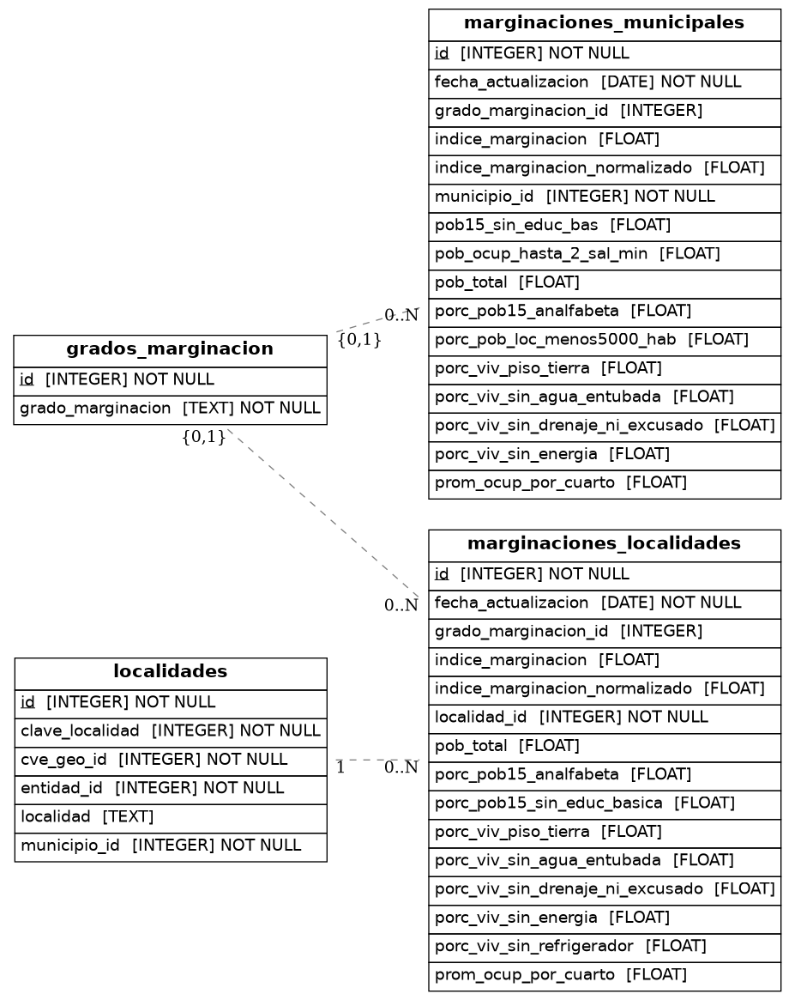

# Marginacion

Pipeline ETL para el índice y grado de marginación municipal y por localidad, publicado por CONAPO.

## Fuentes

| Nivel | Archivo | URL |
|-------|---------|-----|
| Municipal | `IMM_{year}.xlsx` | `URL_MUNICIPAL` en `.env` |
| Localidad | `IML_{year}.zip` | `URL_LOCALIDAD` en `.env` |

Datos filtrados a Jalisco (`CVE_ENT = 14`). Los registros agregados por municipio (`LOC = 9999`) son excluidos.

## Tablas

- `grados_marginacion` — catálogo estático (Muy bajo → Muy alto)
- `localidades` — catálogo dinámico construido desde la fuente de localidades
- `marginaciones_municipales` — índice y variables a nivel municipal
- `marginaciones_localidades` — índice y variables a nivel localidad

## ERD



## Configuración

Copiar `.env.example` a `.env` y completar las variables. `DATA_YEARS` acepta múltiples años separados por coma.

```
DATA_YEARS=2020
```

## Ejecución

```bash
# Bootstrap (carga inicial o recarga completa)
python dags/etl_marginacion.py
```

## Diccionario de variables

### `marginaciones_municipales`

| Variable | Descripción |
|----------|-------------|
| `municipio_id` | Clave INEGI del municipio (5 dígitos: CVE_ENT + CVE_MUN) |
| `grado_marginacion_id` | FK a `grados_marginacion` |
| `pob_total` | Población total |
| `porc_pob15_analfabeta` | % de población de 15 años o más analfabeta |
| `pob15_sin_educ_bas` | % de población de 15 años o más sin educación básica completa |
| `porc_viv_sin_drenaje_ni_excusado` | % de viviendas sin drenaje ni excusado |
| `porc_viv_sin_energia` | % de viviendas sin energía eléctrica |
| `porc_viv_sin_agua_entubada` | % de viviendas sin agua entubada |
| `porc_viv_piso_tierra` | % de viviendas con piso de tierra |
| `prom_ocup_por_cuarto` | Promedio de ocupantes por cuarto |
| `porc_pob_loc_menos5000_hab` | % de población en localidades con menos de 5,000 habitantes |
| `pob_ocup_hasta_2_sal_min` | % de población ocupada con ingresos de hasta 2 salarios mínimos |
| `indice_marginacion` | Índice de marginación |
| `indice_marginacion_normalizado` | Índice de marginación normalizado (0–100) |
| `fecha_actualizacion` | Año de publicación del dato (1 de enero del año correspondiente) |

### `marginaciones_localidades`

| Variable | Descripción |
|----------|-------------|
| `localidad_id` | FK a `localidades` |
| `grado_marginacion_id` | FK a `grados_marginacion` |
| `pob_total` | Población total |
| `porc_pob15_analfabeta` | % de población de 15 años o más analfabeta |
| `porc_pob15_sin_educ_basica` | % de población de 15 años o más sin educación básica completa |
| `porc_viv_sin_drenaje_ni_excusado` | % de viviendas sin drenaje ni excusado |
| `porc_viv_sin_energia` | % de viviendas sin energía eléctrica |
| `porc_viv_sin_agua_entubada` | % de viviendas sin agua entubada |
| `porc_viv_piso_tierra` | % de viviendas con piso de tierra |
| `prom_ocup_por_cuarto` | Promedio de ocupantes por cuarto |
| `porc_viv_sin_refrigerador` | % de viviendas sin refrigerador |
| `indice_marginacion` | Índice de marginación |
| `indice_marginacion_normalizado` | Índice de marginación normalizado (0–100) |
| `fecha_actualizacion` | Año de publicación del dato (1 de enero del año correspondiente) |

## Actualización

Cuando CONAPO publique un nuevo año:

1. Agregar el año a `DATA_YEARS` en `.env`
2. Limpiar la base de datos (flyway clean + re-migrate)
3. Ejecutar el DAG bootstrap
