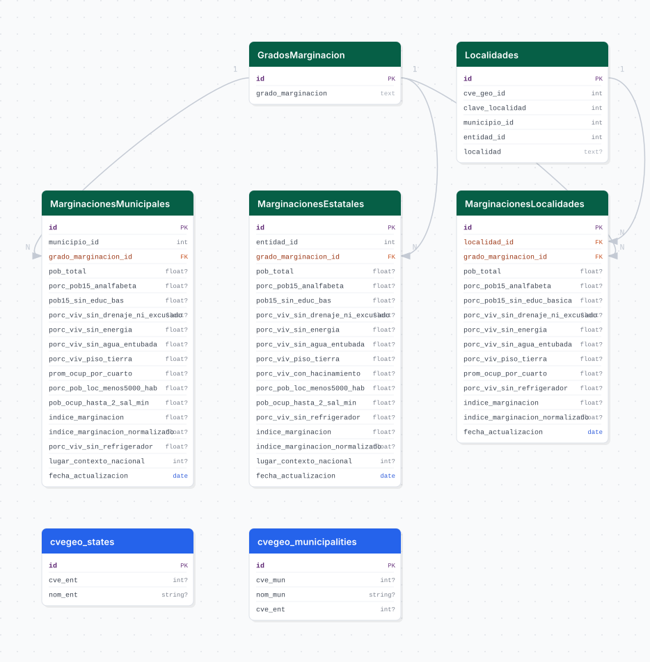

# marginacion

## Descripción general

Pipeline ETL del Índice de Marginación del CONAPO para Jalisco. Carga indicadores de marginación a nivel municipal y de localidad para los años 2010, 2015 y 2020, incluyendo indicadores de rezago educativo, servicios básicos, vivienda y concentración poblacional.

## Fuente general

https://www.gob.mx/conapo

## Fuente específica

```shell
URL_MUNICIPAL=https://conapo.segob.gob.mx/work/models/CONAPO/Datos_Abiertos/Municipio/IMM_{}.xlsx
URL_MUNICIPAL_DP2=https://conapo.segob.gob.mx/work/models/CONAPO/Datos_Abiertos/Municipio/IMM_DP2_{}.xlsx
URL_LOCALIDAD=https://conapo.segob.gob.mx/work/models/CONAPO/Datos_Abiertos/Localidad/IML_{}.zip
```

## Características de los datos

| Característica | Valor |
|---|---|
| Última fecha disponible | `2020` |
| Frecuencia de actualización | Quinquenal |
| Desagregación | Estatal, Municipal, Localidad |
| ¿Tiene update? | No |
| Update | No aplica |

## Diagrama de entidad relación



## Diccionario de variables

### marginaciones_municipales

| variable | descripción |
|---|---|
| `grado_marginacion_id` | FK a catálogo de grados (Muy alto, Alto, Medio, Bajo, Muy bajo) |
| `pob_total` | Población total del municipio |
| `porc_pob15_analfabeta` | % de población de 15+ años analfabeta |
| `pob15_sin_educ_bas` | % sin educación básica completa |
| `porc_viv_sin_drenaje_ni_excusado` | % de viviendas sin drenaje ni excusado |
| `porc_viv_sin_energia` | % de viviendas sin energía eléctrica |
| `porc_viv_sin_agua_entubada` | % de viviendas sin agua entubada |
| `porc_viv_piso_tierra` | % de viviendas con piso de tierra |
| `prom_ocup_por_cuarto` | Promedio de ocupantes por cuarto |
| `porc_pob_loc_menos5000_hab` | % de población en localidades < 5,000 hab. |
| `pob_ocup_hasta_2_sal_min` | % de población ocupada con hasta 2 salarios mínimos |
| `indice_marginacion` | Índice de marginación (IM) |
| `indice_marginacion_normalizado` | IM normalizado (0-100) |
| `porc_viv_sin_refrigerador` | % de viviendas sin refrigerador |
| `lugar_contexto_nacional` | Lugar en el contexto nacional |
| `fecha_actualizacion` | Año del levantamiento |

## Migraciones

| migración | descripción |
|---|---|
| `V1__foreign_tables.sql` | FDW hacia la base `cvegeo` |
| `V2__catalogs_marginacion.sql` | Catálogo de grados de marginación y localidades |
| `V3__tables_marginacion.sql` | Tablas `marginaciones_municipales`, `marginaciones_estatales` y `marginaciones_localidades` |
| `V4__views_marginacion.sql` | Vistas analíticas |
| `V5__initialize_materialized_view.sql` | Expone las geometrías municipales en el FDW de `cvegeo` |
| `V6__materialized_views_marginacion.sql` | Vista materializada `vm_marginacion_geo` para la capa municipal de GeoServer |
| `V7__update_vm_marginacion_geo_columns.sql` | Homologa las columnas temporales y geográficas de `vm_marginacion_geo` |

## Variables de entorno

| variable | descripción |
|---|---|
| `URL_MUNICIPAL` | URL del XLSX municipal con parámetro de año `{}` |
| `URL_MUNICIPAL_DP2` | URL del XLSX municipal formato DP2 (para 2010 y 2015) |
| `URL_LOCALIDAD` | URL del ZIP de localidades con parámetro de año `{}` |
| `DATA_YEARS` | Lista de años a procesar (ej. `[2010,2015,2020]`) |

## Notas metodológicas

### Extract

Descarga el XLSX municipal y el ZIP de localidades para cada año en `DATA_YEARS`. Para 2010 y 2015 usa la URL `DP2`; para 2020 usa la URL estándar.

### Transform

Lee los Excel, filtra a Jalisco (entidad 14), renombra columnas según el mapeo por año, agrega el campo de % de viviendas sin refrigerador desde datos auxiliares, y construye los catálogos de grados y localidades.

### Load

Inserción directa de catálogos e inserción masiva de indicadores en las tres tablas con `bulk_insert` por año.

## Ejecución

**Bootstrap** (años 2010, 2015 y 2020):

```shell
just flyway-migrate marginacion
conda run -n etl python -m core.pipelines.marginacion bootstrap
```

No tiene flujo update.

## Notas adicionales

El CONAPO usa dos formatos de XLSX distintos según el año (DP2 vs estándar). El servidor del CONAPO puede ser lento; el pipeline deshabilita la verificación SSL (`verify=False`) para evitar errores de certificado.
