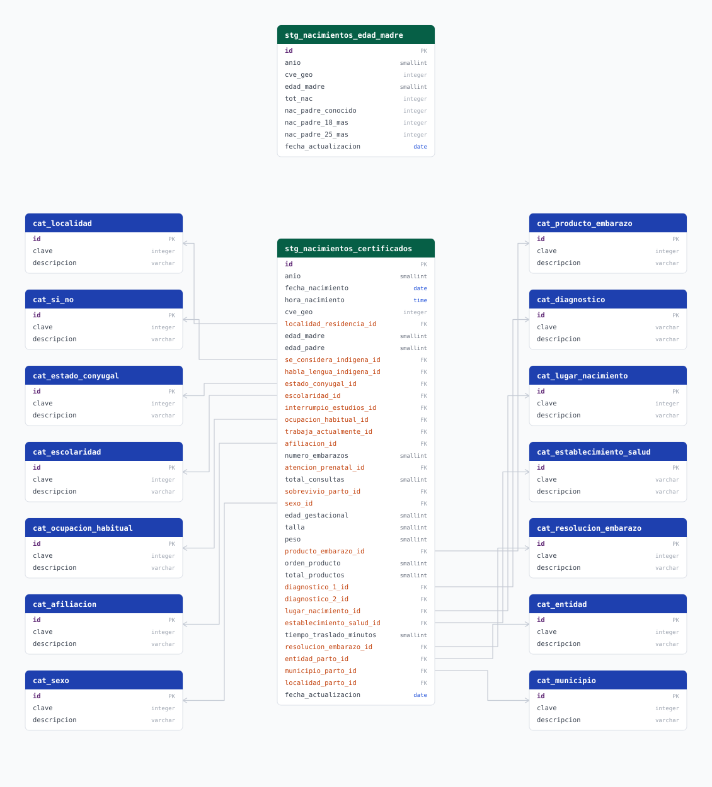

# nacimientos_dgis

## Descripción general

Nacimientos registrados en el **SINAC** (Subsistema de Información sobre Nacimientos) y publicados como datos abiertos por la **DGIS** de la Secretaría de Salud. La fuente es un microdato: una fila por nacimiento. El pipeline se queda sólo con los nacimientos de **madres residentes en Jalisco** y los persiste en **dos granos distintos**:

| tabla | grano | para qué |
|---|---|---|
| `stg_nacimientos_edad_madre` | `año × municipio × edad de la madre` | Alimenta las tasas de fecundidad. Es un agregado: sus filas son conteos, no nacimientos |
| `stg_nacimientos_certificados` | una fila por nacido vivo | Microdato del certificado: sexo, peso, talla, hora, anomalías congénitas, sitio de atención del parto |

Los dos salen del mismo DataFrame ya filtrado a Jalisco, así que el total de certificados y la suma de `tot_nac` del agregado no se pueden separar.

Sobre la base agregada la carga calcula dos indicadores municipales: **tasa de fecundidad general** y **fecundidad adolescente e infantil** (madres de 10-14 y de 15-19 años), cruzando contra la población femenina de `conapo` por FDW.

No confundir con el pipeline `defunciones`, que también viene de la DGIS pero cubre mortalidad.

## Fuente general

[Datos abiertos de nacimientos, DGIS](http://www.dgis.salud.gob.mx/contenidos/basesdedatos/da_nacimientos_gobmx.html)

## Fuentes específicas

Son **tres** fuentes distintas en la misma página, y el pipeline usa las tres. Las dos primeras llevan parámetro:

| descripción | patrón | ejemplo |
|---|---|---|
| Microdato del año: un CSV con una fila por nacido vivo | `.../nacimientos/sinac_{year}.zip` | [sinac_2023.zip](http://www.dgis.salud.gob.mx/descargas/datosabiertos/nacimientos/sinac_2023.zip) |
| Paquete de catálogos: los XLSX que dan significado a las claves | `.../nacimientos/{package}` | [sinac_catalogos_2024.zip](http://www.dgis.salud.gob.mx/descargas/datosabiertos/nacimientos/sinac_catalogos_2024.zip) |
| Descriptores: el diccionario de las 64 columnas del CSV | fijo | [sinac_descriptores_2020_2025.zip](http://www.dgis.salud.gob.mx/descargas/datosabiertos/nacimientos/sinac_descriptores_2020_2025.zip) |

Los descriptores no los descarga el pipeline: son la referencia para saber qué significa cada columna y qué valores son centinela.

```shell
SOURCE_URL=http://www.dgis.salud.gob.mx/descargas/datosabiertos/nacimientos/sinac_{year}.zip
CATALOG_URL=http://www.dgis.salud.gob.mx/descargas/datosabiertos/nacimientos/{package}
```

### Microdato

Un ZIP por año. El extract prueba año por año desde `START_YEAR` hasta el año en curso y trata el `404` como "esa edición todavía no existe".

**El ZIP no siempre trae el CSV al primer nivel.** Las ediciones viejas lo entregan directo; la de 2025 lo envuelve en un segundo ZIP (`sinac_2025.zip` → `.../sinac_2025.zip` → `Nacimientos_2025.csv`). `_member_bytes` desciende recursivamente hasta encontrar el miembro que se le pida, así que ambos formatos funcionan sin tocar nada.

Del CSV se leen 35 de las 64 columnas (`USECOLS`): las cinco del agregado (`ENTIDADRESIDENCIA`, `MUNICIPIORESIDENCIA`, `EDAD`, `EDADPADRE`, `FECHANACIMIENTO`) más los 30 campos del certificado. Las ediciones viejas no publican todas: el extract pide sólo las que existan en el encabezado y avisa de las ausentes.

### Catálogos

**Los catálogos no vienen dentro de `sinac_{year}.zip`**, que sólo trae el CSV. DGIS los publica aparte, y no uno por año sino por rango de ediciones. El valor de `{package}` sale de la edición que se esté procesando:

| paquete | cubre | ejemplo |
|---|---|---|
| `sinac_catalogos_2020_2023.zip` | 2020-2023 | [descargar](http://www.dgis.salud.gob.mx/descargas/datosabiertos/nacimientos/sinac_catalogos_2020_2023.zip) |
| `sinac_catalogos_2024.zip` | 2024 | [descargar](http://www.dgis.salud.gob.mx/descargas/datosabiertos/nacimientos/sinac_catalogos_2024.zip) |
| `sinac_catalogos_2025.zip` | 2025 en adelante | [descargar](http://www.dgis.salud.gob.mx/descargas/datosabiertos/nacimientos/sinac_catalogos_2025.zip) |

Tres detalles que el extract absorbe, porque DGIS no es consistente entre ediciones:

- **Los nombres de archivo se mueven**: `MUNICIPIOS_202201 (2).xlsx` contra `MUNICIPIOS.xlsx`, `ESTABLECIMIENTO_SALUD_202204.xlsx` contra `ESTABLECIMIENTOS_SALUD.xlsx`. El miembro se busca por prefijo, no por nombre exacto.
- **El paquete 2020-2023 no trae `DIAGNOSTICOS.xlsx`**; el de 2024 sí.
- **El paquete 2025 anida un segundo ZIP** dentro de una carpeta.

El encabezado real de los XLSX chicos **no está en la primera fila**: traen filas en blanco y el nombre del catálogo antes de `Clave | Descripción`. `find_header_row` lo localiza en vez de asumir una posición.

## Características de los datos

| Característica | Valor |
|---|---|
| Última fecha disponible | `2025` |
| Frecuencia de actualización | Anual |
| Desagregación | Municipal |
| ¿Tiene update? | Sí |
| Update | Automático |

## Diagrama de entidad relación



```shell
python scripts/generate_erds.py nacimientos_dgis
```

## Diccionario de variables

### stg_nacimientos_edad_madre

Agregado del pipeline. Grano: `anio × cve_geo × edad_madre` (constraint `uq_nacimientos_anio_geo_edad`). Es `UNLOGGED`: se reconstruye desde la fuente, no se replica.

| variable | descripción |
|---|---|
| `id` | Identificador único de la fila (surrogate) |
| `anio` | Año de nacimiento, tomado de `FECHANACIMIENTO` |
| `cve_geo` | Clave geoestadística del municipio de residencia de la madre (`EEMMM`, calculada como `ENTIDADRESIDENCIA * 1000 + MUNICIPIORESIDENCIA`) |
| `edad_madre` | Edad de la madre al momento del nacimiento |
| `tot_nac` | Total de nacimientos del grupo |
| `nac_padre_conocido` | Nacimientos con edad del padre conocida (no nula y distinta de los centinelas, ver abajo) |
| `nac_padre_18_mas` | Nacimientos con padre de 18 años o más |
| `nac_padre_25_mas` | Nacimientos con padre de 25 años o más |
| `fecha_actualizacion` | Fecha en que el pipeline transformó la fila |

### stg_nacimientos_certificados

Microdato: **una fila por nacido vivo** de madre residente en Jalisco. Es `UNLOGGED`: se reconstruye desde la fuente.

Las columnas terminadas en `_id` son llaves foráneas a su catálogo. Una clave que el catálogo de esa edición no publica se guarda como `NULL` en vez de tumbar la carga: DGIS agrega localidades entre ediciones.

| variable | descripción |
|---|---|
| `anio`, `fecha_nacimiento`, `hora_nacimiento` | Fecha y hora del nacimiento. El centinela `99:99` de la hora se guarda como `NULL` |
| `cve_geo` | Municipio de residencia de la madre (`EEMMM`) |
| `localidad_residencia_id` | Localidad de residencia, contra `cat_localidad` |
| `edad_madre`, `edad_padre` | Edades. Los centinelas se guardan como `NULL` (ver abajo) |
| `se_considera_indigena_id`, `habla_lengua_indigena_id`, `atencion_prenatal_id`, `sobrevivio_parto_id`, `interrumpio_estudios_id`, `trabaja_actualmente_id` | Campos SI/NO, contra `cat_si_no` (ver abajo) |
| `estado_conyugal_id`, `escolaridad_id`, `ocupacion_habitual_id`, `afiliacion_id` | Atributos de la madre, contra su catálogo |
| `numero_embarazos`, `total_consultas` | Centinela `99` a `NULL` |
| `sexo_id` | Sexo del nacido vivo, contra `cat_sexo` |
| `edad_gestacional`, `talla` | Semanas y centímetros. Centinela `99` a `NULL` |
| `peso` | Gramos. Centinela `9999` a `NULL` |
| `producto_embarazo_id`, `orden_producto`, `total_productos` | Partos múltiples. `orden` y `total` sólo vienen cuando hubo más de un producto |
| `diagnostico_1_id`, `diagnostico_2_id` | Anomalías congénitas CIE-10. El código `0000` es "ninguna aparente" y se guarda como `NULL`: es la ausencia de anomalía, no una anomalía |
| `lugar_nacimiento_id`, `establecimiento_salud_id` | Dónde ocurrió el parto. La CLUES son 11 caracteres; lo que no los mide es un centinela y se guarda como `NULL` |
| `tiempo_traslado_minutos` | La fuente lo publica como `HH:MM`; se guarda en minutos para poder agregarlo sin parsear |
| `resolucion_embarazo_id` | Procedimiento del nacimiento |
| `entidad_parto_id`, `municipio_parto_id`, `localidad_parto_id` | Dónde se atendió el parto, que no siempre es donde vive la madre |

#### Centinelas de edad

`EDAD` y `EDADPADRE` traen su "no especificado" **codificado distinto según la edición**, y el descriptor oficial sólo documenta uno de los tres:

| edición | cómo marca "sin dato" |
|---|---|
| 2020 | campo vacío |
| 2021-2023 | `99` |
| 2024-2025 | `999` |

Los cuatro valores (`0`, `99`, `888`, `999`) se anulan antes de cualquier cuenta. La evidencia de que son centinelas y no edades está en la propia distribución de Jalisco:

- **`99`**: en 2022 las edades 91 a 98 **no existen** y el 90 aparece 3 veces, pero el 99 sale **4,171 veces**. Un pico así es imposible para padres de 99 años.
- **`0`**: aparece 22 veces en 2022 y en ningún otro año. En la fuente no existe **ninguna** edad de 1 a 11 años, así que un 0 aislado no es una edad.
- **`999`**: lo documenta `Descriptores_SINAC_2020.xlsx`, y es el único que documenta.

Esto no es cosmético. Antes de corregirlo, el `99` se contaba como edad real y entraba en `nac_padre_18_mas`, **inflando el indicador de madres de 10 a 14 años**:

| año | `pct_padres_18_mas_madres_10_14` con el bug | corregido |
|---|---|---|
| 2021 | 44.08% | 36.12% |
| 2022 | 49.89% | 44.19% |
| 2023 | 48.74% | 39.70% |

La edad de la madre es llave del agregado (`NOT NULL`), así que un certificado con la edad en centinela **sale de las dos tablas**. Son 2 filas en seis años para Jalisco, todas en 2020.

#### Campos SI/NO

Los seis campos SI/NO resuelven contra `cat_si_no`, igual que cualquier otro campo codificado. **El dominio no es binario**:

| clave | significado |
|---|---|
| `0` | No especificado |
| `1` | Sí |
| `2` | No |
| `8` | No aplica |
| `9` | Se ignora |

Persistirlos como `boolean` habría metido `0`, `8` y `9` en el mismo `NULL`, y esa diferencia no se recupera después: que una madre **no aplique** a "interrumpió estudios" no es lo mismo que el certificante **no lo supiera**, ni que **no lo haya registrado**. Los cuatro valores distintos de `1` y `2` aparecen en los datos reales, no son teóricos.

El costo es un JOIN más contra una tabla de cinco filas, que es el mismo costo que ya pagan los otros trece catálogos.

### Catálogos

Catorce tablas `cat_*`, todas con la misma forma (`id`, `clave`, `descripcion`), construidas desde los XLSX del paquete de catálogos. La clave es la que publica SINAC, no el `id`.

| catálogo | clave | nota |
|---|---|---|
| `cat_si_no`, `cat_sexo`, `cat_estado_conyugal`, `cat_escolaridad`, `cat_afiliacion`, `cat_ocupacion_habitual`, `cat_lugar_nacimiento`, `cat_producto_embarazo`, `cat_resolucion_embarazo` | entero | Dominio chico y cerrado |
| `cat_entidad` | entero de 2 dígitos | Incluye los centinelas de SINAC (`00`, `88`, `99`), que `cvegeo_states` no tiene |
| `cat_municipio` | `EEMMM` | Compuesta: el `001` de Aguascalientes y el `001` de Jalisco no son el mismo municipio |
| `cat_localidad` | `EEMMMLLLL` | Compuesta con las tres claves |
| `cat_diagnostico` | texto CIE-10 (`P073`) | Claves de 3 y 4 caracteres conviven |
| `cat_establecimiento_salud` | CLUES de 11 caracteres | El XLSX trae `MUNICIPIO` y `LOCALIDAD` además del nombre de la unidad: la descripción es la unidad |

Cuando dos ediciones publican la misma clave con distinta descripción, **gana la más reciente**.

#### Normalización de las descripciones

**SINAC publica todo en MAYÚSCULAS.** Las descripciones se normalizan al entrar, según `.claude/rules/databases.md`:

| catálogo | caja | ejemplo |
|---|---|---|
| `cat_entidad`, `cat_municipio`, `cat_localidad`, `cat_establecimiento_salud` | `title()`, conectores en minúscula | `SAN JUAN DE LOS LAGOS` → `San Juan de los Lagos` |
| los otros diez | sólo la primera letra | `BACHILLERATO O PREPARATORIA COMPLETA` → `Bachillerato o preparatoria completa` |

A los nombres propios se les restituyen los acentos con `ACCENT_MAP` **antes** de cambiar la caja, porque el catálogo publica `TLAHUAC` y el mapa trabaja en mayúsculas.

Las siglas sobreviven al cambio de caja por dos reglas, no por una lista sola:

- **`PRESERVED_TERMS`** para las siglas con vocal, que ninguna regla puede adivinar: `IMSS`, `ISSSTE`, `PEMEX`, `SEDENA`, `SEMAR`, `INSABI`, `ISSFAM`, `UMF`. Salen del propio catálogo (las claves de institución de CLUES y las de afiliación).
- **Sin vocales es sigla**, para la cola larga (`HGZ`, `CSS`, `CMF`, `HGSMF`). Una palabra española de dos a seis letras siempre tiene vocal, así que la que no la tiene no es una palabra. Es lo único que escala a los 58 mil nombres de unidad, donde una lista enumerada siempre se queda corta.

Un detalle que cuesta ver: la `A` de `A.C.` **no** es la preposición. Un conector va entre espacios y una inicial va pegada a un punto, así que la regla mira el separador de los dos lados antes de bajar una palabra a minúscula.

Todo va vectorizado sobre la Serie. No es cosmético: `cat_localidad` del paquete 2020-2023 trae 351,818 filas y aplicar los 465 patrones de acento fila por fila tardaba minutos. Aun así, construir los catálogos de un paquete toma alrededor de un minuto; se hace una vez y queda en caché.

Los 125 municipios de Jalisco salen **idénticos** al catálogo oficial de `cvegeo`, verificado uno por uno. Para llegar ahí hubo que corregir `core/constants/accent_mappings.py`: le faltaban 20 entradas (`ACATLAN`, `AMATITAN`, `CUQUIO`, `TIZAPAN`, `ZUÑIGA`, ...) y sobraban dos, `QUITUPAN` y `TUXPAN`, que acentuaban de más contra el nombre oficial.

Quedan dos cosas imperfectas, a propósito y no por descuido:

- `cat_si_no` dice `Si`, no `Sí`: la fuente lo publica sin acento y `ACCENT_MAP` no lo cubre.
- `IMSS bienestar` conserva `bienestar` en minúscula, porque es una descripción y no un nombre propio.

### stg_tasa_fecundidad

Tabla calculada en SQL a partir de `stg_nacimientos_edad_madre` y `conapo_poblacion`. Grano: `año × municipio`.

| variable | descripción |
|---|---|
| `fecha` | 1 de enero del año del periodo |
| `entidad_id` | Clave de la entidad (`14`, constante) |
| `municipio_id` | Clave del municipio con cero a la izquierda (`CHAR(5)`) |
| `pob_mujeres_15_49` | Mujeres de 15 a 49 años, suma de los siete grupos quinquenales de CONAPO |
| `nacimientos` | Nacimientos del municipio en el año, todas las edades de la madre |
| `tasa_fec_gen` | Tasa de fecundidad general por cada 1,000 mujeres de 15 a 49 años |

### stg_nacimientos_adolescentes

Tabla calculada en SQL. Grano: `año × municipio`. Cubre dos grupos de edad de la madre en paralelo: 10-14 (infantil) y 15-19 (adolescente).

| variable | descripción |
|---|---|
| `fecha` | 1 de enero del año del periodo |
| `entidad_id` / `municipio_id` | Claves de entidad y municipio |
| `nac_madres_10_14` | Nacimientos de madres de 10 a 14 años |
| `tasa_esp_fec_madres_10_14` | Tasa específica por cada 1,000 mujeres de 10 a 14 años |
| `pct_padres_18_mas_madres_10_14` | Porcentaje de esos nacimientos con padre de 18 años o más |
| `pct_edad_padre_sin_dato_madres_10_14` | Porcentaje sin dato de edad del padre |
| `nac_madres_15_19` | Nacimientos de madres de 15 a 19 años |
| `tasa_esp_fec_madres_15_19` | Tasa específica por cada 1,000 mujeres de 15 a 19 años |
| `pct_padres_25_mas_madres_15_19` | Porcentaje de esos nacimientos con padre de 25 años o más |
| `pct_edad_padre_sin_dato_madres_15_19` | Porcentaje sin dato de edad del padre |

Los dos porcentajes de "sin dato" se calculan como `(tot_nac - nac_padre_conocido) / tot_nac`, así que miden cobertura de la variable, no un hecho demográfico.

### Vistas

| objeto | tipo | qué entrega |
|---|---|---|
| `vw_nacimientos_edad_madre` | vista | El agregado con `municipio` y `entidad` resueltos por FDW |
| `vw_nacimientos_certificados` | vista | El microdato con los catorce catálogos resueltos a texto. Sin ella el consumidor ve enteros: un `sexo_id` no dice nada por sí solo |
| `vw_tasa_fecundidad` | vista | `stg_tasa_fecundidad` con nombres de municipio y entidad |
| `vw_nacimientos_adolescentes` | vista | `stg_nacimientos_adolescentes` con nombres de municipio y entidad |
| `tasa_fecundidad` | materializada | Tasa de fecundidad general con geometría municipal, lista para publicar |
| `nacimientos_adolescentes` | materializada | Grupo 15-19 con geometría municipal |
| `nacimientos_infantiles` | materializada | Grupo 10-14 con geometría municipal |

Las tres materializadas parten de `cvegeo_municipalities CROSS JOIN` las fechas distintas, así que **siempre traen los 125 municipios por año**, con `0` donde no hubo nacimientos del grupo. Se crean `WITH NO DATA` y las refresca el load.

## Migraciones

| migración | descripción |
|---|---|
| `V1__foreign_tables.sql` | Extensiones `postgres_fdw` y `postgis`, servidores `cvegeo_server` y `conapo_server`, y foreign tables `cvegeo_states`, `cvegeo_municipalities` y `conapo_poblacion` |
| `V2__tables_nacimientos_dgis.sql` | Crea `stg_nacimientos` (`UNLOGGED`) con su constraint único |
| `V3__views_nacimientos_dgis.sql` | Vista `vw_nacimientos` |
| `V4__tables_calculated.sql` | Crea `stg_tasa_fecundidad` y `stg_nacimientos_adolescentes` |
| `V5__views_calculated.sql` | Vistas `vw_tasa_fecundidad` y `vw_nacimientos_adolescentes` |
| `V6__mv_tasa_fecundidad.sql` | Materializada `tasa_fecundidad` con geometría, `WITH NO DATA` |
| `V7__mv_nacimientos_adolescentes.sql` | Materializada `nacimientos_adolescentes` (15-19), `WITH NO DATA` |
| `V8__mv_nacimientos_infantiles.sql` | Materializada `nacimientos_infantiles` (10-14), `WITH NO DATA` |
| `V9__comments.sql` | `COMMENT ON` de tablas, vistas y materializadas con sus columnas |
| `V11__rename_stg_nacimientos_edad_madre.sql` | Renombra `stg_nacimientos` a `stg_nacimientos_edad_madre` y su vista |
| `V12__catalogos_sinac.sql` | Las catorce tablas `cat_*` |
| `V13__certificados_nacimiento.sql` | Crea `stg_nacimientos_certificados` (`UNLOGGED`) con sus 15 llaves foráneas |
| `V14__views_certificados.sql` | Vista `vw_nacimientos_certificados` |
| `V15__comments_certificados.sql` | `COMMENT ON` de los catálogos, del microdato y de su vista |

### Sobre el rename de V11

La tabla nunca guardó nacimientos: guarda conteos. Mientras fue la única tabla del pipeline el nombre era sólo ambiguo; con la llegada del microdato pasaba a ser falso.

El rename salió barato porque **Postgres guarda las dependencias de las vistas por OID, no por texto**: `ALTER TABLE ... RENAME TO` no rompe la vista ni las tres materializadas, sus definiciones se reescriben solas, y los `COMMENT ON` de V9 viajan con la tabla. No hizo falta ningún `DROP`+`CREATE`.

Lo que sí se decidió a propósito es **no reciclar el nombre**: `stg_nacimientos` no vuelve a existir. Si se le hubiera puesto ese nombre a la tabla de microdato, cualquier consulta vieja seguiría corriendo y devolvería números de otro grano, en silencio. Así revienta con `relation does not exist`, que es lo que uno quiere que pase.
| `V10__fdw_placeholders_por_nombre_db.sql` | Pasa `conapo_server` a placeholders Flyway (`${fdw_conapo_*}`); en `V1` el `dbname` estaba escrito a mano |

## Variables de entorno

| variable | descripción |
|---|---|
| `DB_*` | Conexión a la base `nacimientos_dgis` |
| `LOG_LEVEL` | Nivel de log del pipeline |
| `SOURCE_URL` | Plantilla de descarga del ZIP anual, con `{year}` |
| `START_YEAR` | Primer año a descargar en bootstrap (por defecto `2020`) |

Los placeholders `${fdw_*}` y `${fdw_conapo_*}` de las migraciones los resuelve la configuración de Flyway, no este `.env`. Ver `docs/flyway.md`.

## Notas metodológicas

### Extract

Una tarea por año, desde `START_YEAR` hasta el año en curso. Descarga el ZIP, desciende hasta el CSV, lee las cinco columnas de `USECOLS` y deja un `sinac_{year}.pkl` en `data/extract/nacimientos_dgis/`. Si el pkl ya existe lo reusa sin volver a descargar. Un `404` devuelve `None` y no falla la tarea.

### Transform

Lee todos los `sinac_*.pkl` del directorio de extract y procesa año por año:

- **Filtro geográfico**: sólo `ENTIDADRESIDENCIA = 14`. El criterio es **residencia de la madre**, no lugar de ocurrencia del parto.
- **Clave municipal**: `cve_geo = entidad * 1000 + municipio`.
- **Año**: se toma de `FECHANACIMIENTO` (`%d/%m/%Y`), no del nombre del archivo.
- **Descarte**: se eliminan las filas sin `anio`, sin `cve_geo` o sin `EDAD`.
- **Centinelas de edad**: se anulan antes de cualquier cuenta, tanto la de la madre como la del padre.
- **Agregación**: `groupby(anio, cve_geo, EDAD)` con el conteo total y las tres banderas de edad del padre sumadas.
- **Microdato**: sobre el mismo DataFrame filtrado, `normalize_certificates` aplica renombres, centinelas, claves geográficas compuestas y el cast a entero nullable.
- **Catálogos**: se leen los XLSX ya cacheados por el extract, se unen las ediciones usadas y se deduplica por clave.

El agregado se guarda en `data/transform/nacimientos_dgis/nacimientos.pkl`, los catálogos en `catalogos.pkl` y el microdato en `certificados/{anio}.pkl`, un archivo por año porque son cientos de miles de filas.

### Load

Cinco pasos en la misma corrida, **y el orden importa**: los catálogos van primero porque el microdato tiene llaves foráneas contra ellos.

1. `INSERT ... ON CONFLICT DO NOTHING` de los catorce catálogos, más `sync_id_sequence`.
2. En modo `bootstrap`, `TRUNCATE` del agregado y del microdato. En modo `update` no se trunca.
3. `COPY` de las filas agregadas desde un buffer en memoria (`COPY_COLS` fija el orden de las columnas), y `COPY` del microdato año por año, cambiando antes cada clave SINAC por el `id` de su catálogo. Las claves sin match se cuentan en un `warning` y se guardan como `NULL`.
4. Repobla las dos tablas calculadas con `DELETE` + `INSERT ... SELECT`, cruzando contra `conapo_poblacion` por `(municipio_id, anio, sexo_id = 2)`.
5. `REFRESH MATERIALIZED VIEW` de las tres materializadas.

Al terminar, `cleanup_pipeline_data` borra los pkl de extract y transform.

## Ejecución

**Bootstrap** (carga inicial de todos los años desde `START_YEAR`):

```shell
just create-db nacimientos_dgis
just flyway-migrate nacimientos_dgis
python dags/etl_nacimientos_dgis.py
```

También como DAG bajo demanda: `etl_nacimientos_dgis_bootstrap`.

**Update** (anual, DAG `etl_nacimientos_dgis_update`, schedule `0 14 1 1 *`, "cada año, el 1 de enero"):

Consulta el `anio` máximo cargado y arranca en el siguiente, así que no vuelve a descargar lo que ya está en la base. Si no hay años nuevos, la corrida no hace nada.

## Notas adicionales

- **El año sale del hecho, no del archivo.** `sinac_{year}.zip` agrupa por año de registro, pero `anio` se deriva de `FECHANACIMIENTO`. Un archivo puede contener nacimientos de años anteriores, y esas filas chocarían contra `uq_nacimientos_anio_geo_edad` en un `update` (que no trunca). Es el punto a vigilar en la primera actualización automática; el `bootstrap` no lo sufre porque limpia la tabla.
- **Las tasas dependen de `conapo`.** El denominador viene por FDW de `conapo.stg_poblacion_mitad_anio` con `sexo_id = 2` (mujeres). Un año sin proyección de CONAPO simplemente no aparece en `stg_tasa_fecundidad` ni en `stg_nacimientos_adolescentes`, porque el cruce es un `JOIN`, no un `LEFT JOIN`. Con `START_YEAR = 2020` el rango cubierto por las proyecciones vigentes alcanza, pero conviene revisarlo al extender la serie hacia atrás.
- **`2019` sí existe en la fuente.** `START_YEAR` está en `2020` por decisión de cobertura, no por un límite del servidor.
- **La cobertura de la edad del padre cambió brutalmente.** En Jalisco pasó de 76.2% sin dato en 2020 a 28.1% en 2021, 5.6% en 2022 y prácticamente 0% de 2023 en adelante. Los porcentajes de "sin dato" de `stg_nacimientos_adolescentes` miden esa cobertura, no un hecho demográfico, y por eso se mueven tanto entre años.
- **El último año publicado es parcial.** La DGIS libera la edición del año en curso con avance preliminar; los totales de ese año se mueven en cada actualización.
- **Geografía por FDW.** Municipios y entidades viven en la base `cvegeo` y se consultan por foreign table, según `docs/estandares_datos.md`. `stg_nacimientos_edad_madre` y `stg_nacimientos_certificados` guardan `cve_geo` como entero, sin cero a la izquierda; las tablas calculadas y las materializadas lo emiten como `CHAR(5)` con `LPAD`.
- **El catálogo de localidades de 2020-2023 es enorme.** Trae 351,818 claves (el nacional completo de INEGI) contra 69,167 del de 2024. Se unen y deduplican por clave.
- **Los catálogos son nacionales, el microdato no.** Se cargan los 69 mil registros de `cat_localidad` y los 58 mil de `cat_establecimiento_salud` completos, no sólo Jalisco, porque una madre residente en Jalisco puede parir en otro estado: `entidad_parto` y `municipio_parto` apuntan fuera del estado con frecuencia.
- **La cobertura de catálogo no es perfecta y no debe serlo.** Contra el paquete 2024, las claves de una muestra de 2023 resuelven al 100% salvo `localidad_residencia`, con ~1.2% sin match: DGIS agrega y renumera localidades entre ediciones. Por eso las llaves foráneas son nullable y la carga avisa en vez de fallar.
- **Erratas en nombres de columnas de las materializadas.** `nacimientos_madre_adelocente` y `tasa_fecundidad_adolecente` en `nacimientos_adolescentes` están mal escritos. Se conservan tal cual porque ya son contrato de los consumidores publicados.
