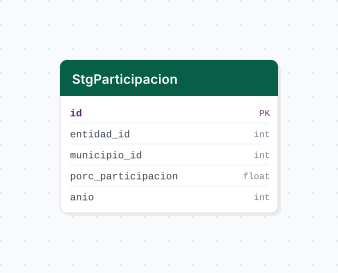

# participacion_ciudadana

Porcentaje de participacion ciudadana en elecciones federales por municipio en Jalisco. Cubre los procesos electorales de 2018, 2021 y 2024.

## Fuente general

https://ine.mx

## Fuente especifica

- [x] URL de drive

Archivo CSV alojado en Google Drive. Se descarga con `core.utils.gdrive.download_public_file`.

## Caracteristicas de los datos

| Caracteristica | Valor |
|---|---|
| Ultima fecha disponible | 2019 |
| Frecuencia de actualizacion | Trianual (elecciones federales) |
| Desagregacion | Municipal |
| Tiene update? | No |
| Update | No aplica |

## Diagrama de entidad relacion



## Diccionario de variables

### stg_participacion

| Variable | Descripcion |
|---|---|
| `entidad_id` | Clave de la entidad federativa (14 = Jalisco) |
| `municipio_id` | Clave del municipio segun catalogo INEGI |
| `porc_participacion` | Porcentaje de participacion ciudadana en la eleccion |
| `anio` | Anio del proceso electoral (2018, 2021, 2024) |

## Migraciones

| Migracion | Descripcion |
|---|---|
| `V1__foreign_tables.sql` | Crea extension postgres_fdw y tablas foraneas cvegeo_states y cvegeo_municipalities |
| `V2__table_participacion.sql` | Crea tabla stg_participacion |
| `V3__view_participacion.sql` | Crea vista v_participacion con nombres de entidad y municipio |

## Variables de entorno

| Variable | Descripcion |
|---|---|
| `GDRIVE_FILE_ID` | ID del archivo CSV en Google Drive |

## Notas metodologicas

- **Extract**: descarga el CSV desde Google Drive usando el file ID configurado en `.env`. Renombra las columnas segun `RENAME_HEADER`.
- **Transform**: convierte el formato wide (una columna por anio) a formato long mediante `melt`. Elimina el simbolo `%` de los porcentajes y convierte a float.
- **Load**: inserta los 375 registros (125 municipios x 3 anios) via `bulk_insert`.

## Ejecucion

```bash
just create-db participacion_ciudadana
just flyway-migrate participacion_ciudadana
python dags/etl_participacion_ciudadana.py
```

## Notas adicionales

- El CSV fuente ya viene filtrado a Jalisco (entidad 14), por lo que no se aplica filtro adicional en el extract.
- La vista `vw_participacion` resuelve los nombres de entidad y municipio mediante join a las tablas foraneas de cvegeo.
