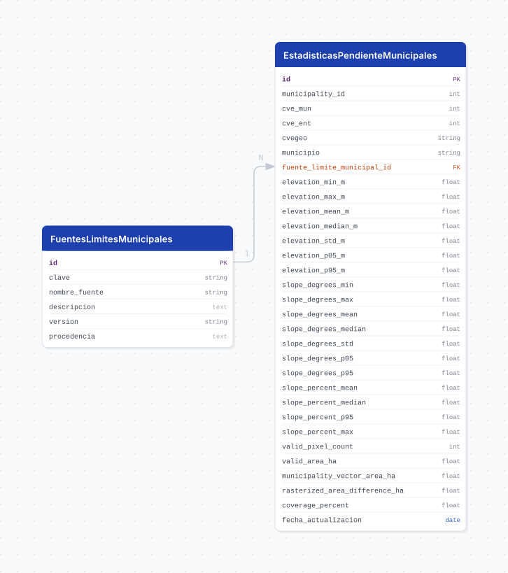

# pendientes

## Descripción general

Pipeline ETL para producir el modelo de elevación acondicionado y la familia de pendientes de Jalisco a partir del
Continuo de Elevaciones Mexicano 4.0 (CEM 4.0) de INEGI. La ruta productiva tiene exactamente tres etapas:
Extract, Transform y Load. El CEM nacional se conserva como fuente inmutable y no se presenta como producto IIEG.

## Fuente general

https://www.inegi.org.mx/temas/relieve/

## Fuente específica

```shell
SOURCE_URL=https://www.inegi.org.mx/contenidos/productos/prod_serv/contenidos/espanol/bvinegi/productos/geografia/relieve/794551151600_t.zip
```

`SOURCE_TIFF_PATH` permite reutilizar un `continuonacional_15m.tif` oficial ya descargado.

## Características de los datos

| Característica | Valor |
|---|---|
| Última fecha disponible | `2024` |
| Frecuencia de actualización | Bajo demanda |
| Desagregación | Raster estatal de 15 m y estadísticas municipales |
| ¿Tiene update? | No |
| Update | Manual / bootstrap |
| Fuente | CEM 4.0 de INEGI, cobertura nacional |
| CRS fuente | `EPSG:6365` |
| CRS de productos | `EPSG:6368` |
| Resolución de productos | 15 × 15 m |
| Cobertura | Jalisco |

## Diagrama de entidad relación



Los píxeles raster no se almacenan en PostgreSQL. `cvegeo_municipalities` es una foreign table de consulta; la FK
física local une `estadisticas_pendiente_municipales` con `fuentes_limites_municipales`.

## Diccionario de variables

### fuentes_limites_municipales

| variable | descripción |
|---|---|
| `id` | Identificador estable de la fuente territorial |
| `clave` | Clave `iieg` o `inegi` |
| `nombre_fuente` | Nombre legible de la delimitación |
| `descripcion` | Descripción institucional de la fuente |
| `version` | Versión del snapshot territorial de `cvegeo` |
| `procedencia` | Tabla y columna geométrica de origen |

### estadisticas_pendiente_municipales

| variable | descripción |
|---|---|
| `municipality_id` | `cve_mun` de Jalisco; no es el ID sustituto remoto de `cvegeo` |
| `cve_mun`, `cve_ent`, `cvegeo`, `municipio` | Identidad y nombre municipal |
| `fuente_limite_municipal_id` | FK a la delimitación IIEG o INEGI |
| `elevation_*_m` | Mínimo, máximo, media, mediana, desviación, p05 y p95 de elevación en metros |
| `slope_degrees_*` | Mínimo, máximo, media, mediana, desviación, p05 y p95 de pendiente en grados |
| `slope_percent_*` | Media, mediana, p95 y máximo de pendiente porcentual |
| `valid_pixel_count`, `valid_area_ha` | Píxeles y superficie raster válida seleccionados por centro de píxel |
| `municipality_vector_area_ha` | Superficie vectorial municipal |
| `rasterized_area_difference_ha`, `coverage_percent` | Control de cobertura de la rasterización |
| `fecha_actualizacion` | Fecha de actualización de la estadística |

### vw_pendientes_estadisticas_municipales

Vista que incorpora el nombre desde `cvegeo_municipalities` y la clave de la fuente territorial. La identidad se
resuelve mediante `cve_ent = 14` y `cve_mun = municipality_id`; no existe una FK física hacia la foreign table.

## Migraciones

| migración | descripción |
|---|---|
| `V1__municipality_reference_pendientes.sql` | Habilita PostGIS/FDW, enlaza `cvegeo_municipalities` y valida los 125 municipios de Jalisco |
| `V2__tables_pendientes.sql` | Crea el catálogo territorial, la tabla de estadísticas, restricciones e índices |
| `V3__view_pendientes.sql` | Crea la vista municipal con identidad `cvegeo` y fuente territorial |
| `V4__comments_municipal_rasterization.sql` | Documenta métricas de cobertura y rasterización municipal |

## Variables de entorno

| variable | descripción |
|---|---|
| `DB_USER`, `DB_PASSWORD`, `DB_HOST`, `DB_PORT`, `DB_NAME` | Conexión PostgreSQL/PostGIS; `DB_NAME` es `pendientes` |
| `SOURCE_URL` | URL oficial del ZIP del CEM 4.0 |
| `SOURCE_TIFF_PATH` | Ruta opcional al TIFF nacional ya descargado |
| `CVEGEO_MUNICIPAL_BOUNDARY_SNAPSHOT_PATH` | Override opcional a un GeoPackage congelado y validado |
| `SOURCE_ZIP_FILENAME` | Nombre local contractual del ZIP fuente |
| `FORCE_DOWNLOAD` | Fuerza la adquisición y reconstrucción controlada de Extract |
| `DOWNLOAD_RETRIES` | Intentos de descarga |
| `DOWNLOAD_CONNECT_TIMEOUT`, `DOWNLOAD_READ_TIMEOUT` | Timeouts HTTP en segundos |
| `DOWNLOAD_CHUNK_SIZE` | Tamaño del bloque de descarga en bytes |
| `TARGET_SRID` | SRID de trabajo y productos, `6368` |
| `TARGET_RESOLUTION_M` | Resolución de la rejilla, 15 m |
| `AOI_BUFFER_M` | Buffer analítico, 10 000 m |
| `BOUNDARY_GEOMETRY_COLUMN` | Geometría estatal para el AOI: `geom_iieg` o `geom_inegi` |
| `STATS_MAX_CELLS`, `DIAGNOSTIC_SAMPLE_MAX_CELLS` | Límites de muestreo para inspección |

## Notas metodológicas

### Extract

Adquiere o reutiliza el CEM, valida CRS, resolución, tipo, NoData y checksum, y conserva el raster nacional como
fuente inmutable. Congela las delimitaciones estatales y los 125 municipios para `geom_iieg` y `geom_inegi` desde la
base compartida `cvegeo`, o valida un snapshot configurado explícitamente.

### Transform

Reproyecta el CEM mediante bilinear a EPSG:6368 y 15 m con buffer analítico. Aplica convolución gaussiana normalizada
por máscara (`sigma=1.5` píxeles, 22.5 m; `truncate=4.0`) y conserva NoData. Calcula la pendiente en grados con GRASS
`r.param.scale method=slope size=5 exponent=0 zscale=1`; deriva el porcentaje exactamente como
`tan(radians(grados)) * 100`.

Los continuos no reciben suavizado posterior. Las clasificaciones se generalizan sólo para cartografía con sieve de
8 vecinos y `threshold=8`, aceptando únicamente cambios a una clase adyacente. El producto de elevación para
geoportal redondea el DEM G15 al múltiplo de 10 m más cercano, conserva elevaciones reales `Int16` y no aplica filtro
espacial adicional. Transform crea los seis COG lossless y calcula estadísticas municipales desde los continuos G15
y WE5 no generalizados.

### Load

Exige la familia coherente de seis COG, valida estructura, grid, checksum y QA lossless, y la materializa mediante
hardlink o copia atómica. Después hace upsert transaccional del catálogo territorial y las 250 filas municipales
esperadas. Load no convierte raster a COG ni carga píxeles en PostgreSQL.

## Ejecución

**Bootstrap** (bajo demanda, DAG `etl_pendientes_bootstrap`, `schedule=None`):

```shell
just flyway-migrate pendientes
conda run -n etl python dags/etl_pendientes.py
```

El DAG ejecuta Extract → Transform → Load, usa `max_active_runs=1`, `retries=1`, `retry_delay=20` minutos y
`catchup=False`. No existe un flujo update automatizado.

## Notas adicionales

### Productos

Analíticos, `Float32`, NoData -9999 y overviews `AVERAGE`:

- `modelo_elevacion_acondicionado_jalisco_15m.tif`;
- `pendiente_grados_jalisco_15m.tif`;
- `pendiente_porcentaje_jalisco_15m.tif`.

Geoportal/cartográficos:

- `elevacion_jalisco_intervalo_vertical_10m.tif`: elevaciones reales `Int16`, NoData -32768 y overviews `MODE`;
- `pendiente_grados_clasificada_jalisco_15m.tif`: clases `UInt8`, NoData 255 y overviews `MODE`;
- `pendiente_porcentaje_clasificada_jalisco_15m.tif`: clases `UInt8`, NoData 255 y overviews `MODE`.

Todos son COG con DEFLATE lossless, bloques de 512 píxeles, EPSG:6368, resolución 15 m y la misma máscara territorial
de Jalisco. La elevación Q10 tiene un **intervalo vertical de representación de 10 m**; esta expresión no declara
exactitud vertical del CEM.

### Clasificaciones

Grados: `[0,2)`, `[2,5)`, `[5,10)`, `[10,15)`, `[15,25)`, `[25,50)`, `>=50`.

Porcentaje: `[0,0.5)`, `[0.5,2)`, `[2,5)`, `[5,8)`, `[8,16)`, `[16,30)`, `[30,45)`, `>=45`.

Son esquemas independientes y no espacialmente equivalentes. La justificación experimental, el QA y las
limitaciones se documentan en [METODOLOGIA.md](METODOLOGIA.md).

### Desarrollo local con `cvegeo`

`cvegeo` comparte driver, usuario, contraseña, host y puerto con la conexión configurada; sólo cambia el nombre de la
base. El SQL se administra mediante Git LFS.

```shell
git lfs install
git lfs pull
cp migrations/cvegeo/.env.example migrations/cvegeo/.env
just flyway-config cvegeo
just create-db cvegeo
just flyway-migrate cvegeo
```

### Pruebas

```shell
.venv/bin/python -m pytest -q tests/pipelines/pendientes
.venv/bin/python -m ruff check core/pipelines/pendientes tests/pipelines/pendientes
```

### Idempotencia y almacenamiento

Extract reutiliza descargas y snapshots válidos; Transform reutiliza sólo artefactos con manifest y checksum
coincidentes; Load vuelve a verificar SHA-256 y usa upsert sin duplicar claves municipales. Los TIFF, GeoPackage,
Parquet, PNG experimentales y manifests de ejecución viven bajo `data/` y no se versionan.
