# Pipeline: Pobreza Multidimensional

Indicadores municipales de pobreza multidimensional del CONEVAL para los años 2010, 2015 y 2020. Cubre las 2,469 localidades municipales de México con métricas de pobreza, carencias sociales y líneas de ingreso.

## Fuente

Medición de pobreza a nivel municipal publicada por el Consejo Nacional de Evaluación de la Política de Desarrollo Social (CONEVAL).

| Atributo | Valor |
|---|---|
| **URL** | [Concentrado_indicadores_de_pobreza_2020.zip](https://www.coneval.org.mx/Medicion/Documents/Pobreza_municipal/2020/Concentrado_indicadores_de_pobreza_2020.zip) |
| **Formato** | Excel (hoja `Concentrado municipal`, datos desde fila 9, encabezados multi-nivel filas 5-6) |
| **Registros** | ~7,407 (2,469 municipios × 3 años) |
| **Llave natural** | `(cve_mun, anio)` |
| **Periodicidad** | Bianual (nueva edición cada 2-3 años) |
| **Comportamiento** | sobreescribe — el archivo reemplaza a la versión anterior completa |

## Estructura

```
pobreza_multidimencional/
├── .env.example     # Variables de entorno con valores de ejemplo
├── config.py        # Settings del pipeline (extiende BaseConfig)
├── consts.py        # Constantes: EXCEL_COL_NAMES, INDICATOR_PREFIXES, NULL_VALUES, DATA_YEARS
├── schemas.py       # Modelos SQLAlchemy (CatEntidad, PobrezaMultidimencionalDatos)
└── stages/
    ├── extract.py   # Descarga ZIP y extrae XLSX
    ├── transform.py # Wide → tidy (municipio × año), extrae catálogos
    └── load.py      # Carga catálogos + datos en BD
```

Archivos relacionados:

- `dags/etl_pobreza_multidimencional.py` — DAG de Airflow (bootstrap, `schedule=None`)
- `migrations/pobreza_multidimencional/sql/` — Migraciones Flyway V1–V3
- `migrations/pobreza_multidimencional/flyway.conf.example` — Config de ejemplo

## Esquema de base de datos

```mermaid
erDiagram
    stg_pobreza_multidimencional_cat_entidad {
        INTEGER id PK
        VARCHAR_2_ cve_ent
        VARCHAR_100_ nombre_entidad
    }
    stg_pobreza_multidimencional_datos {
        INTEGER id PK
        VARCHAR_5_ cve_mun
        VARCHAR_150_ nombre_municipio
        INTEGER cat_entidad_id FK
        SMALLINT anio
        INTEGER poblacion
        FLOAT pobreza_porcentaje
        INTEGER pobreza_personas
        FLOAT pobreza_promedio
        FLOAT pobreza_ext_porcentaje
        INTEGER pobreza_ext_personas
        FLOAT pobreza_ext_promedio
        FLOAT pobreza_mod_porcentaje
        INTEGER pobreza_mod_personas
        FLOAT pobreza_mod_promedio
        FLOAT vul_carencia_porcentaje
        INTEGER vul_carencia_personas
        FLOAT vul_carencia_promedio
        FLOAT vul_ingreso_porcentaje
        INTEGER vul_ingreso_personas
        FLOAT no_pobre_porcentaje
        INTEGER no_pobre_personas
        FLOAT rez_edu_porcentaje
        INTEGER rez_edu_personas
        FLOAT rez_edu_promedio
        FLOAT car_salud_porcentaje
        INTEGER car_salud_personas
        FLOAT car_salud_promedio
        FLOAT car_seg_soc_porcentaje
        INTEGER car_seg_soc_personas
        FLOAT car_seg_soc_promedio
        FLOAT car_viv_porcentaje
        INTEGER car_viv_personas
        FLOAT car_viv_promedio
        FLOAT car_sbv_porcentaje
        INTEGER car_sbv_personas
        FLOAT car_sbv_promedio
        FLOAT car_ali_porcentaje
        INTEGER car_ali_personas
        FLOAT car_ali_promedio
        FLOAT al_1_car_porcentaje
        INTEGER al_1_car_personas
        FLOAT al_1_car_promedio
        FLOAT tres_mas_car_porcentaje
        INTEGER tres_mas_car_personas
        FLOAT tres_mas_car_promedio
        FLOAT lpi_porcentaje
        INTEGER lpi_personas
        FLOAT lpi_promedio
        FLOAT lpei_porcentaje
        INTEGER lpei_personas
        FLOAT lpei_promedio
        DATETIME created_at
        DATETIME updated_at
    }
    stg_pobreza_multidimencional_cat_entidad ||--o{ stg_pobreza_multidimencional_datos : "cat_entidad_id"
```



**Vista analítica**: `vw_pobreza_multidimencional` — JOIN de `datos` + `cat_entidad`, expone todas las columnas de métricas con `nombre_municipio` y `nombre_entidad`.

**Catálogos**: 32 entidades sincronizadas vía `insert_records` con `ON CONFLICT DO NOTHING` usando `cve_ent` como llave.

**Estrategia de update**: `bootstrap_only` — la fuente sobreescribe completamente en cada edición. Re-ingestión completa vía `flyway-reset` + bootstrap.

## Indicadores disponibles

Cada indicador tiene 3 columnas: `_porcentaje` (FLOAT), `_personas` (INTEGER), y `_carencias_promedio` (FLOAT, excepto `vul_ingreso` y `no_pobre`).

| Indicador | Descripción |
|---|---|
| `pobreza` | Pobreza total |
| `pobreza_ext` | Pobreza extrema |
| `pobreza_mod` | Pobreza moderada |
| `vul_carencia` | Vulnerable por carencia social |
| `vul_ingreso` | Vulnerable por ingreso |
| `no_pobre` | No pobre y no vulnerable |
| `rez_edu` | Rezago educativo |
| `car_salud` | Carencia acceso a salud |
| `car_seg_soc` | Carencia seguridad social |
| `car_viv` | Carencia calidad de vivienda |
| `car_sbv` | Carencia servicios básicos de vivienda |
| `car_ali` | Carencia acceso a alimentación |
| `al_1_car` | Al menos una carencia social |
| `tres_mas_car` | Tres o más carencias sociales |
| `lpi` | Ingreso < línea de pobreza |
| `lpei` | Ingreso < línea de pobreza extrema |

## Arquitectura

Sigue el patrón de 3 etapas `Stage` → `Pipeline`:

```
PobrezaMultidimencionalExtract → PobrezaMultidimencionalTransform → PobrezaMultidimencionalLoad
```

| Etapa | Entrada | Salida |
|---|---|---|
| **Extract** | Ninguna | `{"file_path": str, "zip_path": str}` |
| **Transform** | `file_path` | `{"df": DataFrame, "catalogs": dict, "row_count": int}` |
| **Load** | `df` + `catalogs` | `{"row_count": int}` |

### Extract

1. Descarga el ZIP desde `POBREZA_MULTIDIMENCIONAL_SOURCE_URL` (timeout 180 s).
2. Extrae `Concentrado_indicadores_de_pobreza_2020.xlsx`.
3. Elimina el ZIP; guarda el XLSX en `data/extract/pobreza_multidimencional/`.

### Transform

1. Lee el XLSX (`skiprows=8`, `usecols=range(1,146)`) y asigna `EXCEL_COL_NAMES`.
2. Filtra filas donde `cve_mun` no sea un código de 5 dígitos.
3. Aplica `NULL_VALUES`; convierte métricas `_personas` a `Int64` y porcentajes a `float`.
4. Pivota de formato wide a tidy: 3 DataFrames (uno por año) → concatena → 7,407 filas.
5. Extrae catálogo de entidades federativas (32 entidades únicas).

### Load

1. Sincroniza `cat_entidad` con `insert_records` (conflict key: `cve_ent`).
2. Construye mapa `cve_ent → cat_entidad_id`.
3. Resuelve `cat_entidad_id` en el DataFrame.
4. `bulk_insert` en lotes de `POBREZA_MULTIDIMENCIONAL_LOAD_BATCH_SIZE` (default 2,000).
5. Sincroniza secuencias SERIAL.

## Periodicidad

- **Bootstrap**: `schedule=None`, ejecución bajo demanda. Corre `run_bootstrap()` al ejecutar `python dags/etl_pobreza_multidimencional.py` directamente.

## Setup local

```bash
# 1. Copiar y completar variables de entorno
cp core/pipelines/pobreza_multidimencional/.env.example \
   core/pipelines/pobreza_multidimencional/.env

# 2. Aplicar migraciones
just flyway-reset pobreza_multidimencional

# 3. Ejecutar bootstrap
conda activate etl
python dags/etl_pobreza_multidimencional.py
```
