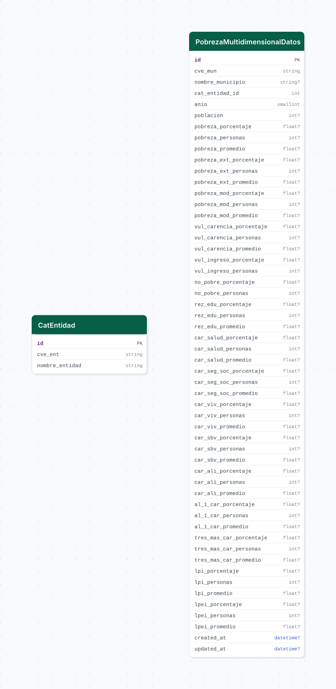

# pobreza_multidimensional

## Descripción general

Pipeline ETL de indicadores de pobreza multidimensional municipal del CONEVAL. Descarga el concentrado de indicadores para los años 2010, 2015 y 2020, transformando el formato wide del XLSX a un formato tidy (municipio × año) con múltiples indicadores de pobreza, vulnerabilidad y carencias sociales.

## Fuente general

https://www.coneval.org.mx/Medicion/Paginas/pobreza-municipio-2010-2020.aspx

## Fuente específica

```shell
POBREZA_MULTIDIMENSIONAL_SOURCE_URL=https://www.coneval.org.mx/Medicion/Documents/Pobreza_municipal/2020/Concentrado_indicadores_de_pobreza_2020.zip
```

## Características de los datos

| Característica | Valor |
|---|---|
| Última fecha disponible | `2020` |
| Frecuencia de actualización | Quinquenal |
| Desagregación | Nacional, Municipal |
| ¿Tiene update? | No |
| Update | No aplica |

## Diagrama de entidad relación



## Diccionario de variables

### pobreza_multidimensional_datos

| variable | descripción |
|---|---|
| `cve_mun` | Clave INEGI del municipio (5 dígitos) |
| `nombre_municipio` | Nombre del municipio |
| `cat_entidad_id` | FK a catálogo de entidades |
| `anio` | Año del levantamiento |
| `poblacion` | Población total del municipio |
| `pobreza_porcentaje` | % de población en situación de pobreza |
| `pobreza_personas` | Personas en situación de pobreza |
| `pobreza_ext_porcentaje` | % en pobreza extrema |
| `pobreza_ext_personas` | Personas en pobreza extrema |
| `pobreza_mod_porcentaje` | % en pobreza moderada |
| `vul_carencia_porcentaje` | % vulnerable por carencia social |
| `vul_ingreso_porcentaje` | % vulnerable por ingresos |
| `no_pobre_porcentaje` | % no pobre y no vulnerable |
| `rez_edu_porcentaje` | % con rezago educativo |
| `car_salud_porcentaje` | % con carencia de acceso a servicios de salud |
| `car_seg_soc_porcentaje` | % con carencia de seguridad social |
| `car_viv_porcentaje` | % con carencia de calidad de vivienda |

## Migraciones

| migración | descripción |
|---|---|
| `V1__catalogos.sql` | Catálogo de entidades federativas |
| `V2__tabla_principal.sql` | Tabla principal `pobreza_multidimensional_datos` |
| `V3__vista.sql` | Vista analítica desnormalizada |

## Variables de entorno

| variable | descripción |
|---|---|
| `POBREZA_MULTIDIMENSIONAL_SOURCE_URL` | URL del ZIP con el XLSX de indicadores municipales |
| `POBREZA_MULTIDIMENSIONAL_LOAD_BATCH_SIZE` | Tamaño de lote para inserción masiva |
| `XLSX_FILENAME` | Nombre del archivo XLSX dentro del ZIP |

## Notas metodológicas

### Extract

Descarga el ZIP desde `POBREZA_MULTIDIMENSIONAL_SOURCE_URL`, extrae el XLSX configurado en `XLSX_FILENAME` y elimina el ZIP para liberar espacio.

### Transform

Lee el XLSX en formato wide (una columna por indicador × año), transforma a formato tidy con `pd.melt`, extrae el catálogo de entidades, sanitiza nulos residuales y valida la estructura.

### Load

Inserta el catálogo de entidades e inserta masivamente los registros tidy en `pobreza_multidimensional_datos` con `bulk_insert`.

## Ejecución

**Bootstrap** (única ejecución):

```shell
just flyway-migrate pobreza_multidimensional
conda run -n etl python -m core.pipelines.pobreza_multidimensional bootstrap
```

No tiene flujo update.

## Notas adicionales

El CONEVAL publica los datos con varios años de rezago. Para incorporar el levantamiento 2025 será necesario actualizar la URL y el nombre del XLSX, y ejecutar nuevamente el bootstrap. El XLSX contiene datos de todos los municipios de México.
