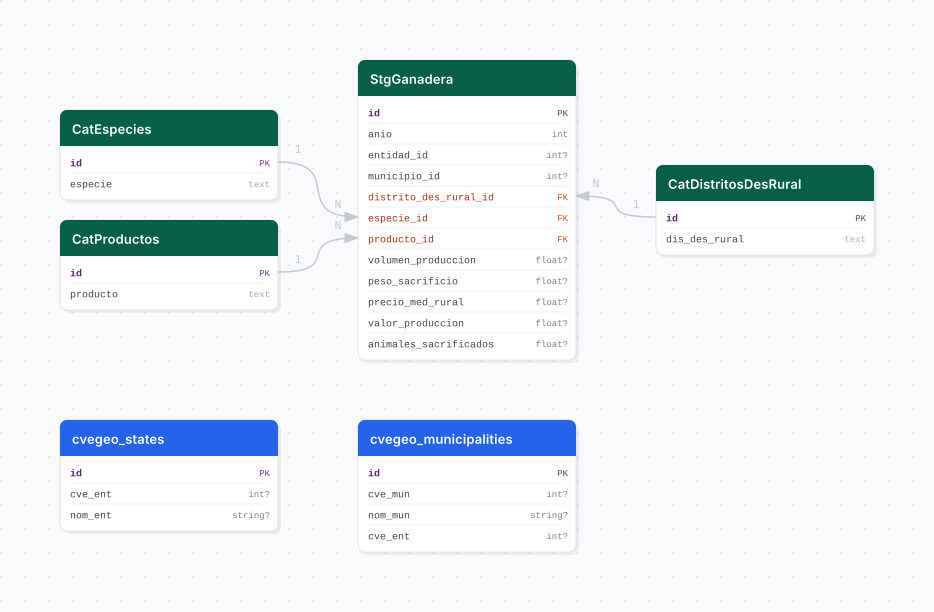

# produccion_ganadera

## Descripción general

Pipeline ETL de producción ganadera anual del SIAP (Secretaría de Agricultura y Desarrollo Rural). Contiene datos por municipio y especie animal de volumen de producción, peso en sacrificio, precio medio rural, valor de producción y animales sacrificados desde 2006.

## Fuente general

https://www.gob.mx/siap

## Fuente específica

```shell
SIAP_URL=https://nube.agricultura.gob.mx/index.php?view=E370DEBE-390827E8-72838350-94616860&ANIO={anio}
```

## Características de los datos

| Característica | Valor |
|---|---|
| Última fecha disponible | `2024` |
| Frecuencia de actualización | Anual |
| Desagregación | Nacional, Estatal, Municipal |
| ¿Tiene update? | Sí |
| Update | Automático |

## Diagrama de entidad relación



## Diccionario de variables

### stg_ganadera

| variable | descripción |
|---|---|
| `anio` | Año de la producción |
| `entidad_id` | Clave de entidad federativa (ref. cvegeo) |
| `municipio_id` | Clave del municipio (ref. cvegeo) |
| `distrito_des_rural_id` | FK a distrito de desarrollo rural |
| `especie_id` | FK a catálogo de especies animales |
| `producto_id` | FK a catálogo de productos ganaderos |
| `volumen_produccion` | Volumen de producción en la unidad registrada |
| `peso_sacrificio` | Peso en sacrificio (kg) |
| `precio_med_rural` | Precio medio rural ($/unidad) |
| `valor_produccion` | Valor de producción (miles de pesos) |
| `animales_sacrificados` | Número de animales sacrificados |

## Migraciones

| migración | descripción |
|---|---|
| `V1__foreign_tables.sql` | FDW hacia la base `cvegeo` |
| `V2__catalogs_produccion_ganadera.sql` | Catálogos de especies, productos y distritos de desarrollo rural |
| `V3__tables_produccion_ganadera.sql` | Tabla principal `stg_ganadera` |
| `V4__views_produccion_ganadera.sql` | Vistas analíticas desnormalizadas |

## Variables de entorno

| variable | descripción |
|---|---|
| `SIAP_URL` | URL con parámetro `{anio}` para descargar el CSV ganadero de cada año |
| `START_DATE` | Año inicial del bootstrap (ej. `2006`) |
| `END_DATE` | Año final del bootstrap (ej. `2024`) |
| `CHUNK_SIZE` | Tamaño de lote para inserción masiva |

## Notas metodológicas

### Extract

Descarga un CSV por año desde la URL del SIAP iterando desde `START_DATE` hasta `END_DATE`. Los archivos se almacenan localmente antes de pasar a transform.

### Transform

Normaliza texto, renombra columnas según el mapa de constantes, extrae catálogos de especies y productos, y resuelve los IDs foráneos.

### Load

Inserta catálogos con `insert_records` y carga registros anuales con `bulk_insert` en `stg_ganadera` (append-only).

## Ejecución

**Bootstrap** (carga inicial desde 2006):

```shell
just flyway-migrate produccion_ganadera
conda run -n etl python -m core.pipelines.produccion_ganadera bootstrap
```

**Update anual** (DAG `etl_produccion_ganadera_update`, `@yearly`):

```shell
conda run -n etl python -m core.pipelines.produccion_ganadera update
```

## Notas adicionales

Comparte la misma infraestructura de descarga con `agropecuario_siap` (mismo portal SIAP) pero con una URL de vista distinta. Los datos cubren todos los estados de México; no se filtra a Jalisco para permitir análisis comparativos.
