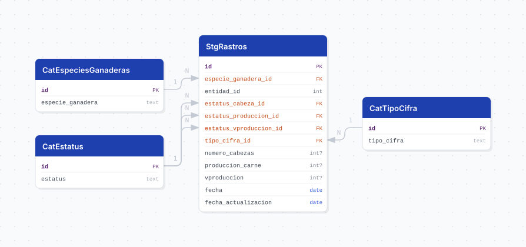

# rastros

## Descripción general

Pipeline ETL de la **Estadística de Sacrificio de Ganado en Rastros Municipales (ESGRM)** del INEGI. Reporta, con periodicidad **mensual desde enero de 2008**, el número de cabezas sacrificadas, el volumen de carne en canal y su valor, por entidad federativa y especie ganadera.

> **Cobertura geográfica: ESTATAL.** El nombre "rastros municipales" describe al administrador del establecimiento (los gobiernos municipales), **no** al nivel de desglose publicado. La fuente entrega `CVEGEO` de 2 dígitos (clave de entidad) y `COBERTURA = 'Estatal'` en el 100% de los registros. **No existe desglose municipal** en los datos abiertos de ESGRM, ni en el conjunto mensual ni en el anual.

## Fuente general

https://www.inegi.org.mx/programas/sacrificioganado/#datos_abiertos

## Fuente específica

```shell
ESGRM_URL=https://www.inegi.org.mx/contenidos/programas/sacrificioganado/datosabiertos/conjunto_de_datos_esgrm_mensual_csv.zip
```

Un solo ZIP contiene todos los años. Dentro, `conjunto_de_datos/esgrm_mensual_tr_cifra_{year}.csv`, un archivo por año.

## Características de los datos

| Característica | Valor |
|---|---|
| Primer periodo disponible | `2008-01` |
| Frecuencia de actualización | Mensual |
| Desagregación | Estatal |
| ¿Tiene update? | Sí |
| Update | Automático (`@monthly`) |
| Estrategia de carga | `upsert_records` |

Las cifras del año en curso se publican como **preliminares** y el INEGI las revisa en publicaciones posteriores; por eso la carga es un upsert sobre `(fecha, entidad_id, especie_ganadera_id)` y no un append.

## Diagrama de entidad relación



## Diccionario de variables

### stg_rastros

| variable | descripción |
|---|---|
| `fecha` | Primer día del mes de referencia (derivado de `ANIO` + `ID_MES`) |
| `entidad_id` | Clave de la entidad federativa, 1 a 32 (ref. `cvegeo_states.cve_ent`) |
| `especie_ganadera_id` | FK a `cat_especies_ganaderas` |
| `numero_cabezas` | Animales vivos que ingresan al rastro para su matanza |
| `estatus_cabeza_id` | FK a `cat_estatus`; disponibilidad de `numero_cabezas` |
| `produccion_carne` | Volumen de carne en canal, en **toneladas** |
| `estatus_produccion_id` | FK a `cat_estatus`; disponibilidad de `produccion_carne` |
| `vproduccion` | Valor de la producción, en **miles de pesos** |
| `estatus_vproduccion_id` | FK a `cat_estatus`; disponibilidad de `vproduccion` |
| `tipo_cifra_id` | FK a `cat_tipo_cifra`; cifras definitivas o preliminares |
| `fecha_actualizacion` | Fecha en que el pipeline cargó o actualizó el registro |

### Catálogos

| tabla | contenido |
|---|---|
| `cat_estatus` | Disponibilidad de una cifra. La fuente usa hoy `Disponible` y `No significativo`; el diccionario del INEGI también contempla `No disponible`, `No aplicable` y `Confidencial` |
| `cat_especies_ganaderas` | `Ganado bovino`, `Ganado caprino`, `Ganado ovino`, `Ganado porcino` |
| `cat_tipo_cifra` | `Cifras Definitivas`, `Cifras Preliminares` |

Los tres catálogos se derivan de los datos, no están hardcodeados: si el INEGI publica un valor nuevo, aparece solo.

## Migraciones

| migración | descripción |
|---|---|
| `V1__foreign_tables.sql` | FDW hacia la base `cvegeo` (`cvegeo_states`) |
| `V2__catalogs_rastros.sql` | Catálogos de estatus, especies ganaderas y tipo de cifra |
| `V3__tables_rastros.sql` | Tabla principal `stg_rastros` |
| `V4__views_rastros.sql` | Vistas `vw_rastros` (32 entidades) y `vw_rastros_jalisco` |

## Vistas

| vista | alcance |
|---|---|
| `vw_rastros` | Las 32 entidades federativas, para comparativos nacionales |
| `vw_rastros_jalisco` | Solo Jalisco (`entidad_id = 14`) |

## Variables de entorno

| variable | descripción |
|---|---|
| `ESGRM_URL` | URL del ZIP del conjunto |
| `DOWNLOAD_TIMEOUT` | Timeout de descarga en segundos |
| `CHUNK_SIZE` | Tamaño de lote para el upsert |

## Notas metodológicas

### Extract

`helpers/source.py::fetch_dataset` descarga el ZIP desde `ESGRM_URL`. Hoy esa ruta única sirve todos los años (el ZIP trae un CSV por año y se le agrega uno en cada edición), pero **el INEGI puede moverla y no se le conoce patrón**: no se intenta adivinar la siguiente. La estrategia es detectar la ruptura y avisar, no improvisar.

> **Cuidado con el status code.** INEGI responde **HTTP 200 con una página HTML** cuando el archivo no existe, así que `raise_for_status()` no detecta una ruta muerta. La validación se hace sobre la firma del archivo (`PK`), no sobre el código de respuesta.

Cuando la URL deje de servir el ZIP, `fetch_dataset` lanza `FileNotFoundError` diciendo explícitamente que hay que consultar la página del programa y actualizar `ESGRM_URL` en el `.env`. El DAG falla ruidosamente en vez de cargar una página de error o quedarse callado.

> Se descartó generar URLs candidatas por año (`..._{anio}_csv.zip`): se probaron 2024, 2025, 2026 y 2027 y **ninguna existe**. Habría sido código muerto que da falsa sensación de resiliencia.

Los CSV anuales se descubren dentro del ZIP por expresión regular, sin listar años: un año nuevo entra sin tocar código.

### Transform

Castea los enteros con `pd.to_numeric` antes de limpiar nulos, arma `fecha` con `helpers/periodo.py::build_fecha` (combina `ANIO` e `ID_MES`, que viene con tabuladores de relleno) y deriva los catálogos.

> `NULL_VALUES` **no** puede incluir `nd`, `na`, `n/a` ni `no disponible`: `list_values_to_null` actúa sobre todas las columnas de texto y esos tokens son etiquetas legítimas del catálogo de estatus, no ausencia de dato.

### Load

Inserta los catálogos con `insert_records` usando la columna de texto como llave de conflicto y **relee los ids desde PostgreSQL** para resolver las FK. Los ids nunca se asignan desde el DataFrame: así un valor nuevo en la fuente no recorre los ids ya referenciados por `stg_rastros`.

## Ejecución

**Bootstrap** (carga inicial 2008 a la fecha):

```shell
just flyway-migrate rastros
python dags/etl_rastros.py
```

**Update mensual** (DAG `etl_rastros_update`, `@monthly`): mismo flujo. El ZIP trae todos los años, así que el upsert agrega los meses nuevos y reescribe las cifras preliminares que el INEGI haya revisado.

## Notas adicionales

- La entidad `09` (Ciudad de México) no aparece en la fuente: 31 entidades con datos de las 32 posibles.
- Los datos se cargan para las 32 entidades; el filtro a Jalisco vive en la vista, no en la tabla, para no perder la base comparativa nacional.
- Por redondeo, la suma de los parciales puede no coincidir con el total nacional publicado por el INEGI.
