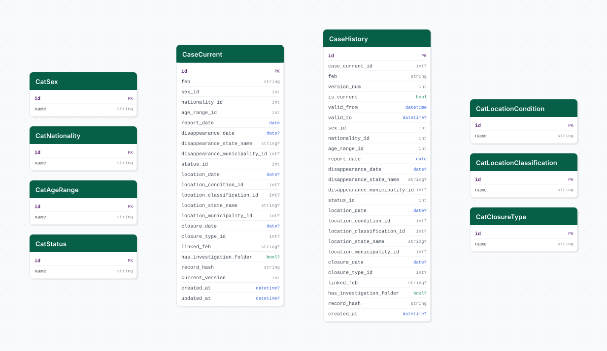

# repd

## Descripción general

Pipeline ETL del Registro Estatal de Personas Desaparecidas (REPD) de Jalisco. Descarga el registro actualizado de casos de personas desaparecidas e implementa SCD Tipo 2 para rastrear el historial de cambios en el estatus y la información de cada caso.

## Fuente general

https://repd.jalisco.gob.mx

## Fuente específica

```shell
REPD_DATA_URL=
```

## Características de los datos

| Característica | Valor |
|---|---|
| Última fecha disponible | `2025-05` |
| Frecuencia de actualización | Mensual |
| Desagregación | Estatal, Municipal |
| ¿Tiene update? | Sí |
| Update | Automático |

## Diagrama de entidad relación



## Diccionario de variables

### stg_repd_casos

| variable | descripción |
|---|---|
| `feb` | Folio Estadístico de Búsqueda (identificador único del caso) |
| `estado_desaparicion` | Nombre del estado de desaparición |
| `estado_localizacion` | Nombre del estado de localización |
| `feb_vinculado` | FEB de caso relacionado (si existe) |
| `record_hash` | Hash SHA-256 del contenido del registro (para SCD2) |
| `version_actual` | Número de versión actual del registro |
| `fecha_creacion` | Timestamp de creación del registro |
| `fecha_actualizacion` | Timestamp de última actualización |

### stg_repd_casos_historial

| variable | descripción |
|---|---|
| `feb` | Folio Estadístico de Búsqueda |
| `es_vigente` | Indica si es la versión vigente |
| `vigente_desde` | Timestamp de inicio de vigencia |
| `record_hash` | Hash SHA-256 del contenido histórico |

## Migraciones

| migración | descripción |
|---|---|
| `V1__catalogos_repd.sql` | FDW a cvegeo; catálogos `cat_sexo`, `cat_nacionalidad`, `cat_rango_edad`, `cat_estatus`, `cat_condicion_localizacion`, `cat_clasificacion_localizacion`, `cat_tipo_cierre` |
| `V2__tabla_stg_repd.sql` | Tablas `stg_repd_casos` y `stg_repd_casos_historial` |
| `V3__vista_repd.sql` | Vista analítica `vw_repd` que resuelve catálogos y municipios |
| `V4__fdw_postgis_conapo.sql` | PostGIS, geometry en FDW de cvegeo, y FDW a CONAPO |
| `V5__vistas_materializadas_repd.sql` | 6 vistas materializadas con geometrías y tasas CONAPO para consumo GIS |
| `V6__comments_repd.sql` | Comentarios en vistas materializadas |

## Vistas materializadas (consumo GIS)

6 vistas materializadas que agregan casos REPD por municipio y mes, con geometrías (`geom_iieg`, `geom_inegi` SRID 6368) y tasas por 100,000 habitantes (denominador CONAPO).

| vista | columnas clave | descripción |
|---|---|---|
| `personas_desaparecidas` | `total`, `total_hombres`, `total_mujeres`, `tasa_total`, `tasa_hombres`, `tasa_mujeres` | Reportes mensuales de personas desaparecidas por municipio (estatus = `PERSONA DESAPARECIDA`) |
| `personas_desaparecidas_hombres` | `total_hombres`, `tasa_hombres` | Vista filtrada sólo con desaparecidos hombres |
| `personas_desaparecidas_mujeres` | `total_mujeres`, `tasa_mujeres` | Vista filtrada sólo con desaparecidas mujeres |
| `personas_localizadas` | `total`, `total_hombres`, `total_mujeres`, `tasa_total`, `tasa_hombres`, `tasa_mujeres` | Personas localizadas por municipio y mes (estatus = `PERSONA LOCALIZADA`) |
| `personas_localizadas_hombres` | `total_hombres`, `tasa_hombres` | Vista filtrada sólo con localizados hombres |
| `personas_localizadas_mujeres` | `total_mujeres`, `tasa_mujeres` | Vista filtrada sólo con localizadas mujeres |

Columnas comunes: `fid`, `nombre`, `fecha` (YYYY-MM-01), `clave_entidad` (14), `clave_municipio` (EEMMM), `geom_iieg`, `geom_inegi`.

Las vistas se refrescan automáticamente después de cada carga (bootstrap/update) mediante `refresh_materialized_views` en la etapa de load.

## Variables de entorno

| variable | descripción |
|---|---|
| `REPD_DATA_URL` | URL de descarga del archivo del REPD |

## Notas metodológicas

### Extract

Descarga el archivo de datos del REPD desde `REPD_DATA_URL` y lo almacena localmente. El archivo contiene el registro completo y actualizado de todos los casos.

### Transform

Normaliza texto, extrae catálogos (sexo, nacionalidad, rangos de edad, estatus, condición de localización, tipo de cierre), calcula el hash SHA-256 del contenido de cada caso para detección de cambios.

### Load

Compara hashes con los registros actuales en `stg_repd_casos`. Los registros nuevos se insertan; los modificados se versionan en `stg_repd_casos_historial` y se actualizan en `stg_repd_casos`. Los catálogos se sincronizan con `insert_records`.

## Ejecución

**Bootstrap** (carga inicial completa):

```shell
just flyway-migrate repd
conda run -n etl python dags/etl_repd.py
```

**Update mensual** (DAG `etl_repd_update`, cron `0 3 1 * *`):

```shell
conda run -n etl python -c "from dags.etl_repd import run_update; run_update()"
```

## Notas adicionales

El SCD2 permite auditar la evolución de cada caso a lo largo del tiempo. La tabla `stg_repd_casos_historial` puede crecer considerablemente si hay muchos cambios de estatus. La URL del REPD puede requerir autenticación institucional.
