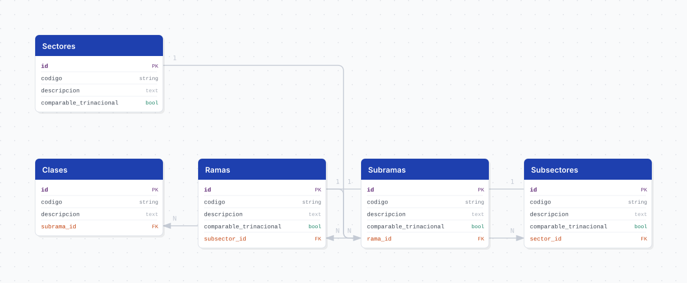

# scian

## Descripción general

Estructura completa del Sistema de Clasificación Industrial de América del Norte (SCIAN) México 2023, publicado por el INEGI. Es el clasificador oficial de actividades económicas del país y la base con la que se codifican fuentes como el DENUE, los Censos Económicos y la ENOE.

El pipeline carga los cinco niveles jerárquicos del clasificador —sector, subsector, rama, subrama y clase de actividad— con sus 2,115 categorías en total, únicamente en su versión en español.

## Fuente general

https://www.inegi.org.mx/app/scian/

## Fuente específica

```shell
SCIAN_ESTRUCTURA_URL=https://www.inegi.org.mx/contenidos/app/scian/estructura2023.xlsx
```

## Características de los datos

| Característica | Valor |
|---|---|
| Última fecha disponible | `2023` |
| Frecuencia de actualización | Quinquenal (2007, 2013, 2018, 2023) |
| Desagregación | Nacional (clasificador, sin desagregación geográfica) |
| ¿Tiene update? | No |
| Update | N/A — se vuelve a correr el bootstrap cuando el INEGI publica una nueva versión |

## Diagrama de entidad relación



## Diccionario de variables

### sectores

| variable | descripción |
|---|---|
| `codigo` | Clave del sector. Dos sectores agrupan un rango de claves: `31-33` y `48-49` |
| `descripcion` | Nombre del sector |
| `comparable_trinacional` | La categoría es comparable con el NAICS de Estados Unidos y Canadá |

### subsectores

| variable | descripción |
|---|---|
| `codigo` | Clave del subsector (3 dígitos) |
| `descripcion` | Nombre del subsector |
| `comparable_trinacional` | La categoría es comparable con el NAICS de Estados Unidos y Canadá |
| `sector_id` | Referencia al sector al que pertenece |

### ramas

| variable | descripción |
|---|---|
| `codigo` | Clave de la rama (4 dígitos) |
| `descripcion` | Nombre de la rama |
| `comparable_trinacional` | La categoría es comparable con el NAICS de Estados Unidos y Canadá |
| `subsector_id` | Referencia al subsector al que pertenece |

### subramas

| variable | descripción |
|---|---|
| `codigo` | Clave de la subrama (5 dígitos) |
| `descripcion` | Nombre de la subrama |
| `comparable_trinacional` | La categoría es comparable con el NAICS de Estados Unidos y Canadá |
| `rama_id` | Referencia a la rama a la que pertenece |

### clases

| variable | descripción |
|---|---|
| `codigo` | Clave de la clase de actividad (6 dígitos) |
| `descripcion` | Nombre de la clase de actividad |
| `subrama_id` | Referencia a la subrama a la que pertenece |

## Migraciones

| migración | descripción |
|---|---|
| `V1__tables_scian.sql` | Crea las cinco tablas de la jerarquía con sus llaves foráneas e índices |
| `V2__views_scian.sql` | Crea `view_scian_estructura`, la jerarquía aplanada con los cinco niveles por renglón |

## Variables de entorno

| variable | descripción |
|---|---|
| `SCIAN_ESTRUCTURA_URL` | URL del archivo `estructura2023.xlsx` publicado por el INEGI |

## Notas metodológicas

### Extract

Descarga directa del `.xlsx` desde una URL fija y lectura de la hoja `Español` sin encabezado, porque la primera fila es el título del documento y no nombres de columna. Se descartan esa fila y las 113 filas totalmente vacías que el archivo usa como separadores visuales entre grupos de códigos.

### Transform

El archivo no trae una columna de nivel: el INEGI codifica la jerarquía como **sangría**, dejando celdas vacías a la izquierda. Cada renglón tiene exactamente dos celdas llenas y contiguas —el código en la columna que corresponde a su nivel y la descripción en la siguiente—, así que el nivel se deduce de la posición de la primera celda llena.

El padre de cada categoría se resuelve **recorriendo el archivo hacia abajo**, no por prefijo del código: los sectores `31-33` y `48-49` agrupan rangos de claves, de modo que el subsector `311` no comparte prefijo con su sector. El recorrido arrastra el último código visto en cada nivel y toma el del nivel inmediato superior.

Las descripciones de los cuatro primeros niveles pueden terminar en una `T` que el INEGI escribe como exponente: marca las categorías comparables a nivel trinacional con el NAICS de Estados Unidos y Canadá. Falta justo donde México se desvía del NAICS —comercio (`43`, `46`), `525` y las actividades gubernamentales (`931`, `932`)—, y nunca aparece en las clases. Se extrae a la columna `comparable_trinacional` y se elimina del texto.

El stage aborta si algún renglón queda sin descripción o con un código fuera de los cinco niveles: eso significaría que el INEGI cambió el formato del archivo.

### Load

Carga de arriba hacia abajo con `bulk_insert`, un nivel a la vez. Después de insertar cada nivel se lee el mapeo `codigo → id` para resolver la llave foránea del nivel siguiente. Si algún código queda sin padre, el stage falla en lugar de insertar filas huérfanas.

Es un pipeline no iterable: la carga es de una sola vez (bootstrap) y el DAG no tiene schedule.

## Ejecución

**Bootstrap** (carga inicial):

```shell
just flyway-migrate scian
python dags/etl_scian.py
```

## Notas adicionales

El archivo del INEGI trae también las hojas `Inglés` y `Español-Inglés`; el pipeline solo usa la versión en español.

Las cinco tablas guardan la versión 2023 del clasificador sin columna de versión: `codigo` es único por tabla. Cargar el SCIAN 2018 o una versión futura junto con la actual requeriría agregar esa columna y mover la restricción de unicidad a `(codigo, version)`.
