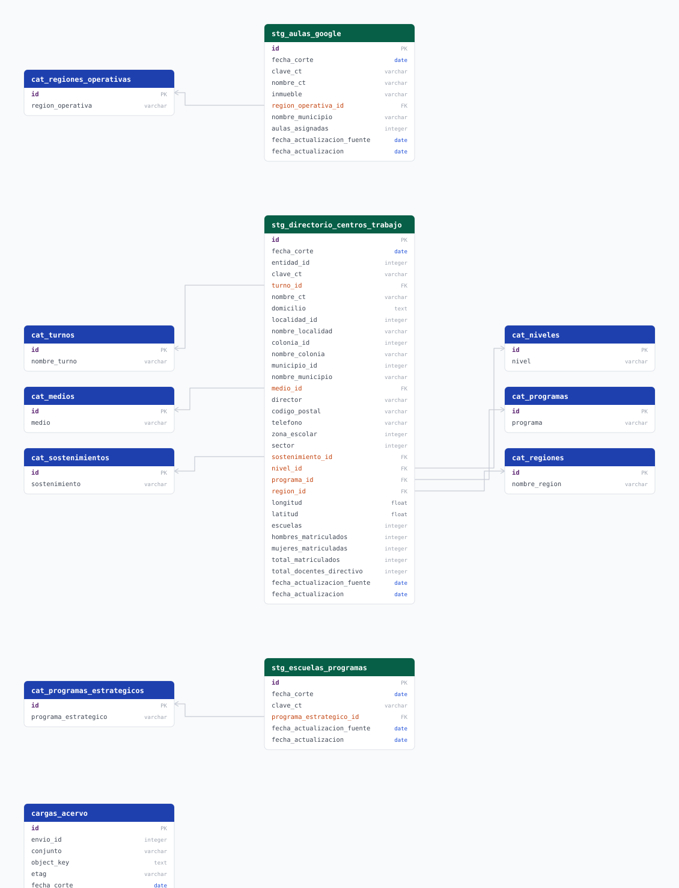

# secretaria_educacion

## Diccionario de variables

### stg_directorio_centros_trabajo

| variable | descripción |
|---|---|
| `entidad_id` | Clave de la entidad. Siempre 14 (Jalisco). Referencia lógica a `cvegeo_states.cve_ent` |
| `municipio_id` | Clave del municipio. Referencia lógica a `cvegeo_municipalities.cve_mun` |
| `localidad_id` | Localidad en `cat_localidades`. cvegeo no cubre este nivel |
| `colonia_id` | Colonia en `cat_colonias`. Nula cuando el origen no la reporta |
| `clave_ct` | Clave del centro de trabajo (CCT), llave de relación con los demás conjuntos |
| `director` | Conserva el title case sin acentos: el origen los omite y son miles de valores distintos |
| `zona_escolar` | Nula cuando el origen la reporta en 0 (sin asignar) o en 999 (no especificado) |
| `sector` | Nulo cuando el origen lo reporta en 0, que corresponde a los niveles donde el sector no aplica |
| `escuelas` | Indicador 0/1 que marca si la fila cuenta para el total oficial. Las filas en 0 son planteles en liquidación |
| `total_docentes_directivo` | Docentes y directivos frente a grupo |
| `fecha_corte` | Fecha a la que corresponden los datos, capturada por la dependencia |
| `fecha_actualizacion_fuente` | Fecha en que la dependencia actualizó el conjunto |

### stg_escuelas_programas_estrategicos

| variable | descripción |
|---|---|
| `clave_ct` | Clave del centro de trabajo. Sin llave foránea al directorio: los cortes de ambos conjuntos son independientes |
| `programa_estrategico_id` | Programa estatal que beneficia a la escuela. Concepto distinto de `programa_id` del directorio, que es la modalidad educativa |
| `fecha_corte` | Fecha a la que corresponden los datos |
| `fecha_actualizacion_fuente` | Fecha en que la dependencia actualizó el conjunto |

### stg_aulas_google

| variable | descripción |
|---|---|
| `municipio_id` | Resuelto contra cvegeo desde el nombre: el origen no manda la clave. Nulo si el nombre no coincide con el oficial |
| `clave_ct` | Clave del centro de trabajo. Sin llave foránea al directorio |
| `inmueble` | Clave del inmueble que ocupa el centro de trabajo |
| `aulas_asignadas` | Número de aulas Google asignadas |
| `fecha_corte` | Fecha a la que corresponden los datos |
| `fecha_actualizacion_fuente` | Fecha en que la dependencia actualizó el conjunto |

### cargas_acervo

Control de envíos procesados: da el watermark del incremental.

| variable | descripción |
|---|---|
| `envio_id` | Identificador del envío en el formulario del SIEEJ |
| `conjunto` | Nombre del conjunto tal como lo capturó la dependencia |
| `object_key` | Ruta del archivo dentro del bucket |
| `etag` | MD5 del contenido. Si coincide con la carga anterior, el archivo no cambió. No es MD5 en subidas multiparte |
| `actualizado_en` | Última modificación del envío. Es el watermark del incremental |
| `procesado_en` | Momento en que el ETL procesó el envío |

## Fuentes

Los tres conjuntos llegan a Acervo por el formulario de datasets del SIEEJ, en el bucket `sieej`. El pipeline los descubre leyendo los metadatos de cada envío y los filtra por el nombre de la dependencia.

| nivel | archivo | variable |
|---|---|---|
| Centro de trabajo | Directorio de centros de trabajo (ZIP con hoja de cálculo) | `ACERVO_FORM_PREFIX` |
| Centro de trabajo | Escuelas beneficiadas por programas estratégicos (CSV) | `ACERVO_FORM_PREFIX` |
| Centro de trabajo | Equipamiento de aulas Google (CSV) | `ACERVO_FORM_PREFIX` |

El acceso a Acervo se configura en `core/acervo/.env`; ver [`core/acervo/README.md`](../../acervo/README.md).

## Actualización

Automática, DAG `etl_secretaria_educacion_update`, schedule `0 19 1,16 * *`.

Quincenal porque esa es la frecuencia que declara Aulas Google, el más frecuente de los tres conjuntos. Los otros dos son anuales, y correr de más no cuesta: el incremental arranca desde el watermark de `cargas_acervo` y salta los envíos cuyo `etag` no cambió, así que una corrida sin novedades ni abre conexión a la base.

La carga inicial usa el DAG `etl_secretaria_educacion_bootstrap`, que es on-demand porque la dependencia sube los datos sin calendario fijo.
